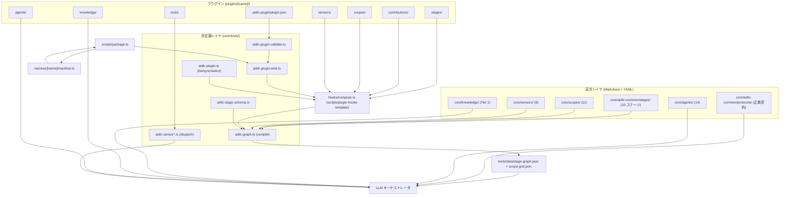
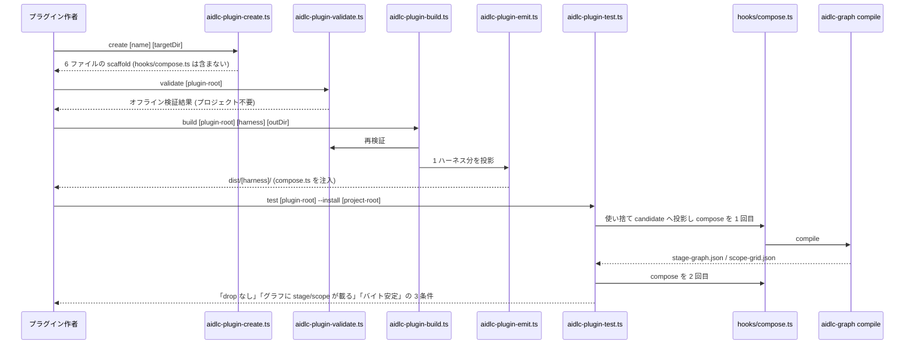
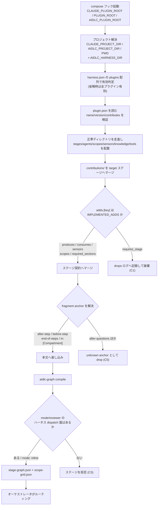
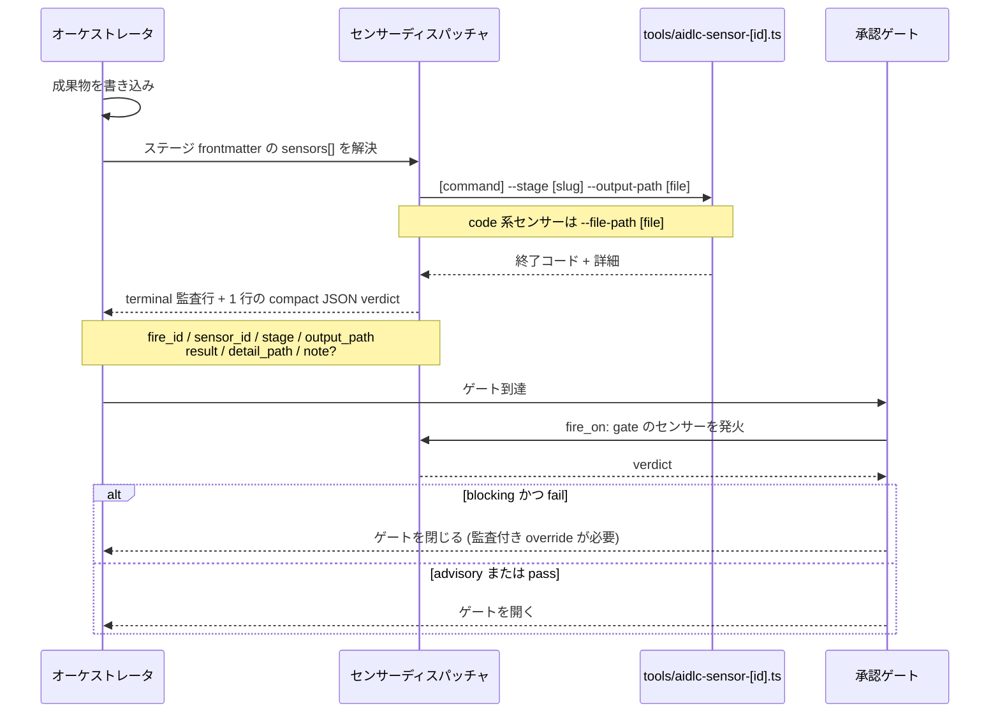

# アーキテクチャ — aidlc-workflows

## システム概観

単一リポジトリ・単一 private package（`aidlc-workflows-dev`）。ランタイムは bun、外部ネットワーク API は持たない。アーキテクチャの中心は次の分離である。

- **宣言レイヤ（Markdown + YAML frontmatter）** — ステージ、スコープ、エージェント、センサーマニフェスト、コントリビューション。人間が書き、レビューする。
- **決定論レイヤ（TypeScript CLI、`core/tools/` 88 ファイル）** — コンパイル、状態機械、監査、センサーディスパッチ、プラグイン検証・投影。判断を含まない。
- **投影レイヤ（`harness/<name>/manifest.ts` + `scripts/package.ts`）** — 宣言レイヤを各ハーネスのネイティブ形式へ書き出す。
- **実行レイヤ（LLM オーケストレータ）** — 投影された成果物を読み、ステージ手順を実行する。

## アーキテクチャスタイル

**モジュラーモノリス + コンパイル型パイプライン**。マイクロサービスでもサーバレスでもない。実行時の結合はなく、すべてが「ソースツリー → コンパイル → 生成物 → ランタイム読み取り」というビルド時パイプラインで結ばれる。根拠: `package.json` の scripts は `typecheck` / `lint` / `check` のみ、`bun run check` が `package.ts` を二重生成して**バイト単位の決定性**を検証する（開発者スキャン「Build System」節）。

## コンポーネント関係

<!-- Text fallback: 宣言レイヤ（ステージ・スコープ・エージェント・センサー・ナレッジ・プロトコル）とプラグインツリー（manifest・stages・contributions・scopes・agents・sensors・knowledge・tools）が入力。プラグイン側は aidlc-plugin-validate が検証し aidlc-plugin-emit が投影、scripts/package.ts はハーネス manifest を介してハーネス投影と plugin 投影を書き出す。compose.ts が core とプラグインの宣言物を統合し、aidlc-graph compile が stage-graph.json / scope-grid.json を生成、LLM オーケストレータがそれとプロトコル・エージェント・ナレッジを読んで実行する。センサーはプラグイン tools から dispatcher 経由でオーケストレータへ verdict を返す。 -->

## プラグイン拡張機構（本件の中核）

プラグインは `plugins/<name>/`（または外部リポジトリ）に置かれ、`.aidlc-plugin/plugin.json` が入口となる。`aidlc.contributes` は**厳格スキーマ**（未知キー拒否）で、値は正準ディレクトリ文字列と完全一致でなければならない。契約詳細は `api-documentation.md` を参照。

拡張点は 3 系統に分かれる。

1. **新規ステージ** — `stages/<phase>/<slug>.md`。frontmatter に `plugin: <name>` と `scopes:` を書けば、compose 後にオーケストレータが即ルーティングする。グラフ上の位置は自ステージの `requires_stage` で表現する。
2. **既存ステージへのコントリビューション（overlay）** — `contributions/<phase>/<slug>.md`。`target` で対象コアステージを指し、`fragments[].anchor` で本文に散文を差し込み、`adds.*` で契約を足す。
3. **横断リソース** — `agents/`, `scopes/`, `sensors/`, `knowledge/<agent-slug>/`, `tools/`。

### 観測された制約（設計前提として扱うこと）

エンジンの実装から観測された制約であり、いずれも `docs/reference/18-plugin-mechanism.md` §6/§7/§9 に文書化済みの deferred である（隠れた debt ではない）。

- **C1: `adds.requires_stage` は未実装** — 宣言すると compose は drops ログに記録するだけ。実装済みキーの唯一の真実源は `scripts/plugin-hooks-template/compose.ts:2191` の `IMPLEMENTED_ADDS = new Set(["produces","sensors","consumes","scopes","required_sections"])`。したがって **コントリビューションからは順序辺を張れない**。プラグインを graph に配置する唯一の手段は自ステージの `requires_stage` であり、「コアステージを自分のステージの後ろに回す」は原理的に不可能。
- **C2: `adds.required_sections` は機械的に強制されない** — マージはされるがコンパイル済みノードまで届かず、同梱の required-sections センサーはテンプレート由来の期待値で動く。章構造を保証したいなら自前センサー（`fire_on: gate` + `default_severity: blocking`）が必須。`fire_on: write` の blocking は当リリースでは advisory 止まり。
- **C3: 独自エージェントはハーネス依存を生む** — ステージが `mode: inline` 以外（`subagent`/`pipeline`/`mob`）または `reviewer:` を使う場合、Kiro CLI / Codex / OpenCode では手書きのディスパッチ面（agent-v1 JSON + `trustedAgents` 登録 / `aidlc-*-agent.toml` / `.opencode/agents/`）がないと compose がそのステージを**拒否**する。
- **C4: `when:` 述語は未評価** — パースのみで評価器がない。`when:` を持つステージは宣言スコープ下で無条件 EXECUTE。
- **C5: `after-questions` anchor は未実装** — `locateAnchor` に case がなく "unknown anchor" として drop（`compose.ts:1749`）。実用可能な anchor は `after-step:<n>` / `before-step:<n>` / `end-of-steps` / `in:<Compartment>` の 4 種のみ。
- **C6: `memory/` サブツリーは投影されない** — フェーズ規約やチーム規約をプラグインから配ることは今日できない（`aidlc.contributes.memory` は宣言しただけで拒否される）。
- **C7: `dependencies` / `aidlc.lock.json` は読まれない** — バージョン制約による活性化・順序制御に依存できない。
- **C8: ナレッジ重複リスク** — `core/knowledge/aidlc-architect-agent/ddd-patterns.md` が既に存在する。プラグイン側 `knowledge/aidlc-architect-agent/` に DDD ナレッジを置くと、コアのそれと二重になる。詳細は `code-quality-assessment.md`。

## インタラクション図

ここでは「ビジネストランザクション」= プラグイン作者およびライフサイクル利用者が実際に走らせる 3 つの流れを、コンポーネント横断で描く。

### T1: プラグインの scaffold → 検証 → ビルド → 実プロジェクト検証

<!-- Text fallback: 作者は aidlc-plugin-create で 6 ファイルの scaffold を得る（compose.ts は BUILD が注入するため含まれない）。aidlc-plugin-validate がオフラインで検証、aidlc-plugin-build が再検証のうえ aidlc-plugin-emit を呼んで dist/<harness>/ に 1 ハーネス分を投影する。aidlc-plugin-test は使い捨ての candidate プロジェクトへ投影を入れ、実 compose を 2 回実行して、1 回目に drop がないこと・グラフに stage と scope が載ること・2 回目がバイト単位で安定することを要求する。 -->

### T2: compose/compile パイプライン（プラグインがグラフに載るまで）

<!-- Text fallback: compose フックは環境変数からプラグインルート・プロジェクト・ハーネスディレクトリを解決し、harness.json の plugins 配列で有効プラグインを決める。plugin.json を検証したうえで正準ディレクトリ（stages/agents/scopes/sensors/knowledge/tools）を配置し、contributions を target ステージへマージする。adds キーは IMPLEMENTED_ADDS（produces/consumes/sensors/scopes/required_sections）のみマージされ、requires_stage は drops ログへ記録して破棄される。fragment anchor は after-step / before-step / end-of-steps / in:<Compartment> のみ解決でき、それ以外は unknown anchor として drop される。その後 aidlc-graph compile がグラフを生成するが、inline 以外の mode や reviewer を持つステージに対象ハーネスのディスパッチ面がなければ compose はそのステージを拒否する。成功すれば stage-graph.json と scope-grid.json が出力され、オーケストレータがルーティングする。 -->

### T3: センサー発火（成果物検証）

<!-- Text fallback: オーケストレータが成果物を書き込むと、ステージ frontmatter の sensors リストが解決され、ディスパッチャが各センサーの command を --stage と --output-path（code 系は --file-path）付きで実行する。センサーは終了コードと詳細を返し、ディスパッチャは terminal 監査行に続けて fire_id・sensor_id・stage・output_path・result・detail_path・任意の note を含む 1 行の compact JSON verdict を出力する。承認ゲートでは fire_on: gate のセンサーが発火し、blocking で fail した場合はゲートが閉じ、監査付きの明示的 override がないと開かない。fire_on: write の blocking は当リリースでは advisory 止まり。 -->

## データフロー

1. **ソース（Markdown/YAML）→ compose → compile → `tools/data/stage-graph.json` + `scope-grid.json`**。生成物はソース管理下に置かれない。
2. **`scripts/package.ts` → `harness/<name>/manifest.ts` → `dist/<harness>/`**（gitignore）。同じく `plugins/<name>/` → `aidlc-plugin-emit.ts` → `dist/plugins/<name>/<harness>/`。
3. **`scripts/package.ts` → `tools/data/plugin-targets.json`** を書き出し、`aidlc-plugin-build.ts` がオフラインでそれを読む。これが**外部プラグインリポジトリからフレームワークチェックアウトなしにビルドできる**経路である。
4. **実行時** — オーケストレータが `stage-graph.json` を読み、ステージ本文・プロトコル・エージェント・ナレッジを参照して進行、成果物をインテントレコードへ書き、センサー verdict と監査行を残す。

## 主要な設計判断

- **生成物をコミットしない + 二重生成による決定性検証** — `bun run check` が `package.ts` → `package.ts --check` を走らせる。プラグイン投影も同じ規律に従うため、`aidlc-plugin-test` は 2 回目のバイト安定を要求する。
- **宣言の厳格性と寛容性の使い分け** — `plugin.json` の最上位は寛容（未知キー保持）だが `aidlc.contributes` は厳格（未知キー拒否）。将来のメタデータ拡張を許しつつ、契約面は固める意図。
- **規約探索によるルーティング** — `aidlc.contributes` の値は正準ディレクトリ文字列と完全一致しか許されず、任意パスへのルーティングは未実装（宣言はあるが実体は規約探索）。
- **命名規約の機械的強制** — フレームワークファイルは `aidlc-*` 接頭辞、センサーは `SENSOR_FILE_REGEX = /^aidlc-([a-z][a-z0-9-]*)\.md$/`、プラグインの scope/agent は `<plugin>-<name>.md` かつ frontmatter `name` == ファイル stem、成果物論理名は `/^[a-z][a-z0-9-]*$/` のフラット名前空間で `<plugin>-` 接頭辞必須（`core-*` は予約）。

## 強化余地

- C1（順序辺）と C2（章構造強制）はプラグイン設計の自由度を直接削る。DDD プラグインは**ステージ配置を自ステージの `requires_stage` だけで表現できる形に畳む**か、コアステージへのコントリビューションに寄せるかを早期に決める必要がある。
- C3 により、対象ハーネスを Claude に限定するか `mode: inline` に寄せるかが、エージェント設計より先に決まる制約となる。
- センサーマニフェストの `matches` glob が旧成果物ツリー路 `**/{aidlc-docs,intents}/**` を引きずっている（コア 6 本と `test-pro` 2 本の両方）。新規センサーはこれを踏襲しないこと。

## 出典

- 開発者スキャン（`developer-scan-aidlc-workflows.md`）— コミット `16341f82`
- `docs/reference/18-plugin-mechanism.md`（613 行、プラグインの正典）、`15-stage-definition.md`（599 行）、`07-sensor-system.md`（450 行）、`10-knowledge-system.md`、`16-artifact-vocabulary.md`
- `scripts/plugin-hooks-template/compose.ts`（2489 行）、`scripts/package.ts`（1757 行）
- `plugins/test-pro/`（唯一の同梱参照プラグイン、17 ファイル）
