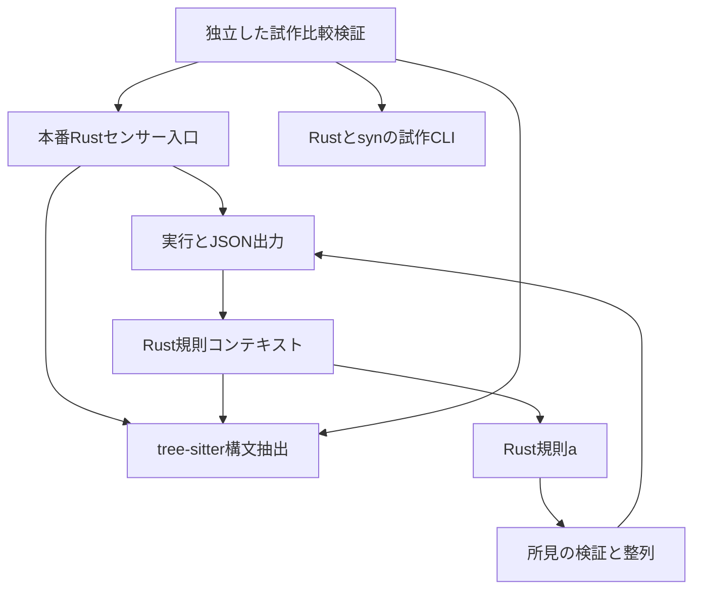
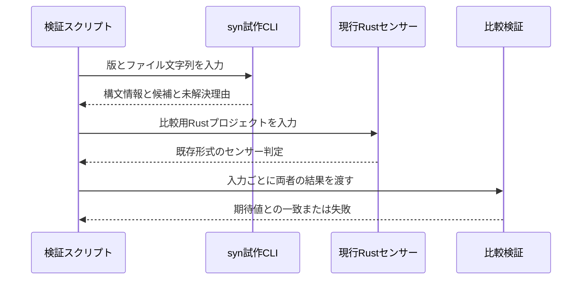

## Architecture Analysis

### System Overview

現行系はBunで動くTypeScriptのコマンドと内部ライブラリからなる。Rustコードをtree-sitterのWASMで読み、Cargoやモデルを含むコンテキストに対して規則を実行し、センサー判定をJSONで出力する。独立したRust＋syn試作は比較検証スクリプトから起動され、本番センサーの依存には入っていない。

### Architectural Style

調査範囲では、入口・実行制御・構文抽出・規則・所見処理を分けたモジュール型CLI構成である。ネットワーク越しのサービス分割ではない。syn試作だけはJSONを介する別プロセスになっている。構成要素ごとの責務と評価は[構成要素一覧](component-inventory.md)を参照する。

既存の規則定義には言語共通を意図する記述があるが、実際の`InspectionContext`は`AnalyzerRuntime`、`SyntaxTree`、`CargoWorkspace`、`RustProgram`を含む。規則aも`structs`というRust固有の情報を直接要求する。したがって、共通判定境界が実装済みとは扱わない。

### Component Relationships

図のテキスト表現: 本番Rustセンサー入口がtree-sitter解析器を初期化して実行制御を呼ぶ。実行制御がRust規則コンテキストを組み立て、構文抽出結果を使って規則aを評価し、検証・整列した所見をJSONへまとめる。独立した比較検証はsyn試作CLIと現行センサー・解析器を別々に呼ぶ。

矢印は今回確認した呼出しまたはデータ受渡しを示す。ファイル単位の完全なimportグラフや、未調査のフレームワーク内部の依存を表すものではない。

### Data Flow

1. 現行センサーは`--stage`と`--output-path`から実行対象を解決する。規則評価側はCargo・モデル・ソースクレームを利用する。
2. tree-sitter解析器がソースを構文情報へ変換する。AST自体は解析器内のWeakMapに保持するが、その構文モデルはRust用である。
3. 規則aがstructフィールドの可視性を確認し、所見処理が決定的なIDと順序を付ける。
4. `runSensor`が判定を出力する。通常経路では所見の有無から`pass`を計算する。noteに残る解析上の制約と、将来の明示的な検査不能は同じ契約ではない。
5. syn試作は独自の版付きリクエストからファイル単位の報告を作る。型の同定、入力との対応、集合の完全性を保証する共通契約への変換はまだない。

### Interaction Diagrams

図のテキスト表現: 試作比較では、検証スクリプトがRustソース文字列をsynへ送り、構文情報・候補・未解決理由を受け取る。比較対象の入力を現行Rustセンサーにも渡し、両者について保存した期待値との一致を確かめる。この比較処理は共通評価器による一回の判定ではない。

図は既存の検証用処理を説明する。今回のリバースエンジニアリングで比較スクリプトを再実行したことを示すものではない。

### Key Design Decisions

| 現状から確認できる選択 | 根拠と効果 | 制約 |
|---|---|---|
| センサー入口と実行・規則を分離する | `ddd-sensor-rust-domain.ts`が初期化と規則指定を行い、実行制御を呼ぶ | 共通のように見えるコンテキストにもRust型が入る |
| 構文抽出と意味解析を区別する | 現行解析器とsyn試作はいずれも構文情報を主体とする | 構文解析成功から型解決やコンパイル成功を推定できない |
| synの試作を独立したCLIに置く | `experiments/rust-syn/`と明示的な検証コマンド | 自動的な通常検証への接続や他OS配布は未確認 |
| 所見の整列とID付与を共用する | `shared/findings.ts`の検証・正規化 | 所見が空でも必要情報が完全とは限らない |

これらは既存実装の説明であり、新しいアーキテクチャの承認記録ではない。利用者入力を受ける境界の安全性は[API資料](api-documentation.md)、検証上の課題は[品質評価](code-quality-assessment.md)に記す。

### Improvement Opportunities

Issue #38では、明示した型から状態情報を取り出す言語別処理と、一規則を判定する共通処理の境界を作れる。既存Rustコンテキストをそのまま共通化するとCargo・モデル探索が最小経路の前提になるため、その再利用範囲を限定する必要がある。

比較対象となる設計案は、既存の汎用的に見えるコンテキストを拡張する案と、指定型だけの小さな独立契約を作る案である。前者は既存規則を呼びやすいがRust依存を持ち込み、後者は既存結果との整合試験が必要になる。今回の合意された範囲には後者が適合するが、具体的な型・プロトコル・配置は次段階で設計する。

入力識別、要求対象の欠落、不完全な空集合、条件付き候補の扱いが主要な設計点である。TypeScriptについては`#`フィールドとクロージャの直接的な形状を対象にし、一般の型・参照・実行時効果の解析へ拡大しない。

## Sources

根拠は[開発者の調査記録](../../intents/260913-shared-state-check/inception/reverse-engineering/developer-scan.md)である。本文のソース位置はその記録から引き継いだ。構成の解釈は本分析による。詳細調査と概要確認の範囲は[調査時点と範囲](reverse-engineering-timestamp.md)に記録した。
