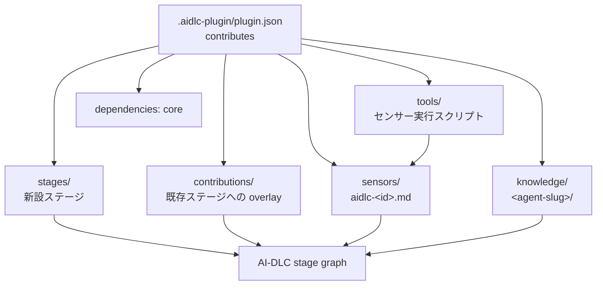
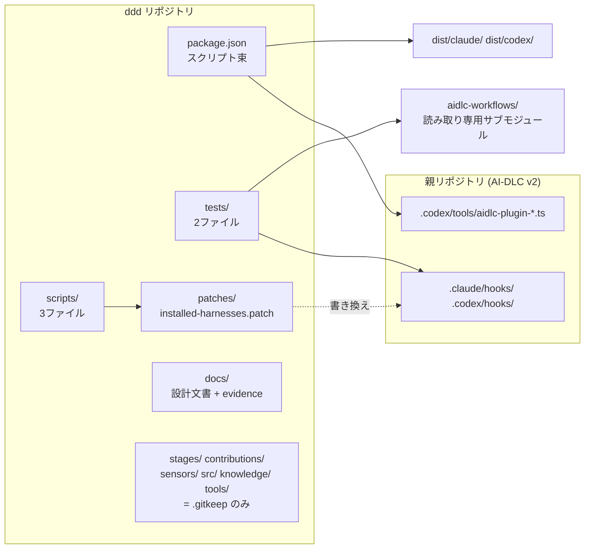
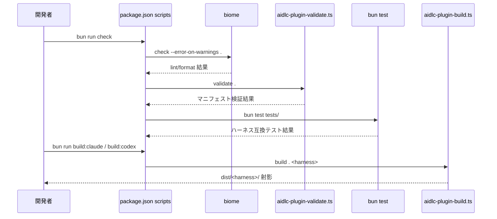
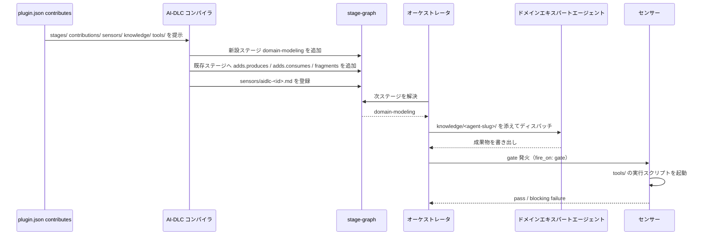

# Architecture — `ddd`

## システム概要

`ddd` は独立した実行系を持たない。AI-DLC v2 のコアフレームワーク（親リポジトリの `.claude/` / `.codex/`）に対する**宣言的な拡張パッケージ**であり、ビルド・検証・テストの処理はすべて親リポジトリのエンジンツール（`../.codex/tools/aidlc-plugin-*.ts`）に委譲する。

## アーキテクチャスタイル

**プラグイン／マニフェスト駆動の宣言型拡張**。根拠:

- `.aidlc-plugin/plugin.json` の `aidlc.contributes` が貢献面をディレクトリパスで宣言する（コード登録ではない）
- ビルドは `aidlc-plugin-build.ts` が `dist/claude/` `dist/codex/` へハーネス別マニフェストを射影する形を取る
- サーバも HTTP API も存在しない（`api-documentation.md` 参照）

## 意図されたアーキテクチャ（`plugin.json` の宣言）

<!-- Text fallback: plugin.json の contributes が stages / contributions(overlays) / sensors / knowledge / tools の5面を宣言し、dependencies に core を持つ。stages・contributions・sensors・knowledge は AI-DLC のステージグラフへ合流し、tools は sensors から呼ばれる実行スクリプトを供給する。 -->

## 現状のアーキテクチャ（実装されているもの）

<!-- Text fallback: ddd リポジトリは package.json のスクリプト束、scripts/(3)、tests/(2)、patches/、docs/ からなり、stages/contributions/sensors/src/knowledge/tools は .gitkeep のみで空。package.json は親リポジトリの .codex/tools/aidlc-plugin-*.ts を呼び、scripts は patches を親の hooks へ適用する。tests は親の hooks と読み取り専用サブモジュール aidlc-workflows のフィクスチャを検証する。ビルド出力は dist/claude と dist/codex。 -->

## 宣言と実装のギャップ

| 貢献面 | `plugin.json` の宣言 | 実体 | 設計入力 |
|---|---|---|---|
| `stages/` | あり | `.gitkeep` のみ（inception / construction 両方） | `domain-layer-design.md` §2・§8〜§10（新設ステージ `domain-modeling`） |
| `contributions/`（overlays） | あり | `.gitkeep` のみ（inception / construction 両方） | `use-case-layer-design.md` §1・§7〜§9、`interface-adapter-layer-design.md` §1・§8〜§9 |
| `sensors/` | あり | `.gitkeep` のみ | `domain-layer-design.md` §10 |
| `knowledge/` | あり | `.gitkeep` のみ | `domain-layer-design.md` §10 |
| `tools/` | あり | `.gitkeep` のみ | 同上（センサー実行スクリプト） |
| `src/` | （contributes 対象外だが tsconfig の include 対象） | `.gitkeep` のみ | — |

**実装率: 宣言5面に対して 0 件。** `dist/` にも空ディレクトリがそのまま射影されている。

## Interaction Diagrams（意図された貢献フロー — 未実装）

以下はいずれも **意図された／目標のフロー**であり、現時点で動作する挙動ではない。実装されているのは (A) の検証・ビルド経路のみで、その入力となる貢献物が存在しない。

### A. ビルド・検証パイプライン（経路は実装済み、入力が空）

<!-- Text fallback: 開発者が bun run check を実行すると、package.json のスクリプトが biome check、aidlc-plugin-validate.ts、bun test tests/ を直列に呼ぶ。別途 build:claude / build:codex が aidlc-plugin-build.ts を呼び、dist/<harness>/ を射影する。 -->

### B. 意図されたプラグイン貢献の合流フロー（未実装）

<!-- Text fallback: 意図されたフローでは、plugin.json の contributes を AI-DLC コンパイラが読み、新設ステージ domain-modeling をステージグラフへ追加し、既存ステージへ adds.produces / adds.consumes / fragments を追加し、sensors/aidlc-<id>.md を登録する。オーケストレータはグラフから次ステージを解決してエージェントへ knowledge/<agent-slug>/ とともにディスパッチし、成果物の書き出し後に gate 発火でセンサーが tools/ のスクリプトを起動し、pass または blocking failure を返す。現時点でこのフローは1段も実装されていない。 -->

## 機構上の制約（設計時に守るべき事実）

`docs/domain-layer-design.md` §10 に調査結果として記録されている、プラグイン機構側のハード制約:

- センサーのファイル名は `sensors/aidlc-<id>.md` がハード要件で、走査はフラット（サブディレクトリ不可）
- センサー必須フィールドは `id` / `kind` / `command` / `default_severity` / `description`、`kind` は `deterministic` のみ
- **blocking が実効を持つのは `fire_on: gate` ＋ `default_severity: blocking` の組み合わせだけ**。write 発火の blocking は advisory へ降格される
- contribution は**追加のみ**。上書き・削除は不可。利用可能面は `adds.produces` / `adds.consumes` / `adds.sensors` / `adds.scopes` / `fragments` に限られる
- `adds.required_sections` は機械強制されない。`adds.requires_stage` は deferred
- `knowledge/<agent-slug>/` はディレクトリ名がエージェント slug と完全一致しなければ**黙って無視される**

## データフロー

永続データストアは存在しない。流れるのは (1) マニフェストとステージ定義の Markdown/JSON、(2) ハーネスフックの JSON stdin/stdout 契約、(3) `dist/` へのビルド射影、(4) `docs/evidence/*.json` の検証証跡のみ。

## 主要な設計上の選択と代替案

### 選択1: ビルド／検証を親リポジトリのエンジンツールに委譲する

- **Context**: プラグインは AI-DLC コアのマニフェスト仕様に従う必要がある。
- **Decision**: `package.json` の `validate` / `build:*` / `test:sandbox` は `../.codex/tools/aidlc-plugin-*.ts` を直接呼ぶ。
- **Consequences**: 仕様追随のコストがゼロになる一方、`ddd` は親リポジトリの相対パス配置に強く結合し、単独 clone では動作しない。
- **Alternatives Rejected**: (a) 検証ロジックを `ddd` 内へ複製 — 仕様ドリフトの恒常的リスクを負うため却下。(b) エンジンツールを npm 依存として取得 — 現状パッケージ公開されておらず不可。

### 選択2: ハーネス互換性をパッチで確保する

- **Context**: Codex ハーネスでのステージルール配送に、親リポジトリ側の未修正な挙動がある。
- **Decision**: `patches/installed-harnesses.patch`（425行）を `scripts/apply-harness-patches.ts` で親の `.claude/` `.codex/` に適用する。
- **Consequences**: 短期的に検証可能な状態を得られる一方、上流更新のたびに適用が壊れる構造的負債となる（`code-quality-assessment.md` 参照）。
- **Alternatives Rejected**: (a) 上流へ PR して取り込む — 未実施であり、本 intent の進行を待たせるため見送り。(b) パッチなしで Codex 対応を諦める — 二ハーネス対応という前提を崩すため却下。

## 改善余地

1. 5つの貢献面の実装（本 intent の主目的）
2. 品質ゲートの穴の解消 — 型検査 / CI / カバレッジ閾値
3. `patches/installed-harnesses.patch` の上流化、または適用不要化
4. `docs/codex-host-verification.md` の二層構造（冒頭に修正後 VERIFIED、本文は修正前 NOT VERIFIED）の整理

## Sources

- `ddd/.aidlc-plugin/plugin.json`, `ddd/package.json`, `ddd/README.md`
- `developer-scan-ddd.md`（Build System / APIs Discovered / Technical Debt Signals / Handoff Summary）
- `ddd/docs/domain-layer-design.md` §10（機構上の制約、設計入力として）
