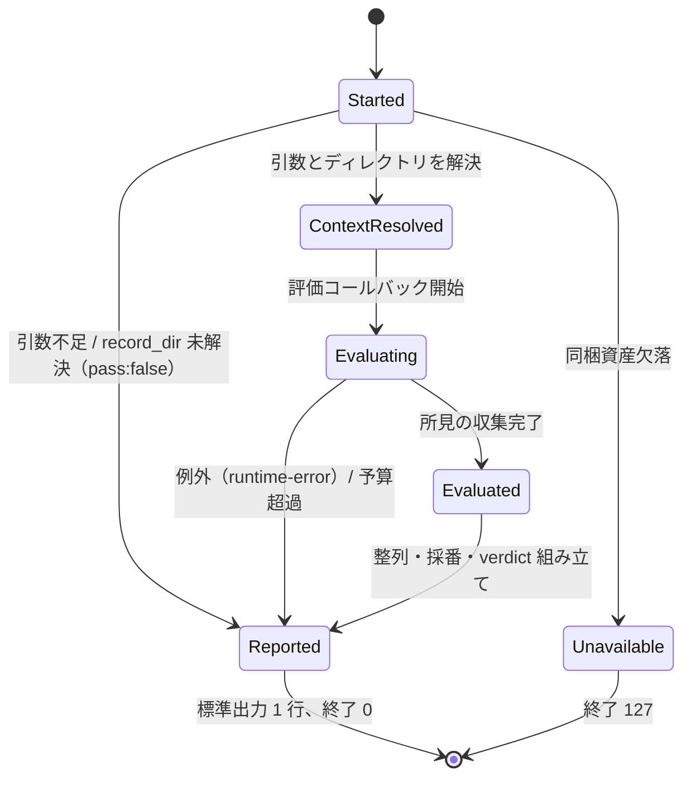
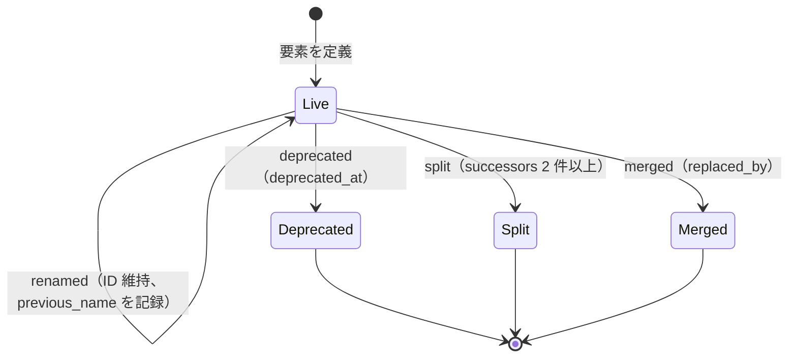
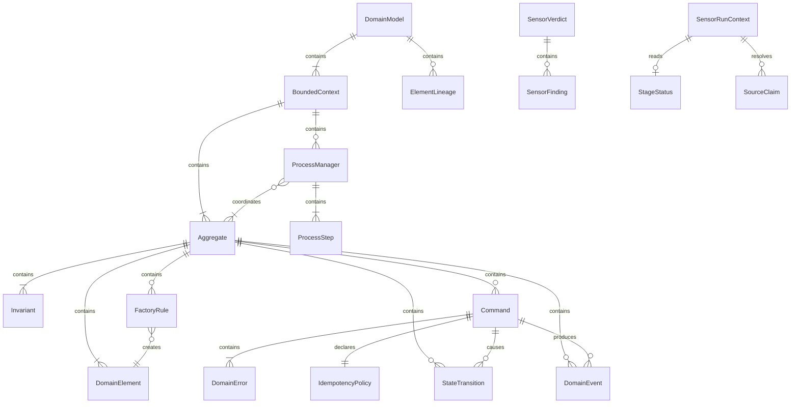

# 機能仕様 — U1 センサー基盤（u1-sensor-foundation）

## Sources

- `inception/units-generation/unit-of-work.md`（U1 = SensorRuntime + DomainModelSchema、kind: library、統合点はセンサー実行契約と正規モデル読み込み器）
- `inception/units-generation/unit-of-work-story-map.md`（U1 の要件と、U4〜U8 が U1 に依存する横断要件 FR1.7、FR7.2〜FR7.3、NFR2）
- `inception/requirements-analysis/requirements.md`（FR2、FR8.5、NFR1、NFR2、NFR8、NFR9）
- `inception/domain-design/components.md`（SensorRuntime / DomainModelSchema の振る舞い、依存先なし、依存元は DesignSensorSuite / RustCodeSensorSuite / ステージ・contribution・ナレッジ）
- `inception/domain-design/decisions.md`（ADR-001 配置、ADR-003 申告ソース、ADR-004 状態ファイル）
- `construction/u1-sensor-foundation/functional-design/entities.md`（型定義。ER 図はここから導出）
- `construction/u1-sensor-foundation/functional-design/rules.md`（規則。要約表はここから導出）
- エンジンのディスパッチャ `.claude/tools/aidlc-sensor.ts`（起動引数、終了コードと標準出力 JSON の解釈、詳細ファイルの生成）

本書はワークフローと状態機械の正である。U1 はライブラリなので「ユースケース」は呼び出し元（センサー実行スクリプト、U4〜U8）から見た操作として記す。技術非依存で書くが、投影先が bun 上の TypeScript であることは ADR-001 で確定しているため、公開 API の名前だけは仮置きで示す。

## 1. 公開する操作（ライブラリの API 面）

| 操作 | 提供側 | 利用側 | 入力 | 出力 |
|---|---|---|---|---|
| `runSensor(definition)` | SensorRuntime | すべてのセンサースクリプト（U4、U5） | センサー定義（sensor_id、severity、評価コールバック、任意の budget_ms）と実行時の argv | 標準出力への SensorVerdict と終了コード（戻り値は無し） |
| `resolveContext(argv)` | SensorRuntime | runSensor の内部、テスト | argv | SensorRunContext または解決失敗 |
| `readStageStatus(ctx, stage)` | SensorRuntime | U4 の model-presence | 文脈とステージ slug | StageStatus |
| `readSourceClaims(ctx, options)` | SensorRuntime | U5 の 3 センサー | 文脈と拡張子フィルタ | SourceClaim の一覧（解決済み）または失敗 |
| `loadDomainModel(path)` | DomainModelSchema | U4、U5、U6〜U8 のテスト | domain-model.yaml のパス | success(DomainModel, ElementIndex) または failure(所見一覧) |
| `checkCompleteness(model)` | DomainModelSchema | U4 の model-completeness、mapping-declarations | 読み込み済みモデル | 完全性報告（(i)〜(iii)、(j) に相当する所見） |
| `index.resolve(id, expectedKind?)` | DomainModelSchema | U4 の reference-ids、U5 の (b)(c)(n) | ID 文字列 | resolved(要素) または unresolved(理由: undefined / deprecated / kind-mismatch / malformed) |
| `index.commandsOf(aggregateId)` | DomainModelSchema | U5 の (b)(c)(n) | 集約 ID | Command の一覧 |
| `index.elements(kind?)` | DomainModelSchema | U4 の (f) 整合検査、U8 のナレッジ例 | 種別 | 要素の一覧（id、name、所有関係、statement） |
| `parseElementId(text)` | DomainModelSchema | U4、U7 の宣言解析 | 文字列 | ElementId または文法違反 |

## 2. ワークフロー

### WF1. センサー実行（ディスパッチャ → スクリプト → SensorRuntime）

前提: ディスパッチャがマニフェストの `command` を `--stage <slug> --output-path <path>` 付きで起動する（code 系は `--file-path`）。

1. スクリプトは自分の定義（sensor_id、severity、評価コールバック、budget_ms）を組み立て、`runSensor` に argv を渡す。
2. `resolveContext` が引数を読み、`--stage` とパス引数の存在を確認する（BR7.1）。不足なら手順 9 へ（pass:false、reason "args-missing"）。
3. パスを絶対化し、祖先を辿って `record_dir`（`aidlc-state.md` を含む）と `workspace_root`（`aidlc/` を含む）を決める（BR8.1）。見つからなければ手順 9 へ（reason "record-dir-unresolved"）。
4. `record_dir/construction/<unit>/` 配下なら `unit` を設定する（BR8.2）。
5. 評価コールバックを呼ぶ。コールバックは文脈を受け取り、必要に応じて `readStageStatus` / `readSourceClaims` / `loadDomainModel` を呼び、所見を積む。ファイル境界ごとに経過時間を確認し、budget_ms を超えたら打ち切る（BR7.8、reason "budget-exceeded"）。
6. コールバックが例外を投げたら捕捉し、findings 空・pass:false・reason "runtime-error: <要約>" とする（BR7.5）。
7. 所見を (file, line, rule_id, message) で整列し、finding_id を採番する（BR7.7、BR9.2）。severity はマニフェストの重大度を転記する（BR9.3）。
8. `pass = (findings_count = 0)` として SensorVerdict を組み立てる。
9. 標準出力に JSON を 1 行だけ書き、終了コード 0 で終える（BR7.2、BR7.3）。ログは標準エラーに書く。
10. 例外経路: 同梱資産が無いときだけ終了コード 127 で終える（BR7.4）。それ以外の経路で非 0 終了コードを返さない。

不幸な経路の整理:

| 状況 | 出力 | ディスパッチャの扱い |
|---|---|---|
| 引数不足、record_dir 未解決、source-manifest 不正 | 終了 0、pass:false、reason | SENSOR_FAILED（blocking ならゲートが閉じる） |
| 評価中の例外 | 終了 0、pass:false、reason "runtime-error" | 同上（フェイルクローズ） |
| 予算超過 | 終了 0、pass:false、reason "budget-exceeded" | 同上。硬い timeout（SIGTERM）に先んじる |
| 同梱資産欠落 | 終了 127 | tool-unavailable（advisory の pass 扱い）。blocking ゲートでは検証済み pass にならないためゲート進入を拒否 |
| 所見なし | 終了 0、pass:true（任意の note） | SENSOR_PASSED |

### WF2. 正規モデルの読み込みと検証（`loadDomainModel`）

1. yaml ファイルを読み、構文解析する。解析失敗は所見 1 件（rule_id schema.yaml-parse、line は解析器が返す位置）で failure を返す。
2. 構造検証（BR3.1、BR3.4、BR3.8、BR3.9、BR4.1、BR4.3、BR2.1）: 必須キー、列挙値、未知キー、件数条件を検査する。違反はすべて集めてから failure を返す（1 件目で止めない）。
3. ID 文法の検査（BR1.1、BR1.3）: すべての `element_id` と参照属性の文字列を `parseElementId` に通す。
4. 索引構築（BR1.2）: id → 要素、kind → 要素群、集約 → 所有要素群、を作る。重複 ID と廃止 ID の再利用はここで検出する。
5. 所有者一致（BR1.4）と参照解決（BR1.5、BR3.5〜BR3.7、BR5.2）: 参照属性を索引で引き、未定義・廃止・種別違反を所見にする。読み込み時違反に分類される規則はここで failure に寄与し、`resolve` の unresolved 結果は成功時にも下流が使えるよう索引に残す。
6. 系譜検証（BR2.2〜BR2.4）: 廃止 ID が本文に無いこと、後継が既知であること、置換グラフが非循環であることを検査する。
7. 導出値の補完: `Aggregate.process_managers` を ProcessManager.aggregates から逆引きして埋める。
8. 読み込み時違反が 1 件でもあれば failure(所見一覧) を返し、索引は返さない（BR6.2）。無ければ success(model, index) を返す。

### WF3. 完全性検査（`checkCompleteness`）

読み込み成功後に U4 が呼ぶ。読み込みを失敗にしない規則だけを検査し、所見一覧を返す。

1. 各 Aggregate の invariants 件数を数える（BR3.2 → completeness.i）。
2. 各 Command の state_effect と transitions を照合する（BR3.3 → completeness.ii）。
3. Domain Error は読み込み時に保証済みなので、ここでは件数だけを報告用に集計する（completeness.iii は常に 0 件）。
4. 各 Command の effect と strategy を照合する（BR4.2 → idempotency.j）。
5. 結果は rule_id 付きの所見一覧。ゲートで止めるかどうかは呼び出し元のマニフェストの重大度で決まる。

### WF4. 申告ソースの解決（`readSourceClaims`）

1. 文脈に unit が無ければ失敗（reason "unit-unresolved"）。
2. `record_dir/construction/<unit>/code-generation/source-manifest.json` を読み、厳密スキーマで検証する（BR8.4）。
3. 各 write を `workspace_root`（repo 付きは repo ルート。repo ルートは `record_dir` 直下の登録情報からではなく、呼び出し元が渡した repo → パスの対応で解決し、対応が無ければ範囲外扱い）に対して解決する。
4. 範囲外のパスは所見（runtime.claim-out-of-scope）として一覧に含め、検査対象からは外す（BR8.5）。
5. ディレクトリ申告は呼び出し元の拡張子フィルタで展開し、存在しないパスは所見（runtime.claim-missing、advisory）にする。
6. 解決済みの SourceClaim 一覧と所見を返す。

### WF5. ステージ状態の読み取り（`readStageStatus`）

1. `record_dir/aidlc-state.md` を読む。無ければ absent。
2. `## Stage Progress` 以降の行から `- [c] <slug> — EXECUTE|SKIP` に一致する行を探す（BR8.3）。
3. 見つかれば execution と checkbox を返し、無ければ absent を返す。

## 3. 状態機械

### SM1. センサー実行の状態

<!-- Text fallback: Started から ContextResolved、Evaluating、Evaluated を経て Reported に至り終了コード 0 で終わる。引数不足・record_dir 未解決・例外・予算超過はいずれも Reported（pass:false）へ短絡する。同梱資産の欠落だけが Unavailable（終了 127）へ分岐する。 -->

### SM2. 要素 ID のライフサイクル（系譜）

<!-- Text fallback: 要素は Live で始まり、rename では Live のまま ID を維持する。deprecated / split / merged はいずれも終端で、対象 ID は本文から消え、系譜にだけ残る。終端の ID は再利用できない。 -->

## 4. ER 図（entities.md から導出）

<!-- Text fallback: DomainModel は BoundedContext と ElementLineage を含む。BoundedContext は Aggregate と ProcessManager を含む。Aggregate は DomainElement・Invariant・Command・DomainEvent・StateTransition・FactoryRule を含む。Command は DomainError を含み、IdempotencyPolicy を宣言し、StateTransition と DomainEvent を参照する。FactoryRule は DomainElement を生成し、ProcessManager は複数の Aggregate を調整し ProcessStep を含む。実行時側では SensorVerdict が SensorFinding を含み、SensorRunContext から StageStatus と SourceClaim を読む。 -->

## 5. ルール要約（rules.md から導出）

| 群 | 内容 | 検査の時点 |
|---|---|---|
| BR1 ID | 文法、一意性、段数、所有者一致、参照解決 | 読み込み時 |
| BR2 系譜 | relation の形、廃止 ID の除外、非循環、後継の既知性 | 読み込み時 |
| BR3 構造 | 包含構造、不変条件、state_effect、Domain Error、root、状態名、Event、kind、未知キー | 読み込み時（BR3.2、BR3.3 は完全性検査） |
| BR4 冪等性 | effect と strategy、accumulation の制約、保持方針 | 読み込み時（BR4.2 は完全性検査） |
| BR5 Process Manager | 任意、2 集約以上、ステップと補償 | 読み込み時 |
| BR6 正の所在 | yaml のみ、失敗時は索引なし | 常時 |
| BR7 実行契約 | 引数、JSON 1 行、終了コード、127、フェイルクローズ、無通信、決定性、予算 | 実行時 |
| BR8 解決 | record_dir、unit、Stage Progress、source-manifest、範囲外、書き込み禁止 | 実行時 |
| BR9 所見 | 必須項目、finding_id、pass の定義 | 実行時 |

## 6. 統合点と境界

- U4（設計センサー）は `runSensor` と `loadDomainModel` / `checkCompleteness` / `index.resolve` を使う。(f) の md 整合検査は U4 が md を読み、U1 の索引と突き合わせる。
- U5（Rust コードセンサー）は `runSensor`、`readSourceClaims`、`index.commandsOf` / `index.resolve` を使う。構文木と層判定は U2 から得る。
- U6・U7・U8 はスキーマと ID 文法の出典として本書と JSON Schema（契約文書）を参照する。実行時には依存しない。
- U1 は Rust 構文・Cargo・マニフェストの重大度判定を持たない。severity は呼び出し元が渡す値を転記するだけである。

## 7. 未決事項の扱い

- YAML の構文解析器は bun 組み込みの解析器を第一候補とし、無い場合は最小の解析器を `tools/ddd/lib/` に同梱する。どちらにするかは code-generation の計画で確定する（実行時依存を増やさない Q4 の方針に従う）。
- JSON Schema（契約文書）の版は 2020-12 とし、`tools/ddd/lib/schema/domain-model.schema.json` に置く。手書き検証器と JSON Schema の整合は、適合／不適合サンプル（NFR4）で両方を通して確認する。
