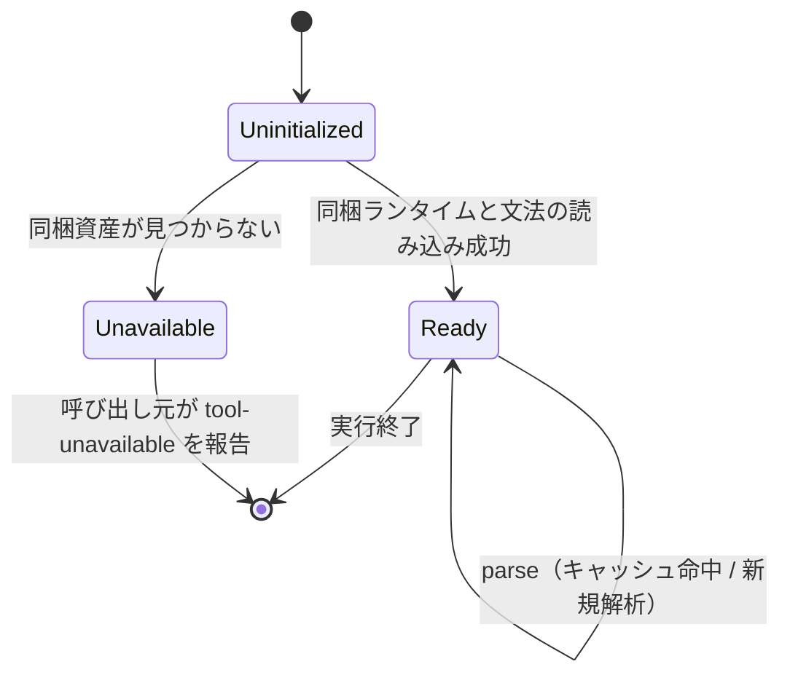
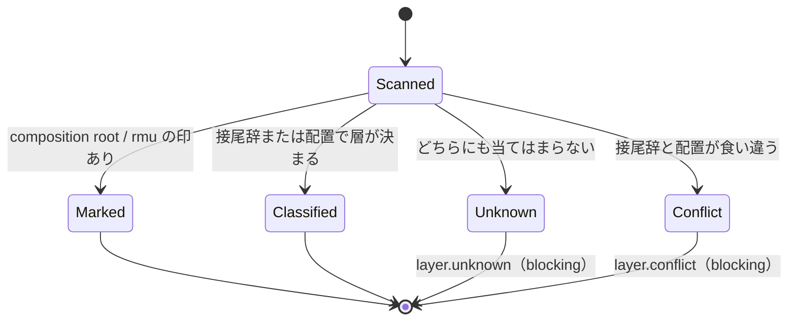
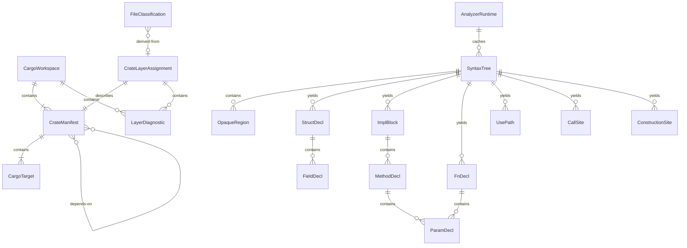

# 機能仕様 — U2 Rust 解析基盤（u2-rust-analysis-foundation）

## Sources

- `inception/units-generation/unit-of-work.md`（U2 = RustSyntaxAnalyzer + WorkspaceLayerResolver、kind: library、統合点は構文木問い合わせ API とクレート → 層判定）
- `inception/units-generation/unit-of-work-story-map.md`（U2 の要件と、U5・U7・U8 が U2 に依存する横断要件 FR7.4〜FR7.9、NFR2）
- `inception/requirements-analysis/requirements.md`（FR8.4、FR8.6、FR9、NFR1、NFR2、NFR3）
- `inception/domain-design/components.md`（RustSyntaxAnalyzer / WorkspaceLayerResolver の振る舞い、依存先なし、依存元は RustCodeSensorSuite・contribution・ナレッジ）
- `inception/domain-design/decisions.md`（ADR-001 配置、ADR-005 判定規約）
- `construction/u2-rust-analysis-foundation/functional-design/entities.md`（型定義。ER 図はここから導出）
- `construction/u2-rust-analysis-foundation/functional-design/rules.md`（規則。要約表はここから導出）

本書はワークフローと状態機械の正である。U2 はライブラリなので、操作は呼び出し元（U5 の 3 センサー、U7・U8 の規約参照）から見た API として記す。技術非依存で書くが、投影先が bun 上の TypeScript で、Rust 文法が tree-sitter-rust（WASM）であることは確定している。

## 1. 公開する操作（ライブラリの API 面）

| 操作 | 提供側 | 利用側 | 入力 | 出力 |
|---|---|---|---|---|
| `scanWorkspace(rootPath)` | WorkspaceLayerResolver | U5、テスト | workspace ルート（Cargo.toml を含むディレクトリ） | CargoWorkspace（診断を含む） |
| `assignLayers(workspace)` | WorkspaceLayerResolver | U5 | CargoWorkspace | CrateLayerAssignment の一覧（診断を含む） |
| `classifyFile(assignments, filePath)` | WorkspaceLayerResolver | U5 | 判定結果と workspace 相対パス | FileClassification |
| `isAllowed(from, to)` | WorkspaceLayerResolver | U5 の (g) と依存方向検査 | 2 つの CrateLayerAssignment（または FileClassification） | boolean と理由コード（layer-forbidden / cross-side / ok） |
| `permissionTable()` | WorkspaceLayerResolver | U7・U8（規約の出典として） | なし | DependencyPermission の一覧 |
| `conventions()` | WorkspaceLayerResolver | U7・U8 | なし | 接尾辞・配置・CQRS 側・composition root の規約を列挙した構造（ナレッジと手順が転記する出典） |
| `initAnalyzer()` | RustSyntaxAnalyzer | U5 | なし | AnalyzerRuntime（state = ready または unavailable） |
| `parse(runtime, filePath, bytes)` | RustSyntaxAnalyzer | U5 | ファイルとバイト列 | SyntaxTree（不透明領域を含む） |
| `structs(tree)` / `impls(tree)` / `fns(tree)` / `uses(tree)` / `calls(tree)` / `constructions(tree)` | RustSyntaxAnalyzer | U5 の規則モジュール | SyntaxTree | それぞれ StructDecl / ImplBlock / FnDecl / UsePath / CallSite / ConstructionSite の一覧（Span 順） |
| `opaqueRegions(tree)` | RustSyntaxAnalyzer | U5（advisory 所見 analyzer.macro-opaque の材料） | SyntaxTree | OpaqueRegion の一覧 |

## 2. ワークフロー

### WF1. workspace の走査（`scanWorkspace`）

1. `rootPath/Cargo.toml` を読む。読めなければ `workspace.unreadable` を診断に積み、members 空で返す（BR1.2）。
2. `[workspace].members` の各 glob を rootPath を基準に展開し、`[workspace].exclude` に一致するものを除く。`[workspace]` が無く `[package]` があれば、ルートを唯一のメンバーにする。メンバーが 0 件なら `workspace.no-members`。
3. 各メンバーの `Cargo.toml` を読み、`name`、`path`、ターゲット（明示 + 自動検出、BR1.3）、内部依存（BR1.4）を集める。個別の Cargo.toml が読めないメンバーは `workspace.unreadable` を積み、名前をディレクトリ名で仮置きして続行する。
4. メンバーを `path` の昇順に整列して CargoWorkspace を返す（BR6.3 と同じ決定性の方針）。

### WF2. 層の判定（`assignLayers`）

各メンバーについて、次の順に評価する（BR2.6）。

1. **同居の検査（BR2.5）**: targets に bin と lib の両方があれば `layer.mixed-targets` を積む。
2. **composition root（BR2.4）**: bin 専用、接尾辞 `-composition-root`、配置 `packages|modules/composition-root/` のいずれかなら `is_composition_root = true`、`layer = composition-root`、`layer_source = marker`。手順 6 へ。
3. **CQRS 側（BR3.1〜BR3.3）**: 名前セグメントと配置から command / query / rmu を判定する。両方あって食い違えば `cqrs.conflict`。印が無ければ none。
4. **rmu（BR3.5）**: cqrs_side = rmu なら `layer = rmu`、`layer_source = marker`。手順 6 へ。
5. **層（BR2.1〜BR2.3）**: 接尾辞と配置を評価する。一致 → both、片方 → その規約、無し → unknown + `layer.unknown`、食い違い → unknown + `layer.conflict`。
6. **クエリ側の検査（BR3.4）**: cqrs_side = query かつ layer = domain なら `cqrs.query-domain`。
7. CrateLayerAssignment を返す。診断は code → crate_name の順に整列する。

判定の決定表（代表例）:

| クレート名 | 配置 | targets | layer | cqrs_side | 診断 |
|---|---|---|---|---|---|
| `billing-domain` | `packages/domain/billing-domain/` | lib | domain（both） | none | なし |
| `billing-domain` | `packages/use-case/billing-domain/` | lib | unknown | none | layer.conflict |
| `billing-command-use-case` | `crates/…` | lib | use-case（suffix） | command（segment） | なし |
| `billing-query-domain` | `packages/query/domain/…` | lib | domain | query | cqrs.query-domain |
| `billing-rmu` | `packages/rmu/billing-rmu/` | lib | rmu（marker） | rmu（both） | なし |
| `billing-app` | `apps/billing-app/` | bin | composition-root（marker） | none | なし |
| `billing-app` | `apps/billing-app/` | bin + lib | unknown | none | layer.mixed-targets、layer.unknown |
| `billing-wiring-composition-root` | `packages/…` | lib | composition-root（marker） | none | なし |
| `util` | `crates/util/` | lib | unknown | none | layer.unknown |

### WF3. ファイルの分類（`classifyFile`）

U1 が解決した申告ソース（SourceClaim）の各パスについて:

1. パスの祖先に最も深く一致するメンバークレートを探す（BR4.1）。無ければ `role = unowned`、`effective_layer = unknown`、`layer.unowned`。
2. クレートディレクトリからの相対パスが `tests/`、`examples/`、`benches/` 配下、または `build.rs` なら `role = auxiliary`、`effective_layer = auxiliary`（BR4.2）。
3. クレートが composition root なら `role = composition-root`（BR4.3）。
4. それ以外は `role = crate-source` とし、クレートの layer / cqrs_side を継承する（BR4.4）。
5. target_kind は src_path の一致からとる（一致しなければ unknown）。

### WF4. 構文解析と問い合わせ（`initAnalyzer` → `parse` → 各問い合わせ）

1. `initAnalyzer` は同梱の web-tree-sitter を読み込み、`tools/ddd/wasm/tree-sitter-rust.wasm` を文法として登録する（BR6.1）。どちらかが無ければ `state = unavailable` で返す（BR6.2）。
2. `parse` はバイト列の SHA-256 を content_hash とし、同一実行内で同じハッシュがあればキャッシュを返す（BR6.3）。
3. 構文木を得たら、ERROR / MISSING ノードを `parse-error` の OpaqueRegion に、item 位置のマクロ呼び出し・式位置のマクロ呼び出し・組み込み以外の属性マクロをそれぞれの reason の OpaqueRegion にする（BR6.5、BR6.6）。
4. 各問い合わせは構文木を一度だけ走査して事実を抽出し、Span 順に整列して返す。字面と位置だけを返し、解決はしない（BR6.4）。
   - `structs`: struct / enum、可視性、フィールド（名前・可視性・型の字面）、derive のトレイト名。
   - `impls`: impl 対象型・トレイトの字面、メソッド（可視性、receiver、引数、戻り型、body_shape（BR6.7））。
   - `fns`: 自由関数。
   - `uses`: use 宣言の解決前パス、先頭セグメント（ハイフンをアンダースコアに正規化して照合できる形）、alias。
   - `calls`: メソッド呼び出し（レシーバの字面付き）とパス呼び出し、囲む関数名。
   - `constructions`: 構築箇所の 4 種（BR6.8）。
5. 呼び出し元（U5）は事実と FileClassification を組み合わせて規則を判定する。U2 は判定しない。

### WF5. 依存方向の照会（`isAllowed`）

1. from と to の layer が同じなら ok（同一層内）。
2. 層間の許可表（BR5.1）を引く。許可されていなければ `layer-forbidden`。
3. from と to の cqrs_side が command と query の組み合わせなら、from が rmu でない限り `cross-side`（BR5.2）。
4. それ以外は ok。U2 は所見を作らず、結果と理由コードを返す（BR5.3）。

## 3. 状態機械

### SM1. 解析ランタイムの状態

<!-- Text fallback: ランタイムは Uninitialized から始まり、同梱資産の読み込みに成功すると Ready、失敗すると Unavailable になる。Ready では parse を繰り返し、実行終了で終わる。Unavailable は呼び出し元が終了コード 127 に写像する。 -->

### SM2. クレート判定の結果状態

<!-- Text fallback: 走査済みのクレートは、印があれば Marked（composition-root / rmu）、接尾辞または配置で層が決まれば Classified、どちらにも当てはまらなければ Unknown、食い違えば Conflict に分かれる。Unknown と Conflict は blocking の診断を伴う。 -->

## 4. ER 図（entities.md から導出）

<!-- Text fallback: CargoWorkspace は CrateManifest と LayerDiagnostic を含み、CrateManifest は CargoTarget を含んで他の CrateManifest に依存する。CrateLayerAssignment は CrateManifest を記述し LayerDiagnostic を含む。FileClassification は CrateLayerAssignment から導出される。SyntaxTree は OpaqueRegion と各構文的事実（StructDecl、ImplBlock、FnDecl、UsePath、CallSite、ConstructionSite）を生み、StructDecl は FieldDecl を、ImplBlock は MethodDecl を、MethodDecl と FnDecl は ParamDecl を含む。AnalyzerRuntime は SyntaxTree をキャッシュする。 -->

## 5. ルール要約（rules.md から導出）

| 群 | 内容 | 検査の時点 |
|---|---|---|
| BR1 走査 | Cargo.toml のみ、メンバー解決、ターゲット、内部依存 | 走査時 |
| BR2 層 | 接尾辞・配置・一致／不明／食い違い、composition root、同居、評価順 | 判定時 |
| BR3 CQRS 側 | 名前・配置・食い違い、クエリ側のドメイン層、rmu | 判定時 |
| BR4 ファイル | 所属、auxiliary、composition-root、継承 | 分類時 |
| BR5 許可表 | 層間、CQRS 側、判定 API | 照会時 |
| BR6 解析 | 同梱、資産欠落、決定性、字面のみ、解析エラー、不透明領域、本体の形、構築箇所 | 解析時 |
| BR7 分離 | 言語非依存の型、lib/<lang>/ | 常時 |

## 6. 統合点と境界

- U5（Rust コードセンサー）は WF1〜WF5 のすべてを使う。U1 の `readSourceClaims` で得た申告パスを WF3 で分類し、WF4 の事実と組み合わせて規則 (a)〜(n) と依存方向（FR9.5）を判定する。診断（LayerDiagnostic）と不透明領域（OpaqueRegion）はそのまま所見に変換する。
- U7（contribution）と U8（ナレッジ）は `conventions()` と `permissionTable()` を規約の出典として転記する。実行時には依存しない。
- U2 は正規モデル（U1 の DomainModelSchema）を読まない。「宣言された Command か」の照合は U5 が U1 の索引と U2 の事実を突き合わせて行う。
- U2 は所見を作らない。診断と不透明領域を「事実」として返すところまでが責務である。

## 7. 未決事項の扱い

- `body_shape` の returns-field-only の判定式（BR6.7）は初版の構文的定義であり、`Option<&T>` を返す `as_ref` 系や `to_owned` 系を含めるかはゴールデンケース（U5）で確認して広げる。
- web-tree-sitter の同梱方法（`tools/ddd/lib/rust/vendor/` へのコピーとライセンス表記）は code-generation の計画で確定する。
