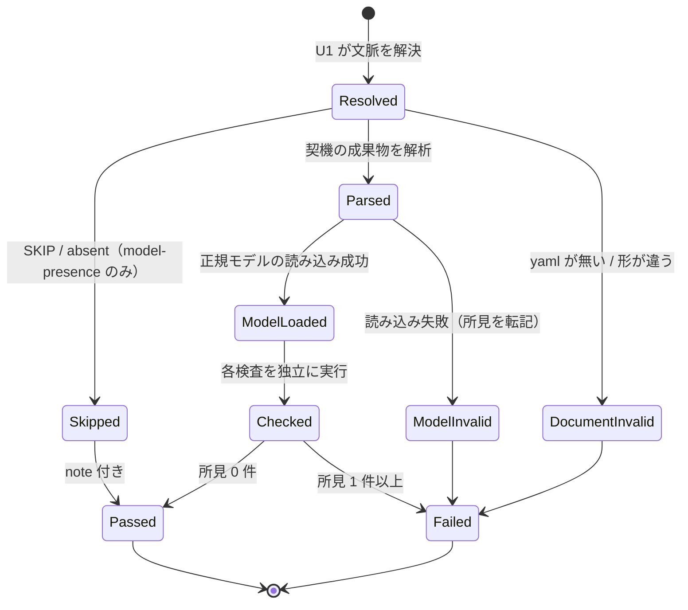
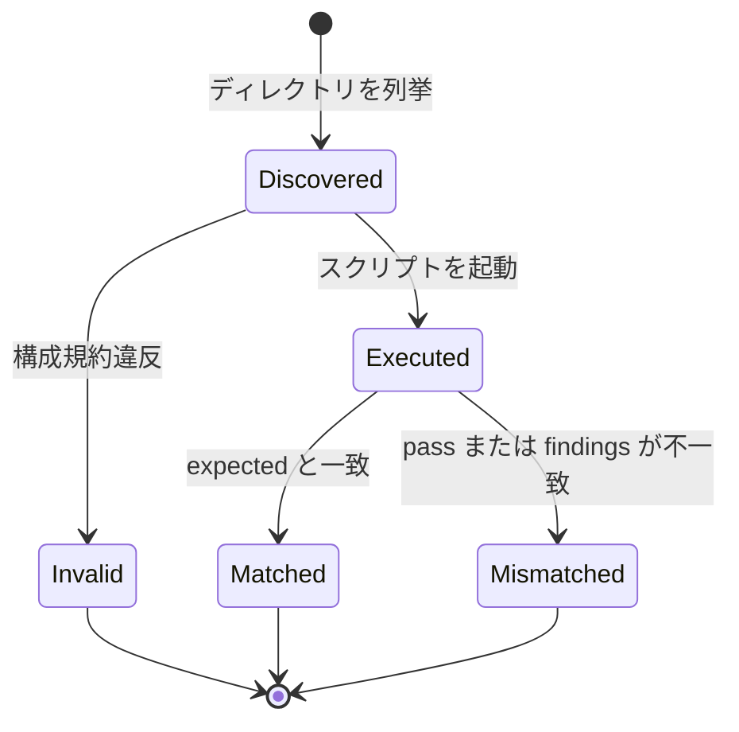
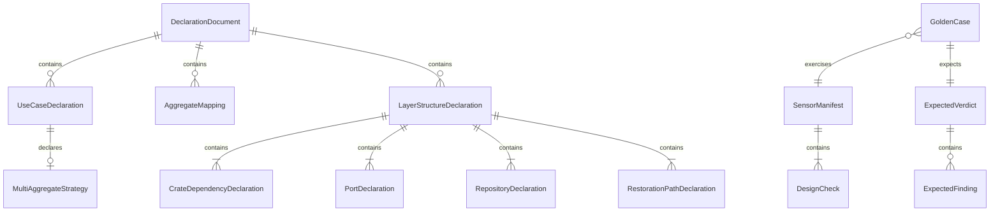

# 機能仕様 — U4 設計センサー（u4-design-sensors）

## Sources

- `inception/units-generation/unit-of-work.md`（U4 = DesignSensorSuite + GoldenCaseSuite（規約と設計センサー分）。統合点はマニフェスト ID、成果物論理名、fixture 規約）
- `inception/units-generation/unit-of-work-story-map.md`（U4 の要件と横断要件）
- `inception/requirements-analysis/requirements.md`（FR6、FR8.1、FR8.2、FR8.7、NFR4、および検査対象の FR1.8、FR3、FR4、FR5）
- `inception/domain-design/components.md`（DesignSensorSuite の振る舞いと依存元: DomainModelingStage、4 つの contribution、GoldenCaseSuite、PluginPackaging）
- `inception/domain-design/decisions.md`（ADR-002、ADR-004、ADR-008、ADR-009）
- `construction/u4-design-sensors/functional-design/entities.md`（型定義。ER 図はここから導出）
- `construction/u4-design-sensors/functional-design/rules.md`（規則。要約表はここから導出）
- U1 の設計 `construction/u1-sensor-foundation/functional-design/functional-spec.md`（runSensor、loadDomainModel、checkCompleteness、readStageStatus、index.resolve）

本書はワークフローと状態機械の正である。U4 は 6 本のセンサースクリプトと fixture の集合で、公開する API は無い（統合点はマニフェスト ID と宣言成果物の形式）。

## 1. マニフェストの実体

| id | 重大度 | 契機（matches） | 束ねる側 | 検査（rule_id） |
|---|---|---|---|---|
| `ddd-model-completeness` | blocking | `**/domain-modeling/domain-model.yaml` | U6 の `sensors:` | `model-completeness.schema` / `.i` / `.ii` / `.iv` / `.f-missing` / `.f-unknown` / `.f-invariant` / `.f-absent` |
| `ddd-model-presence` | blocking | `**/domain-design/components.md` | U7 domain-design の `adds.sensors` | `model-presence.missing` / `.invalid` / `.unresolved`（SKIP / absent は note で pass） |
| `ddd-reference-ids` | blocking | `**/domain-design/ddd-aggregate-mapping.md`、`**/functional-design/ddd-use-case-declarations.md` | U7 domain-design / functional-design の `adds.sensors` | `reference-ids.document` / `.model` / `.undefined` / `.deprecated` / `.kind` / `.malformed` / `.cycle` / `.missing` |
| `ddd-mapping-declarations` | blocking | 同上 | 同上 | `mapping-declarations.aggregate-unmapped` / `.axes` / `.duplicate` / `.use-case-item` / `.multi-aggregate-strategy` / `.process-manager-required` / `.j` |
| `ddd-layer-structure` | blocking | `**/infrastructure-design/ddd-layer-structure.md` | U7 infrastructure-design の `adds.sensors` | `layer-structure.item` / `.cqrs-sides` / `.dependencies-incomplete` / `.k` / `.l` / `.m-name` / `.m-media` / `.n` |
| `ddd-design-advisories` | advisory | `**/functional-design/ddd-use-case-declarations.md`、`**/infrastructure-design/ddd-layer-structure.md` | U7 functional-design / infrastructure-design の `adds.sensors` | `design-advisories.multi-aggregate` / `.repository-scope` / `.store-upsert` |

実行スクリプトは `tools/ddd-sensor-model-completeness.ts` のように 1 マニフェスト 1 本、いずれも U1 の `runSensor` に評価コールバックを渡す薄いファイル。

## 2. 宣言成果物の形式（U7 への契約）

3 つの `ddd-` 成果物は Markdown で、最初の fenced `yaml` ブロックを正とし、人間向けの表を併記する（ADR-008）。yaml の最上位は `schema_version: 1`、`model_ref`、そして成果物ごとのリスト（`aggregate_mappings:` / `use_cases:` / `layer_structures:`）。各要素の属性は entities.md の AggregateMapping / UseCaseDeclaration / LayerStructureDeclaration のとおり。U7 の contribution はこの形式を fragments で指示し、U8 のナレッジはこの形式を説明する。

## 3. ワークフロー

### WF1. 共通の実行手順（6 本共通）

1. U1 の `runSensor` が引数を解釈し、記録ディレクトリを解決する（U1 WF1）。
2. 評価コールバックが契機の成果物を読む。宣言成果物なら最初の fenced yaml を取り出して解析する。yaml が無い／形が違えば `<manifest>.document` の所見で終える。
3. 必要なら正規モデルを U1 で読み込む。読み込み失敗は `<manifest>.model`（または `model-completeness.schema`）として U1 の所見を転記する。
4. マニフェスト固有の検査（WF2〜WF7）を独立に走らせ、所見を積む。ある検査の失敗が他の検査を止めない（入力そのものが読めない場合を除く）。
5. U1 が整列・採番・verdict 出力を行う。severity はマニフェストの重大度。

### WF2. model-completeness（domain-modeling のゲート）

1. 契機の `domain-model.yaml` を読み込む。失敗なら `model-completeness.schema` で終える（BR2.1）。
2. `checkCompleteness` の所見を `.i` / `.ii` に転記する（BR2.2）。
3. 索引の unresolved 参照を `.iv` にする（BR2.3）。
4. 同じディレクトリの `domain-model.md` を読む。無ければ `.f-absent`。あれば ID と行を抽出し、`.f-missing` / `.f-unknown` / `.f-invariant` を判定する（BR2.4、Q2）。
5. 所見が 0 件なら pass。

### WF3. model-presence（domain-design のゲート）

1. 契機は `components.md`。中身は読まない（BR3.1）。
2. `readStageStatus(domain-modeling)`。SKIP / absent なら note を付けて pass（BR3.2）。
3. EXECUTE なら `<record>/inception/domain-modeling/domain-model.yaml` の存在 → 読み込み → 参照解決を順に確認し、`.missing` / `.invalid` / `.unresolved` を判定する（BR3.3）。

### WF4. reference-ids（domain-design / functional-design のゲート）

1. 契機の宣言成果物を解析する（BR4.1）。
2. `model_ref` の正規モデルを読み込む。
3. 宣言中の全 ID を `index.resolve(id, expectedKind)` で解決し、`.undefined` / `.deprecated` / `.kind` / `.malformed` を判定する（BR4.2）。系譜の循環は読み込み時の所見を `.cycle` として転記する（BR4.3）。
4. domain-design では各 mapping の `reference_ids` が空でないことを確認する（BR4.4）。

### WF5. mapping-declarations（domain-design / functional-design のゲート）

1. 契機の宣言成果物と正規モデルを読み込む。
2. domain-design: 全 Aggregate の mapping 存在、2 軸、重複を判定する（BR5.1）。
3. functional-design: 各ユースケースの必須 6 項目と複数集約時の戦略を判定する（BR5.2）。対象集約がすべてアクターモデルなら Process Manager 参照を要求する（BR5.3。`ddd-aggregate-mapping` を `<record>/inception/domain-design/` から読む。無ければ判定を省略し note に記す）。
4. 正規モデルの `checkCompleteness` から `idempotency.j` を `.j` として転記する（BR5.4）。

### WF6. layer-structure（infrastructure-design のゲート）

1. 契機の `ddd-layer-structure` を解析し、必須項目を確認する（BR6.1）。
2. 各コンテキストについて (k)(l) を `crate_dependencies` に対して判定する（BR6.2、BR6.3）。
3. `repositories` の各名前に (m) を判定する（BR6.4）。
4. 対象 Aggregate の集合を `ddd-aggregate-mapping`（あれば）か正規モデルから求め、(n) を判定する（BR6.5）。
5. Rust コードと Cargo.toml は読まない（BR6.6）。

### WF7. design-advisories（functional-design / infrastructure-design のゲート）

1. 契機の成果物を解析する。
2. use-case-declarations なら複数集約更新を（BR7.1）、layer-structure ならリポジトリスコープと store の意味を（BR7.2、BR7.3）advisory 所見にする。
3. 所見があれば pass:false。マニフェストが advisory なのでゲートは開く（BR7.4）。

### WF8. ゴールデンケースの実行（`bun test tests/golden/design/`）

1. ランナーは `tests/golden/design/` 配下の全ケースディレクトリを列挙する（`<sensor-id>/<case-name>/`）。
2. 各ケースについて、`expected.json` を読み（起動引数 `stage` / `output_path` と期待結果を 1 ファイルで持つ。BR8.2）、`record/` を一時ディレクトリにコピーし（書き込み禁止を保証するため）、`output_path` をコピー先に対して絶対化して、スクリプトを実運用と同じ引数（`--stage`、`--output-path`）で起動する（BR8.4）。
3. 標準出力の JSON を解析し、`pass` と findings の集合（rule_id、file、line）を expected と比較する（BR8.2）。
4. 網羅性テストとして、各マニフェストの rule_id 一覧に対して violation ケースが 1 件以上あることを確認する（BR8.3）。
5. 決定性テストとして、各 suite の代表ケースを 3 回実行し JSON の一致を確認する（BR8.5）。
6. fixture の構成規約（BR8.1）はランナーの検証項目にも含める（不正な構成はテスト失敗）。U5 は同じランナーを `tests/golden/rust/` に対して使う。

## 4. 状態機械

### SM1. 1 回の検査実行の状態（6 本共通）

<!-- Text fallback: 文脈解決後、model-presence だけは SKIP / absent で Skipped（note 付き pass）へ短絡する。契機の成果物の解析に失敗すれば DocumentInvalid、正規モデルの読み込みに失敗すれば ModelInvalid で Failed。解析と読み込みに成功すれば各検査を独立に実行し、所見 0 件なら Passed、1 件以上なら Failed。 -->

### SM2. ゴールデンケースの状態

<!-- Text fallback: 列挙したケースは構成規約違反なら Invalid、正しければスクリプトを起動して Executed になり、expected と一致すれば Matched、しなければ Mismatched で終わる。Invalid と Mismatched はテスト失敗。 -->

## 5. ER 図（entities.md から導出）

<!-- Text fallback: SensorManifest は複数の DesignCheck を含む。DeclarationDocument は AggregateMapping・UseCaseDeclaration・LayerStructureDeclaration を含み、UseCaseDeclaration は任意の MultiAggregateStrategy を、LayerStructureDeclaration は CrateDependencyDeclaration・PortDeclaration・RepositoryDeclaration・RestorationPathDeclaration を含む。GoldenCase は 1 つの SensorManifest を対象にし、ExpectedVerdict とその ExpectedFinding を持つ。 -->

## 6. ルール要約（rules.md から導出）

| 群 | 内容 | 時点 |
|---|---|---|
| BR1 マニフェスト | 形、重大度と契機、matches、timeout、U1 への委譲 | 作成時 |
| BR2 model-completeness | 読み込み、(i)〜(iv)、(v)/(f)、意味判断は扱わない | domain-modeling ゲート |
| BR3 model-presence | components.md 契機、EXECUTE 判定、欠落・不正・未解決 | domain-design ゲート |
| BR4 reference-ids | 宣言の形、ID 解決、循環、reference_ids 必須 | domain-design / functional-design ゲート |
| BR5 mapping-declarations | 2 軸、6 項目、PM 必須化、(j) | 同上 |
| BR6 layer-structure | 必須項目、(k)(l)(m)(n) | infrastructure-design ゲート |
| BR7 design-advisories | 複数集約、スコープ、upsert、止めない | functional-design / infrastructure-design ゲート |
| BR8 ゴールデンケース | 構成、expected、網羅、入口、決定性、投影外 | テスト時 |

## 7. 統合点と境界

- U1: すべてのスクリプトは `runSensor` で起動し、正規モデルの読み込み・完全性検査・参照解決・状態ファイルの読み取りを U1 に委ねる。U4 は成果物（yaml 宣言と md）の解析と、検査の判定だけを持つ。
- U6: `ddd-model-completeness` を `sensors:` に列挙する。md の書き方（Q2 の約束）は U6 の手順が指示する。
- U7: 4 つの contribution が `adds.sensors` で ID を束ね、fragments で §2 の宣言形式を指示する。
- U5: `tests/golden/rust/` で同じ fixture 規約とランナーを使う。
- U9: `bun run check` が `tests/golden/` を実行する。
- ゲート発火の性質: 存在する宣言済み成果物にだけ発火するため、契機はコアが必ず書く成果物か、`adds.produces` で必須化された成果物に限る（Q3）。

## 8. 未決事項の扱い

- (m) の媒体語の一覧（BR6.4）は初版の固定リストであり、ゴールデンケースで見直す。
- Q2 の md 整合検査で、コードスパン内の ID を「出現」として数えるかは「数える」を採る（見出し・表・本文のどこに書いてもよい）。除外したい ID は md に書かないことで対応する。
