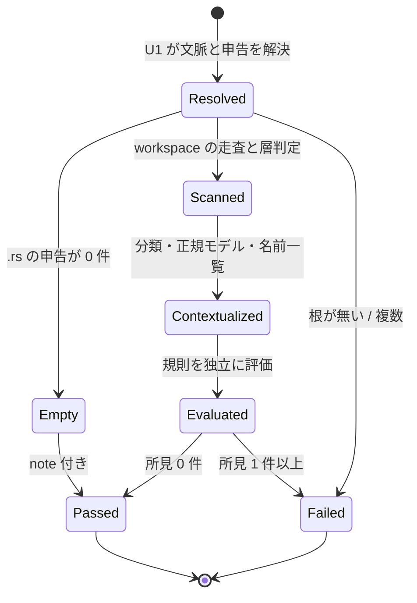
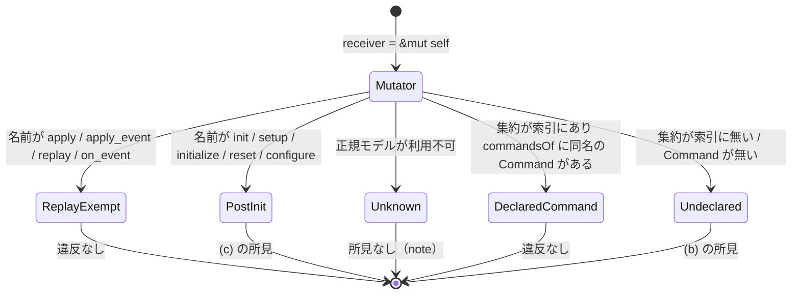
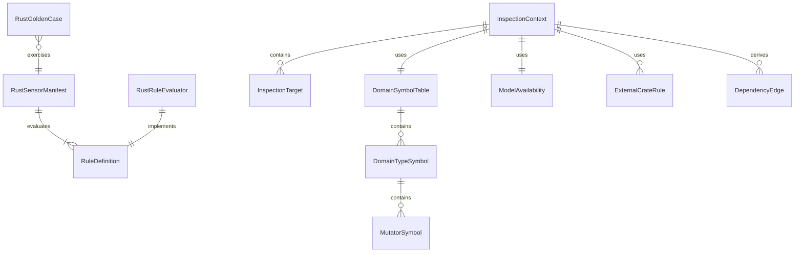

# 機能仕様 — U5 Rust コードセンサー（u5-rust-code-sensors）

## Sources

- `inception/units-generation/unit-of-work.md`（U5 = RustCodeSensorSuite + GoldenCaseSuite（Rust センサー分）。統合点はマニフェスト ID と rule_id、U1 / U2 の API）
- `inception/units-generation/unit-of-work-story-map.md`（U5 の要件と横断要件 FR7.2〜FR7.5、FR7.8〜FR7.11、FR8.7、NFR1、NFR3）
- `inception/requirements-analysis/requirements.md`（FR7、FR8.3、FR8.6、FR9.5、NFR1、NFR3）
- `inception/domain-design/components.md`（RustCodeSensorSuite の振る舞いと依存: RustSyntaxAnalyzer、WorkspaceLayerResolver、SensorRuntime、DomainModelSchema。依存元: CodeGenerationContribution、GoldenCaseSuite、PluginPackaging）
- `inception/domain-design/decisions.md`（ADR-001、ADR-002、ADR-003、ADR-005、ADR-009）
- `construction/u5-rust-code-sensors/functional-design/entities.md`（型定義。ER 図はここから導出）
- `construction/u5-rust-code-sensors/functional-design/rules.md`（規則。要約表はここから導出）
- U1 の設計 `construction/u1-sensor-foundation/functional-design/functional-spec.md`（runSensor、readSourceClaims、readStageStatus、loadDomainModel、index.resolve / commandsOf）
- U2 の設計 `construction/u2-rust-analysis-foundation/functional-design/functional-spec.md`（scanWorkspace、assignLayers、classifyFile、isAllowed、parse と問い合わせ）
- U4 の設計 `construction/u4-design-sensors/functional-design/functional-spec.md`（マニフェストの形、ゴールデンケースのランナー WF8）

本書はワークフローと状態機械の正である。U5 は 3 本のセンサースクリプトと規則モジュール、fixture の集合で、公開する API は無い（統合点はマニフェスト ID、rule_id、U1 / U2 の API）。

## 1. マニフェストの実体

| id | 対象層 | 契機（matches） | 束ねる側 | 評価する規則（rule_id） |
|---|---|---|---|---|
| `ddd-rust-domain` | domain | `**/code-summary.md` | U7 code-generation の `adds.sensors` | `a` 公開フィールド、`b` 未宣言の状態変更、`c` 不完全な生成経路、`d` getter 呼び出し、`g` 依存方向違反（層間・外部 I/O。FR9.5 の安全網）、`layer.<code>` 層診断の転記、`model.invalid` |
| `ddd-rust-use-case` | use-case | 同上 | 同上 | `g` DIP 違反、`h` execute の引数、`i` ユースケース間呼出、`d` getter 呼び出し |
| `ddd-rust-interface-adapter` | interface-adapter、rmu、および実効層に関わらず cqrs_side = query のファイル（`includes_query_side`、BR1.2） | 同上 | 同上 | `k` コマンド側⇄クエリ側、`l` クエリ側のドメイン型参照、`m` リポジトリ命名、`n` 復元経路の迂回、`g`（IA 層・rmu の許可外依存方向） |

実行スクリプトは `tools/ddd-sensor-rust-domain.ts` / `tools/ddd-sensor-rust-use-case.ts` / `tools/ddd-sensor-rust-interface-adapter.ts` の 3 本。いずれも U1 の `runSensor` に「対象層」と「評価する rule_id 一覧」を渡す薄いファイルで、共通手順（WF1）は `tools/ddd/lib/rules/` の 1 つの評価器が担う。3 本とも blocking で、`fire_on: gate`、timeout 10 秒（軟らかい予算 9000 ms）。

## 2. 規則モジュールの構成

```
tools/ddd/lib/rules/
  definitions.ts        # RuleDefinition の一覧（言語非依存: rule_id、statement、target_layers、requires_model、facts、source）
  lists.ts              # 固定リスト: replay 除外名、後付け初期化名、媒体語、I/O クレート一覧（U4 と共有）
  context.ts            # InspectionContext の組み立て（WF1 の手順 2〜6）
  evaluate.ts           # マニフェストごとの評価ループ（WF1 の手順 7〜8）
  rust/
    symbols.ts          # DomainSymbolTable の作成（WF2）
    a-public-field.ts … n-restoration-bypass.ts、edges.ts   # RustRuleEvaluator（1 規則 1 ファイル）と依存辺の作成
```

定義と判定器の分離は FR8.6 のため（第 2 言語は `rules/<lang>/` を追加する）。固定リストは `lists.ts` に 1 か所で置き、U4 の媒体語一覧と同じ値を使う（ADR-009 で設計側とコード側の意味を揃える）。

## 3. ワークフロー

### WF1. 共通の実行手順（3 本共通）

1. U1 の `runSensor` が引数を解釈し、記録ディレクトリと Unit を解決する（U1 WF1）。Unit が無ければ U1 が pass:false（unit-unresolved）で終える。
2. `readSourceClaims(ctx, { extensions: [".rs"] })` で申告ソースを解決する（BR2.1）。範囲外・欠落の所見は U1 のものをそのまま積む。.rs が 0 件なら note "no rust sources claimed" で pass（BR2.2）。
3. 申告ファイルの祖先から Cargo workspace の根を決め、U2 `scanWorkspace` → `assignLayers` を実行する（BR2.3）。根が無い／複数ある場合は所見にして終える。
4. 各申告ファイルを U2 `classifyFile` で分類し、実効層がマニフェストの対象層なら targets、それ以外は skipped に振り分ける。`ddd-rust-interface-adapter` は cqrs_side = query のファイルも実効層に関わらず targets に加える（BR1.2、BR2.4）。層診断は `ddd-rust-domain` だけが `layer.<code>` として所見にする（BR1.3）。
5. `readStageStatus(domain-modeling)` と `loadDomainModel` で ModelAvailability を決める（BR3.4）。invalid なら `model.invalid` を所見にする。
6. DomainSymbolTable を作る（WF2）。
7. targets の各ファイルを U2 `parse` し、不透明領域を InspectionContext.opaque に集める。マニフェストの rule_id 一覧のうち `per_file = true` の判定器をファイルごとに、`per_file = false` の判定器（依存辺）を文脈全体で 1 回、独立に評価する。ある判定器の所見が他を止めない。ファイル境界ごとに予算を確認する（BR8.2）。
8. 所見を (file, line, rule_id) で統合し（BR7.4）、不透明領域を note に列挙し（BR7.3）、skipped の件数と理由、ModelAvailability の note を合わせて U1 に返す。U1 が整列・採番・verdict 出力を行う。

### WF2. ドメイン型の名前一覧の作成（`symbols.ts`）

1. `assignments` から `layer = domain` のクレートを取り、各クレートの lib / bin ターゲットの `src_path` の祖先ディレクトリ配下の `.rs` をパス昇順に列挙する（auxiliary は含めない）（BR3.1、BR8.3）。
2. 各ファイルを U2 `parse` し、`structs` と `impls` を取り出す。同一実行内の再解析は U2 のキャッシュで避ける。
3. struct / enum ごとに DomainTypeSymbol を作る: `aggregate_slug`（PascalCase → ケバブ）、`getters`（固有 impl の `body_shape = returns-field-only`）、`constructors`（receiver なしで戻り型が Self 系）、`mutators`（receiver = mut-self）、`has_default`、`non_private_fields`（BR3.2）。
4. 各 mutator を分類する: replay-exempt → post-init → unknown（正規モデル利用不可）→ declared-command / undeclared。正規モデルが available なら `index.resolve("aggregate.<aggregate_slug>", aggregate)` で型が集約ルートかを確かめ、`index.commandsOf("aggregate.<aggregate_slug>")` の Command 集合の名前セグメントと `command_slug` を照合する（BR3.3）。
5. `getter_names` と `type_names` の和集合を作り、`file_count` を記録する。

名前変換の例:

| Rust の字面 | 変換後 | 照合先 |
|---|---|---|
| `struct Invoice` | `invoice` | `aggregate.invoice` |
| `struct InvoiceLine` | `invoice-line` | `aggregate.invoice-line`（集約でなければ一致せず、`&mut self` は違反） |
| `fn issue(&mut self)` on `Invoice` | `issue` | `command.invoice.issue` |
| `fn add_item(&mut self)` on `Cart` | `add-item` | `command.cart.add-item` |
| `fn apply_event(&mut self)` | — | replay-exempt（照合しない） |
| `fn init(&mut self)` | — | post-init（(c) の違反） |

### WF3. ドメイン層の評価（`ddd-rust-domain`）

targets（実効層 domain）の各ファイルについて:

1. **(a)** `structs` の各 struct のフィールドで visibility ≠ private → 所見 `a`（BR4.1）。
2. **(b)** そのファイルで impl されているドメイン型の mutators のうち classification = undeclared → 所見 `b`（BR4.2）。unknown は所見にせず note に従う。
3. **(c)** c-literal（固有 impl の外の struct リテラル / update 構文）、c-default（derive / impl / 呼び出し）、c-post-init を独立に判定 → 所見 `c`（BR4.3）。
4. **(d)** `calls` の method-call でレシーバが self 以外、callee が `getter_names` に含まれる → 所見 `d`（BR4.4）。

文脈全体で 1 回: 申告ファイルの所属クレートの依存辺を作り（BR6.1）、layer-forbidden と external-io をどちらも `g` にする（BR4.5。FR9.5 の安全網）。

### WF4. ユースケース層の評価（`ddd-rust-use-case`）

文脈全体で 1 回: 依存辺の layer-forbidden / external-io → 所見 `g`（BR5.1）。

targets（実効層 use-case）の各ファイルについて:

1. **(h)** name = execute の各引数の型の最外がドメイン型（Id で終わる型を除く）→ 所見 `h`（BR5.2）。
2. **(i)** self 以外への `execute` 呼び出し、`<Type>::execute` の path-call → 所見 `i`（BR5.3）。
3. **(d)** WF3 の手順 4 と同じ（BR5.4）。

### WF5. インターフェイスアダプタ層の評価（`ddd-rust-interface-adapter`）

文脈全体で 1 回: 依存辺のうち cross-side → 所見 `k`（BR6.2）。IA 層・rmu クレートの layer-forbidden → `g`。

targets（実効層 interface-adapter / rmu、および実効層に関わらず cqrs_side = query のファイル）の各ファイルについて:

1. **(l)** cqrs_side = query のファイルで、use の末尾セグメント・フィールド型・引数型の最外がドメイン型または `*Repository` → 所見 `l`（BR6.3）。
2. **(m)** `*Repository` の trait / struct / type の名前を集約名集合と媒体語で照合 → 所見 `m`（BR6.4）。
3. **(n)** ドメイン型の構築箇所が struct リテラル / update 構文 / Default、または constructors に無い関連関数 → 所見 `n`（BR6.5）。

判定の決定表（代表例、cqrs_side = command の IA 層ファイル）:

| コード | 規則 | 結果 |
|---|---|---|
| `let inv = Invoice { id, lines: vec![] };` | n | 所見（struct-literal） |
| `let inv = Invoice::restore(row.id, row.lines)?;`（`restore` が `Result<Self, _>` を返す） | n | なし |
| `let inv = Invoice::default();` | n | 所見（default-call） |
| `agg.apply_event(ev);`（replay） | n | なし（replay-exempt） |
| `trait InvoiceRepository { fn store(..) }` | m | なし |
| `trait DynamoDbInvoiceRepository` | m | 所見（媒体語） |
| `struct InMemoryInvoiceRepository` | m | なし（実装名） |
| `struct OrderStore` | m | なし（Repository で終わらないため対象外。命名の強制は設計側 U4 が担う） |
| `use billing_query_dao::InvoiceDao;`（command 側から） | k | 所見（cross-side） |
| `use billing_command_domain::Invoice;`（rmu から） | k | なし |

### WF6. 依存辺の作成（`edges.ts`、3 本共通）

1. 申告ファイルの `uses` から `first_segment` を取り、crate / self / super / std / core / alloc を除く。メンバークレート名（ハイフン ↔ アンダースコア正規化）に一致すれば内部辺、denylist に一致すれば外部辺、それ以外は無視する。
2. 所属クレートの Cargo.toml の `internal_dependencies` と外部依存からも辺を作る（file は Cargo.toml、line は無し）。
3. 内部辺は U2 `isAllowed(from, to)` の理由コードを verdict にする。外部辺は from の層が domain / use-case なら external-io、それ以外は ok（BR6.1）。
4. 辺を (file, line, to_crate) で整列し、同じ (from, to) が use と Cargo の両方にあれば use 側を残す（BR5.1、BR7.4）。

### WF7. ゴールデンケースの実行（`bun test tests/golden/rust/`）

U4 WF8 のランナーを `tests/golden/rust/` に対して使う。差分は次の 2 点（BR10.1）:

1. `record/` と `workspace/` を同じ一時ディレクトリ配下にコピーし、`workspace_root` を揃える（`source-manifest.json` の申告は workspace/ 内の相対パス）。
2. `expected.json` の `stage` は `code-generation`、`output_path` は `construction/<unit>/code-generation/code-summary.md`。

網羅性（BR10.2）、正規モデル無し／不正のケース（BR10.3）、決定性 3 回実行と性能計測（BR10.4）を含める。

## 4. 状態機械

### SM1. 1 回の検査実行の状態（3 本共通）



<!-- Text fallback: 文脈解決後、.rs の申告が無ければ Empty（note 付き pass）。workspace の根が決まらなければ Failed。走査・層判定・分類・正規モデル・名前一覧を経て Contextualized になり、規則を独立に評価して所見 0 件なら Passed、1 件以上なら Failed。 -->

### SM2. `&mut self` メソッドの分類（WF2 手順 4）



<!-- Text fallback: &mut self メソッドは、replay 除外名なら ReplayExempt（違反なし）、後付け初期化名なら PostInit（(c) の所見）、正規モデルが無ければ Unknown（所見なし、note）、型が集約ルートとして索引にあり commandsOf の Command 集合に同名があれば DeclaredCommand（違反なし）、集約でないか Command が無ければ Undeclared（(b) の所見）に分かれる。評価順は ReplayExempt → PostInit → Unknown → Declared / Undeclared。 -->

## 5. ER 図（entities.md から導出）



<!-- Text fallback: RustSensorManifest は複数の RuleDefinition を評価し、各 RuleDefinition に 1 つの RustRuleEvaluator が対応する。InspectionContext は InspectionTarget、DomainSymbolTable、ModelAvailability、ExternalCrateRule を束ね、DependencyEdge を導出する。DomainSymbolTable は DomainTypeSymbol を、DomainTypeSymbol は MutatorSymbol を含む。RustGoldenCase は 1 つの RustSensorManifest を対象にする。 -->

## 6. ルール要約（rules.md から導出）

| 群 | 内容 | 時点 |
|---|---|---|
| BR1 マニフェスト | 3 本 blocking、層ごとの担当（クエリ側は IA が兼ねる）、層診断の転記、無実行 | 作成時・文脈組み立て時 |
| BR2 対象 | 申告 .rs、空申告、workspace の根、分類 | 文脈組み立て時 |
| BR3 名前一覧 | ドメイン層全クレート、型の要約、&mut self の分類、正規モデルの利用可否 | 文脈組み立て時 |
| BR4 ドメイン層 | (a)(b)(c)(d)、(g) 依存方向 | 評価時 |
| BR5 ユースケース層 | (g)(h)(i)(d) | 評価時 |
| BR6 IA 層 | 依存辺、(k)(l)(m)(n) | 評価時 |
| BR7 報告 | 4 項目、構文のみ、不透明領域は note、重複統合 | 報告時 |
| BR8 決定性・性能 | 3 回一致、予算、一覧の範囲 | 常時 |
| BR9 分離 | 定義と判定器、固定リスト | 常時 |
| BR10 ゴールデンケース | 構成、網羅、正規モデル無し、ランナー | テスト時 |

## 7. 統合点と境界

- U1: `runSensor`、`readSourceClaims`、`readStageStatus`、`loadDomainModel`、`index.resolve`（集約の存在確認）、`index.commandsOf`（(b) の Command 集合）を使う。所見の形式と決定性は U1 の契約に従う。
- U2: `scanWorkspace`、`assignLayers`、`classifyFile`、`isAllowed`、`parse` と各問い合わせを使う。層診断と不透明領域はそのまま転記する。tree-sitter の Node は扱わない。
- U4: マニフェストの形、fixture の規約、ランナー、媒体語一覧を共有する。設計側の (k)(l)(m)(n) は U4 が宣言に対して、コード側は本 Unit が申告ソースに対して検査する（ADR-009）。rule_id は設計側が `layer-structure.k` のようにマニフェスト名を接頭辞に持ち、コード側は `k` の 1 文字なので衝突しない。依存方向違反（FR9.5）はコード側では別 ID を設けず、要件の受け入れ基準どおり `g` で報告する。
- U7: `contributions/construction/code-generation.md` の `adds.sensors` に 3 本の ID を列挙し、fragments で命名・配置規約（U2 の `conventions()`）と「Command 以外の状態変更メソッドを書かない」「`&mut self` の replay 経路は `apply_event` 等の名前にする」「execute の引数は ID と VO」を指示する。
- U8: 規則 (a)〜(n) の対応表と固定リスト（replay 除外名、後付け初期化名、I/O クレート一覧）をナレッジに転記する。索引先はゴールデンケースの clean fixture。
- U9: `bun run check` が `tests/golden/rust/` を実行し、README にセンサー一覧 (a)〜(n) と固定リストを載せる。

## 8. 未決事項の扱い

- (c-model)「正規モデルの FactoryRule が挙げる前提条件を検査しない復元経路」は、構文だけでは前提条件の検査有無を判定できないため初版では所見にしない。ナレッジ（factory-naming、完全コンストラクタ）と設計側の `restoration_paths`（U4 の (n)）で補う。
- `&self` に内部可変性（RefCell / Cell / Mutex）を持ち込む setter の偽装は初版では検査せず、ナレッジ interior-mutability に委ねる。フィールド型の字面に RefCell< / Cell< / Mutex< を含むかで (a) の派生として検出する案はゴールデンケースで検討する。
- I/O クレートの固定一覧（Q6）と媒体語一覧はゴールデンケースで見直す。一覧は `lists.ts` の 1 か所にある。
- NFR3 の目安（200 ファイルで 10 秒）は仮置き。名前一覧の作成がドメイン層全体を読むため、性能計測ケース（BR10.4）の結果で見直す。
