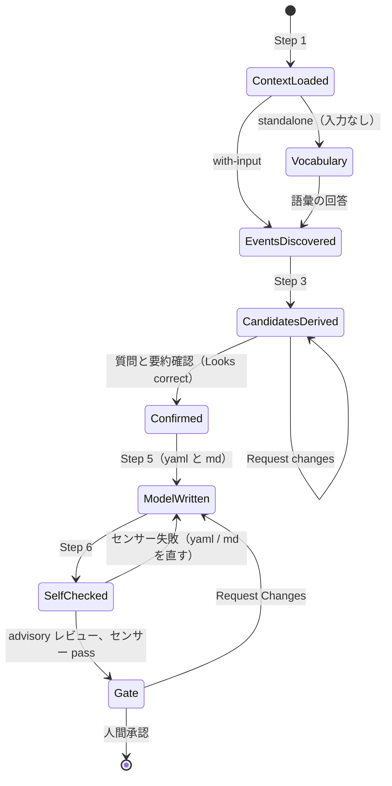
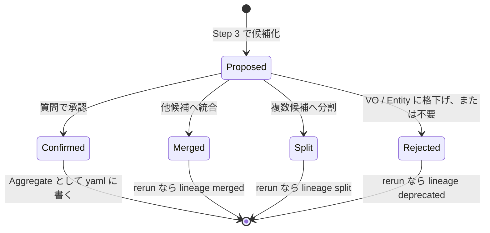
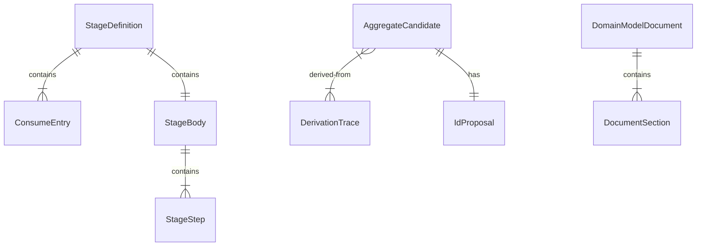

# 機能仕様 — U6 domain-modeling ステージ（u6-domain-modeling-stage）

## Sources

- `inception/units-generation/unit-of-work.md`（U6 = DomainModelingStage、kind: spec。統合点は frontmatter の宣言（produces / sensors / requires_stage）とナレッジの参照）
- `inception/units-generation/unit-of-work-story-map.md`（U6 の要件 FR1、FR1.1〜FR1.9 と横断要件 FR1.7 / FR1.8）
- `inception/requirements-analysis/requirements.md`（FR1、FR2、FR6.5）
- `inception/domain-design/components.md`（DomainModelingStage の振る舞いと依存: DomainModelSchema、DesignSensorSuite、DddKnowledgePack。依存元: PluginPackaging）
- `inception/domain-design/decisions.md`（ADR-004、ADR-006、ADR-007、ADR-010）
- `construction/u6-domain-modeling-stage/functional-design/entities.md`（型定義。ER 図はここから導出）
- `construction/u6-domain-modeling-stage/functional-design/rules.md`（規則。要約表はここから導出）
- U1 の設計 `construction/u1-sensor-foundation/functional-design/functional-spec.md`（SM2 要素 ID のライフサイクル、WF2 読み込みと検証）
- U4 の設計 `construction/u4-design-sensors/functional-design/functional-spec.md`（WF2 model-completeness）
- コアの `stage-protocol.md` §3（質問の流れ、Consolidated Summary Confirmation）、`stage-definition.md`（本文の区画）

本書はステージ定義の構成と、ステージが実行されたときの手順（ワークフロー）・状態機械の正である。U6 は spec Unit なので「ワークフロー」はリード（architect）が従う手順であり、実行時のコードは持たない。

## 1. ステージ定義の frontmatter（確定値）

```yaml
slug: domain-modeling
plugin: ddd
phase: inception
execution: CONDITIONAL
lead_agent: aidlc-architect-agent
support_agents: [aidlc-product-agent]
mode: inline
summary_confirmation: required
reviewer: aidlc-architecture-reviewer-agent
review_artifact: ddd-domain-model
review_class: advisory
reviewer_max_iterations: 1
produces: [ddd-domain-model, ddd-domain-model-yaml]
requires_stage: [requirements-analysis, user-stories]
scopes: [enterprise, feature, mvp, classic, workshop, refactor]
sensors: [ddd-model-completeness]
```

`consumes` は `requirements` / `stories`（`required: false`）、`architecture` / `component-inventory`（`required: false`、`conditional_on: brownfield`）。`condition`、`inputs`、`outputs` は英語の一文（entities.md の StageDefinition）。成果物は `<record>/inception/domain-modeling/domain-model.md` と `domain-model.yaml`、質問ファイルは `domain-modeling-questions.md`（いずれも engine-resolved、記録ディレクトリのルートは書かない）。

## 2. ステージ本文の構成（英語で執筆）

| 区画 | 内容 |
|---|---|
| Constraints | 所有権の境界（Aggregate 境界まで。モジュール・デプロイ・ユースケース手順は書かない）、コードを書かない、yaml が正で md は派生 |
| Steps | Step 1 Load context → Step 2 Discover events → Step 3 Derive aggregate candidates → Step 4 Questions and confirmation → Step 5 Write the canonical model → Step 6 Self-check → Step 7 Completion |
| Sensors | `ddd-model-completeness` の rule_id 一覧と、失敗時に直す場所（yaml / md） |
| Learn | コアの §13 への委譲 |

## 3. ワークフロー

### WF1. 入力ありの実行（with-input）

1. **Step 1 Load context**: `requirements.md`、`stories.md`（あれば）、brownfield なら `architecture.md` / `component-inventory.md` を読む。既存の `domain-model.yaml` があれば rerun（WF3）を重ねる。ナレッジ `ddd-always-valid-model.md` / `ddd-aggregate-and-invariants.md` / `ddd-layer-boundaries.md` の参照節を確認する（BR7.1）。
2. **Step 2 Discover events**: ストーリーごとに過去形のドメインイベントを列挙し、各イベントの Command と actor を書く。DerivationTrace の表を質問ファイルの下書きに残す（BR3.1、BR4.3）。
3. **Step 3 Derive aggregate candidates**: 同じ状態を変えるイベント群を候補に集め、候補ごとに不変条件の仮説と Bounded Context を書く。不変条件を持てない候補は統合または格下げの案を付ける（BR3.2）。複数集約に跨がる流れは Process Manager 候補として別表にする（BR3.3）。brownfield では既存コードの主体と照合し、差分を open-questions に書く（BR2.3）。
4. **Step 4 Questions and confirmation**: 質問ファイル `domain-modeling-questions.md` を作る。トピックは bounded-contexts、aggregate-candidates（統合・格下げの確認）、invariants、commands-and-errors（effect / state_effect / Domain Error / idempotency）、states-and-transitions、id-slugs（非 ASCII の用語があるとき）、process-managers（候補があるとき）。コアの §3 の流れで回答を集め、矛盾検出のあと Consolidated Summary Confirmation を取る（BR3.4、BR4.1）。
5. **Step 5 Write the canonical model**: 確定した候補を `domain-model.yaml`（U1 の形）に書き、`domain-model.md` を派生させる（§5 の構成、BR5.1〜BR5.3）。rerun なら lineage を更新する（BR4.2）。
6. **Step 6 Self-check**: (i)〜(v) の自己点検表を埋め、md の末尾に残す（BR6.1）。
7. **Step 7 Completion**: コアの完了手順（advisory レビュー → 学び → ゲート）。ゲート前に `ddd-model-completeness` が発火し、失敗すれば Sensors 節の案内に従って直す（BR6.2、BR6.3）。

### WF2. 入力なしの単独実行（standalone、`--stage domain-modeling --single`）

1. Step 1 で入力が無いことを確認し、standalone と判定する（BR2.1）。
2. Step 2 の前に vocabulary トピック（業務の主体、扱う「もの」、起きる出来事、守るべき約束）を質問ファイルの先頭に置き、回答を D<n> として DerivationTrace の出典にする（BR2.2）。
3. 以降は WF1 の Step 2〜7 と同じ。FR1.5 の判定「入力なしで単独実行したとき質問ファイルが生成されて対話が始まる」は手順 2 で満たす。

### WF3. 再実行（rerun、既存の `domain-model.yaml` がある）

1. Step 1 で既存 yaml を読み、要素 ID の一覧を候補の初期値にする（BR4.2）。
2. Step 3 の候補表に「既存 ID」列を足し、新規・維持・統合・分割・廃止を明示する。
3. Step 5 で維持の要素は element_id を変えず（rename は name だけ）、統合・分割・廃止は `lineage:` に relation / successors / replaced_by / deprecated_at を書く。廃止 ID は本文から消し、再利用しない。
4. md の lineage 節に変更の一覧を転記する。

### WF4. 完了条件の点検とセンサーの対応

| 条件 | 自己点検（Step 6） | 機械検査（U4 model-completeness） | 失敗時に直す場所 |
|---|---|---|---|
| (i) 全 Aggregate に不変条件 | invariants の件数 | `.i` | yaml の invariants（不変条件を持てないなら候補の統合・格下げ） |
| (ii) 全 Command に遷移または「遷移なし」 | state_effect と transitions | `.ii` | yaml の state_effect / transitions |
| (iii) 全 Command に Domain Error | domain_errors の件数 | 読み込み時 `.schema`（schema.command-no-error） | yaml の domain_errors |
| (iv) 全参照 ID が解決 | 参照属性の突合 | `.iv` | yaml の参照 ID / lineage |
| (v) md と yaml の整合 | 見出し・表の ID と statement | `.f-missing` / `.f-unknown` / `.f-invariant` / `.f-absent` | md の見出し・表 |
| (vi) 人間承認 | — | — | ゲート（advisory レビューの所見を材料に） |

## 4. 状態機械

### SM1. ステージ実行の状態



<!-- Text fallback: Step 1 で文脈を読み、入力が無ければ語彙の質問を挟んでからイベント発見に進む。集約候補を導いたら質問と要約確認で Confirmed になり、yaml と md を書いて自己点検し、センサーが pass すればゲートへ。センサー失敗やゲートの Request Changes は ModelWritten に戻る。 -->

### SM2. 集約候補の状態



<!-- Text fallback: 候補は Proposed から始まり、質問の回答で Confirmed（yaml に書く）、Merged、Split、Rejected のいずれかで終わる。再実行で既存 ID を持つ候補が Merged / Split / Rejected になったときは lineage に記録する。 -->

要素 ID そのもののライフサイクル（Live → renamed / deprecated / split / merged）は U1 の SM2 に従う。

## 5. `domain-model.md` の構成

| 節 | 見出し | 内容 |
|---|---|---|
| Sources | `## Sources` | 読んだ入力、質問ファイル、ナレッジ |
| Overview | `## Overview` | Bounded Context の一覧と責務分担の一文（モジュール・デプロイ・ユースケースは他ステージ） |
| Bounded Context | `## <name>（bc.<slug>）` | 説明。配下の Aggregate と Process Manager の一覧（element_id 付き） |
| Aggregate | `### <name>（aggregate.<slug>）` | 説明、states、Elements 表（element_id / kind / name / attributes）、Invariants 表（element_id / Statement 全文）、Commands 表（element_id / effect / state_effect / idempotency / Domain Errors）、Events 表、Errors 表（element_id / condition）、Transitions 表（element_id / from / to / command）と stateDiagram-v2 |
| Process Manager | `### <name>（pm.<slug>）` | aggregates、steps、compensations |
| Lineage | `## Lineage` | rerun の変更一覧（無ければ「None」） |
| Derivation | `## Derivation` | DerivationTrace の転記（ストーリー → イベント → Command → 集約） |
| Self-check | `## Self-check` | (i)〜(v) の点検表 |
| Open questions | `## Open questions` | 人間承認に委ねる意味判断（集約境界の妥当性など） |

## 6. ER 図（entities.md から導出）



<!-- Text fallback: StageDefinition は ConsumeEntry と StageBody を含み、StageBody は StageStep を含む。AggregateCandidate は複数の DerivationTrace から導かれ、1 つの IdProposal を持つ。DomainModelDocument は DocumentSection を含む。 -->

## 7. ルール要約（rules.md から導出）

| 群 | 内容 | 時点 |
|---|---|---|
| BR1 frontmatter | 確定値、requires_stage、scopes、produces / sensors、consumes | 定義作成時 |
| BR2 モード | with-input / standalone / rerun、語彙、brownfield | Step 1〜3 |
| BR3 導出 | イベント逆算、不変条件で境界、PM 候補、Command 属性 | Step 2〜4 |
| BR4 ID | 英語スラッグと確認、rerun の系譜、導出の記録 | Step 4〜5 |
| BR5 成果物 | yaml が正、md の約束、所有権、言語 | Step 5 |
| BR6 完了 | 自己点検、センサー案内、advisory レビュー | Step 6〜7 |
| BR7 ナレッジ・制約 | 読むナレッジ、コードを書かない | 常時 |

## 8. 統合点と境界

- U1: `domain-model.yaml` の形と ID 文法の出典。ステージ本文はスキーマの要点だけを書き、詳細は U1 の JSON Schema（契約文書）を参照する。
- U4: `ddd-model-completeness` を `sensors:` で束ねる。md の書き方（U4 Q2）は Step 5 の手順が指示する。
- U7: `domain-design` の contribution が `adds.consumes` で `ddd-domain-model-yaml` を要求し、U4 の model-presence が存在を検査する。本ステージは順序辺を持たない（ADR-007）。
- U8: Step 1 で参照するナレッジ 3 本。ADR-010 の矛盾一覧に従う。
- U3 / U9: `stages/inception/domain-modeling.md` として投影し、compose 後の `stage-graph.json` に載ること、drops ログが空であることを統合テストで確認する（FR1.1、FR1.2）。

## 9. 未決事項の扱い

- (i)〜(v) を人間承認の前に手元で機械検査する CLI（U1 の読み込み器を呼ぶ `ddd-model-check.ts` のようなもの）は本 Unit では定義しない。センサーがゲートで検査するため必須ではないが、rerun の多いプロジェクトでは有用なので U1 の code-generation 計画で検討する。
- `condition` の文言（「ドメイン概念の変更があるとき実行」）は英語で確定するが、CONDITIONAL の判定は人間が行う。SKIP のときの下流（model-presence の pass）は ADR-004 で保証済み。
