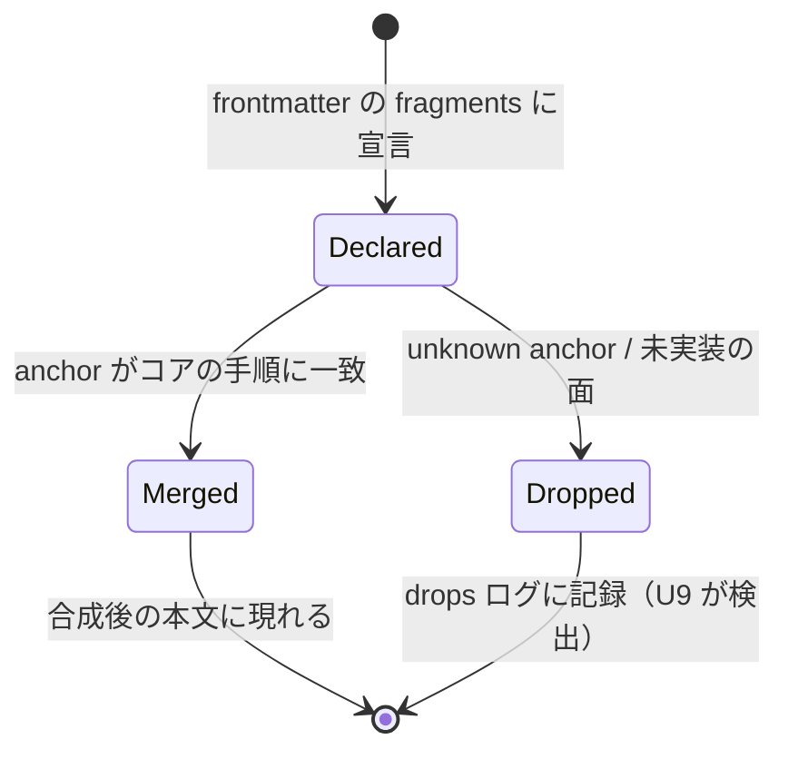
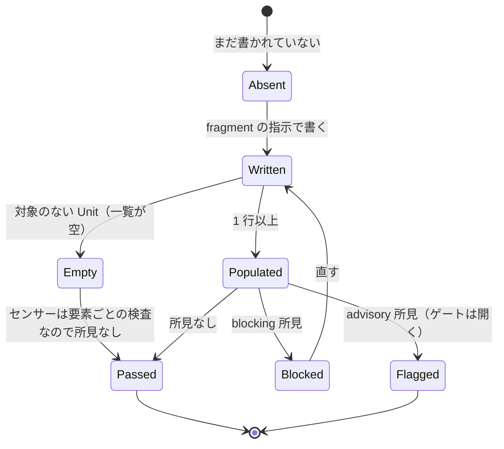
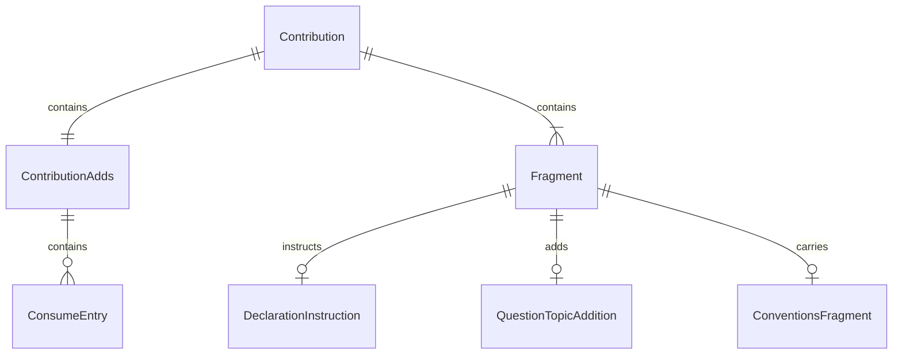

# 機能仕様 — U7 コアステージ contribution（u7-core-contributions）

## Sources

- `inception/units-generation/unit-of-work.md`（U7 = 4 つの contribution、kind: spec。統合点は `adds` の宣言と fragments が指示する宣言形式）
- `inception/units-generation/unit-of-work-story-map.md`（U7 の要件 FR3〜FR5、FR8.3 と横断要件 FR3.5 / FR4.3 / FR5.4 / FR8.3、FR11.1 / FR11.2 / FR11.5）
- `inception/requirements-analysis/requirements.md`（FR3〜FR5、FR8.3、CON1〜CON3、CON8、CON12）
- `inception/domain-design/components.md`（4 つの contribution の振る舞いと依存: DomainModelSchema、DesignSensorSuite、RustCodeSensorSuite、WorkspaceLayerResolver。依存元: PluginPackaging）
- `inception/domain-design/decisions.md`（ADR-003、ADR-005、ADR-007、ADR-008、ADR-009）
- `construction/u7-core-contributions/functional-design/entities.md`（型定義。ER 図はここから導出）
- `construction/u7-core-contributions/functional-design/rules.md`（規則。要約表はここから導出）
- U4 の設計 `construction/u4-design-sensors/functional-design/functional-spec.md` §1〜§2、U5 の設計 `construction/u5-rust-code-sensors/functional-design/functional-spec.md` §1・§7
- コアのステージ定義の Steps 番号

本書は 4 つの contribution の構成と、それがコアの手順に合成されたときの流れ（ワークフロー）の正である。U7 は spec Unit なので実行時のコードは持たない。

## 1. contribution の一覧

| target（path） | adds.consumes | adds.produces | adds.sensors | fragments（anchor / kind） |
|---|---|---|---|---|
| `domain-design`（`contributions/inception/domain-design.md`） | `ddd-domain-model-yaml`（required: true） | `ddd-aggregate-mapping` | `ddd-model-presence`、`ddd-reference-ids`、`ddd-mapping-declarations` | `after-step:2` question-topics（2 軸、写像先）/ `after-step:4` declaration-instruction（写像成果物） |
| `functional-design`（`contributions/construction/functional-design.md`） | — | `ddd-use-case-declarations` | `ddd-reference-ids`、`ddd-mapping-declarations`、`ddd-design-advisories` | `after-step:2` question-topics + procedure（規約 5 点、進行役、整合性境界、再実行可能性）/ `after-step:4` declaration-instruction（ユースケース宣言） |
| `infrastructure-design`（`contributions/construction/infrastructure-design.md`） | — | `ddd-layer-structure` | `ddd-layer-structure`、`ddd-design-advisories` | `after-step:2` question-topics + procedure（層構造、ポート規約、永続化基盤、RMU）/ `after-step:5` declaration-instruction（層構造宣言） |
| `code-generation`（`contributions/construction/code-generation.md`） | — | — | `ddd-rust-domain`、`ddd-rust-use-case`、`ddd-rust-interface-adapter` | `after-step:1` conventions（命名・配置・実装規約）/ `in:Sensors` sensor-guidance |

fragment の見出しは参照プラグインに倣い `### Step <n>x (ddd): <title>`（`in:Sensors` は見出しなしの段落）。本文は英語。

## 2. 宣言成果物の指示内容（U4 の形式への写像）

| 論理名 | 置き場所（engine-resolved） | yaml のルート | 各行の必須項目（U4 entities.md） | 空の形（Q2） |
|---|---|---|---|---|
| `ddd-aggregate-mapping` | `inception/domain-design/ddd-aggregate-mapping.md` | `schema_version: 1`、`model_ref`、`aggregate_mappings:` | aggregate_ref、programming_model、persistence_method、crate、module、repository、reference_ids（1 件以上） | 正規モデルがある限り空にならない（全 Aggregate に 1 行） |
| `ddd-use-case-declarations` | `construction/<unit>/functional-design/ddd-use-case-declarations.md` | `schema_version: 1`、`model_ref`、`use_cases:` | use_case_id、name、target_aggregates、commands、re_execution_basis、recovery_policy、read_model_exposure、（2 集約以上なら）multi_aggregate_strategy | `use_cases: []` + 一文 |
| `ddd-layer-structure` | `construction/<unit>/infrastructure-design/ddd-layer-structure.md` | `schema_version: 1`、`model_ref`、`layer_structures:` | context_ref、cqrs、command_side_crates、crate_dependencies、ports、repositories、restoration_paths、persistence_backend | `layer_structures: []` + 一文 |

## 3. ワークフロー（合成後のコアステージから見た流れ）

### WF1. domain-design（合成後）

1. コア Step 1: 正規モデル `domain-model.yaml` が `consumes` に入り、EXECUTE なのに無ければ入力欠落（BR2.1）。
2. コア Step 2 → **Step 2x (ddd)**: 質問に「集約ごとの 2 軸」と「写像先」を含める（BR2.3）。
3. コア Step 3〜4: 回答を集め、コンポーネントカタログを書く。
4. **Step 4x (ddd)**: `ddd-aggregate-mapping.md` を U4 の形式で書く。各 Aggregate を 1 行、`reference_ids` に写像先が参照する正規モデルの ID を書く。Entity / Aggregate / 不変条件を再定義しない（BR2.2、BR6.2）。
5. コア Step 5〜8。ゲート前に `ddd-model-presence`（components.md 契機）、`ddd-reference-ids` と `ddd-mapping-declarations`（ddd-aggregate-mapping.md 契機）が発火する（BR2.4）。

### WF2. functional-design（合成後、Unit ごと）

1. コア Step 1: Unit の文脈を読む。
2. コア Step 2 → **Step 2x (ddd)**: 規約 5 点セット・進行役原則・整合性境界・再実行可能性の手順を挿入し、質問に必須 6 項目を含める（BR3.2）。
3. コア Step 3〜4: 回答を集め、entities / rules / functional-spec を書く。
4. **Step 4x (ddd)**: `ddd-use-case-declarations.md` を U4 の形式で書く。対象のない Unit は `use_cases: []`（BR3.1、BR6.3）。
5. コア Step 5〜6。ゲート前に `ddd-reference-ids`、`ddd-mapping-declarations`、`ddd-design-advisories` が発火する（BR3.3、BR3.4）。

### WF3. infrastructure-design（合成後、Unit ごと）

1. コア Step 1。
2. コア Step 2 → **Step 2x (ddd)**: 層構造・ポート規約・永続化基盤・RMU の手順を挿入し、質問に宣言事項を含める（BR4.2）。
3. コア Step 3〜5: 回答を集め、インフラ設計と成果物を書く。
4. **Step 5x (ddd)**: `ddd-layer-structure.md` を U4 の形式で書く。ADR-009 の必須項目（依存先、リポジトリ名、復元経路）を含める（BR4.1）。
5. コア Step 6〜7。ゲート前に `ddd-layer-structure`、`ddd-design-advisories` が発火する（BR4.3）。

### WF4. code-generation（合成後、Unit ごと）

1. コア Step 1 → **Step 1x (ddd)**: 命名・配置規約（U2）と実装規約（U5 の (a)〜(n) の要点）を読み、計画（Step 2）に反映する（BR5.2）。
2. コア Step 2〜5: 計画、承認、生成、`code-summary` と `source-manifest.json`。
3. ゲート前に `code-summary.md` を契機に 3 本の Rust マニフェストが申告ソースを検査する（BR5.1）。Sensors 節の案内（BR5.3）に従って所見を直す。

### WF5. contribution の作成と検証（U7 の作業手順）

1. コアの 4 ステージの現行 Steps 番号を確認し、anchor を決める（BR1.3）。
2. frontmatter（target / plugin / adds / fragments）を書く（BR1.1、BR1.2）。
3. fragments を kind ごとに書く。宣言形式は U4 entities.md を、規約の値は U2 / U5 を、根拠はナレッジ（U8）を参照し、再定義しない（BR1.5、BR5.2）。
4. `bun run validate` と `aidlc-plugin-test --install` で drops ログが空、合成後のノードに consumes / produces / sensors が載ることを確認する（U9 と共有）。

## 4. 状態機械

### SM1. fragment の合成状態（compose から見た 1 fragment）

<!-- Text fallback: fragment は宣言され、anchor がコアの手順に一致すれば Merged（合成後の本文に現れる）、一致しないか未実装の面なら Dropped（drops ログに記録され U9 の統合テストで検出）。 -->

### SM2. 宣言成果物の状態（ゲートから見た 1 成果物）

<!-- Text fallback: 宣言成果物は書かれると Empty（対象なし）か Populated になり、Empty は所見なしで Passed、Populated は所見なしなら Passed、blocking 所見なら Blocked（直して書き直す）、advisory 所見なら Flagged（ゲートは開きレビュー対象）。 -->

## 5. ER 図（entities.md から導出）

<!-- Text fallback: Contribution は 1 つの ContributionAdds と複数の Fragment を含む。ContributionAdds は ConsumeEntry を含む。Fragment は kind に応じて DeclarationInstruction、QuestionTopicAddition、ConventionsFragment のいずれかを持つ。 -->

## 6. ルール要約（rules.md から導出）

| 群 | 内容 | 時点 |
|---|---|---|
| BR1 形 | ファイル、adds の 3 面、anchor と位置、追加のみ、短く、英語 | 作成時 |
| BR2 domain-design | 必須入力、写像成果物、2 軸の質問、3 センサー | 作成時 / 合成後 |
| BR3 functional-design | ユースケース宣言、規約と手順、3 センサー、advisory | 同上 |
| BR4 infrastructure-design | 層構造宣言、手順、2 センサー | 同上 |
| BR5 code-generation | 3 つの Rust センサー、規約、Sensors 節 | 同上 |
| BR6 宣言の共通 | fenced yaml、参照 ID、空の宣言、ddd- 接頭辞 | 作成時 |

## 7. 統合点と境界

- U4: 宣言成果物の形式と 6 本のマニフェスト ID。fragment は U4 §2 の形式をそのまま指示する。設計側の (k)(l)(m)(n) は U4、コード側は U5（ADR-009）。
- U5: 3 本の Rust マニフェスト ID と、code-generation の fragments に載せる規約の要点（U5 BR3〜BR6、lists.ts）。
- U2: 命名・配置規約（`conventions()`）の出典。fragment は値を転記せず要点と参照で済ませる。
- U6: `domain-modeling` は本 Unit の contribution を持たない。domain-design の順序強制は BR2.1 と U4 の model-presence で行う（ADR-007）。
- U8: 各 fragment が参照するナレッジ（ddd-cqrs-and-consistency、ddd-use-case-conventions、ddd-interface-adapter-conventions、ddd-rust-domain-conventions、ddd-rust-persistence-conventions）。
- U3 / U9: `contributions/` として投影し、`aidlc-plugin-test --install` で drops ログが空、合成後のノードに consumes / produces / sensors が載ることを確認する。

## 8. 未決事項の扱い

- FR4.3 は (g)(h)(i)(d)(j) を functional-design に束ねると読めるが、(g)(h)(i)(d) はコード規則で functional-design のゲートには Rust コードが無い。本設計は ADR-009 の分離を functional-design にも適用し、(j) と 6 項目を設計側で、(g)(h)(i)(d) を code-generation で満たす（BR3.3）。要件の字面との差はゲートで人間の判断に委ねる。
- コアのステップ番号の変更は anchor を壊す。U9 の統合テスト（drops ログ）で検出し、本 Unit が追随する。
