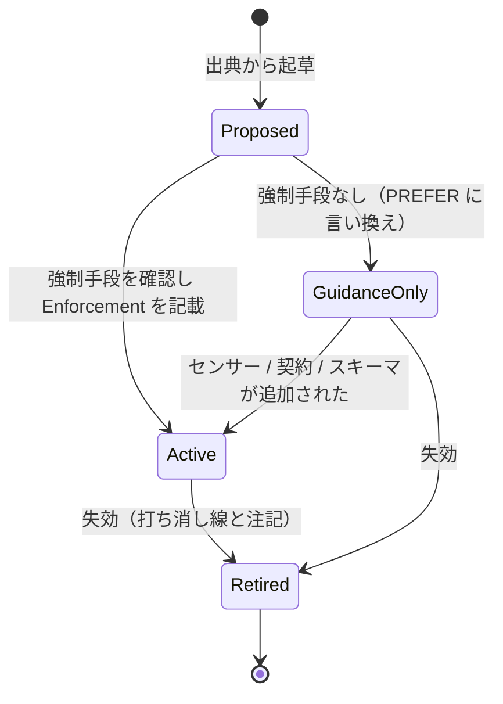
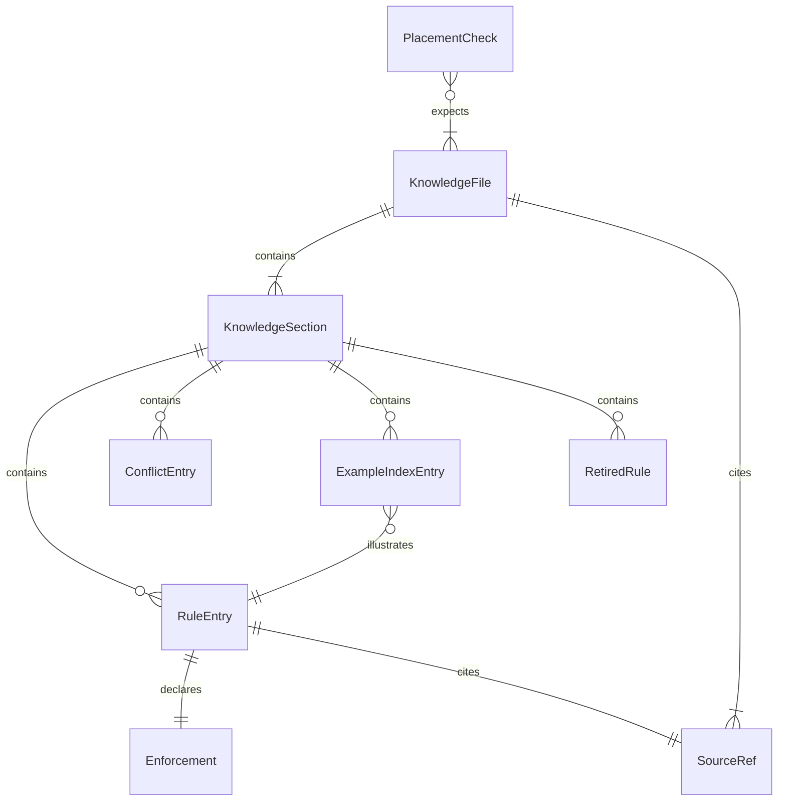

# 機能仕様 — U8 ナレッジ（u8-knowledge-pack）

## Sources

- `inception/units-generation/unit-of-work.md`（U8 = DddKnowledgePack、kind: spec。統合点はナレッジの配置とスキーマ・規約の出典）
- `inception/units-generation/unit-of-work-story-map.md`（U8 の要件 FR10〜FR10.6 と横断要件 FR10.4）
- `inception/requirements-analysis/requirements.md`（FR10.1〜FR10.6）
- `inception/domain-design/components.md`（DddKnowledgePack の振る舞いと依存: DomainModelSchema、WorkspaceLayerResolver を出典に参照し、DomainModelingStage と PluginPackaging が依存する）
- `inception/domain-design/decisions.md`（ADR-006、ADR-010）
- `construction/u8-knowledge-pack/functional-design/entities.md`（型定義。ER 図はここから導出）
- `construction/u8-knowledge-pack/functional-design/rules.md`（規則。要約表はここから導出）
- `ddd/docs/domain-layer-design.md` §9、`ddd/docs/use-case-layer-design.md` §9、`ddd/docs/interface-adapter-layer-design.md` §9（トピックの出典）

本書は文書集合の構成と執筆手順の正である。U8 は実行時の振る舞いを持たないため、「ワークフロー」は執筆・転記・検証の手順、「状態機械」は規則のライフサイクルである。

## 1. 文書集合（8 本）

| path | 主題 | consumers | 主な出典 |
|---|---|---|---|
| `knowledge/aidlc-shared/ddd-layer-boundaries.md` | 層境界と依存方向の原則（4 層、許可方向、composition root、CQRS の相互依存禁止の要点のみ） | 全ステージ | DL §7-5、IA §3、U2 の許可表 |
| `knowledge/aidlc-architect-agent/ddd-always-valid-model.md` | Always Valid Domain Model と Domain Primitive、ADT 原則、4 種分類、ユビキタス言語命名、正規モデルの構造と ID 文法（出典 U1）、**メタ規律**（優先順位、例外、索引、失効、anchored）、**コアとの矛盾 4 件** | domain-modeling、domain-design、functional-design | DL §3〜§6、U1 設計、ADR-010 |
| `knowledge/aidlc-architect-agent/ddd-aggregate-and-invariants.md` | 集約＝FSM、不変条件、Command / Event / Domain Error、集約間参照は ID、ドメインサービスは最後の手段、イベント逆算の導出、ID 系譜 | domain-modeling、domain-design | DL §2〜§5、U1 設計 |
| `knowledge/aidlc-architect-agent/ddd-use-case-conventions.md` | ユースケース規約 5 点セット、進行役原則、CQS の適用範囲、強整合／弱整合、再実行可能性・冪等性、プロセスマネージャー、必須 6 項目 | functional-design | UC §2〜§8 |
| `knowledge/aidlc-architect-agent/ddd-cqrs-and-consistency.md` | CQRS の層構造、コマンド側／クエリ側／RMU、2 軸の宣言（プログラミングモデル × 永続化方式）、コマンド側からリードモデルを読まない理由 | domain-design、functional-design、infrastructure-design | IA §2〜§4、UC §6、DL §7-2 |
| `knowledge/aidlc-developer-agent/ddd-rust-domain-conventions.md` | field-visibility、tell-dont-ask、factory-naming、interior-mutability、module-visibility、domain-equality、error-handling、first-class-collections、`&mut self` 業務操作、setter 禁止、完全コンストラクタ、規則 (a)〜(d) との対応、クレート命名・配置規約（出典 U2） | code-generation、functional-design（support） | DL §6、DL §9、U2 設計 |
| `knowledge/aidlc-developer-agent/ddd-rust-persistence-conventions.md` | スタティックバインディング既定、`event-store-adapter-rs` を参照実装とした ES 実装規約、decide / apply 分離、replay 経路、ポートの trait 配置・実装命名、`store` は upsert、規則 (g)〜(i)、(k)〜(n) との対応 | code-generation | DL §6〜§7、UC §5、IA §5・§9 |
| `knowledge/aidlc-aws-platform-agent/ddd-interface-adapter-conventions.md` | ポート責務の分類、リポジトリ命名とスコープ、動詞、媒体名禁止、in-memory から始める、クエリ側は DAO＋DTO、永続化基盤の選定、RMU 設計、upstream-contracts、infrastructure 層は言語拡張のみ、宣言成果物 ddd-layer-structure の書き方（出典 U4） | infrastructure-design | IA §5〜§9、U4 設計 |

## 2. トピック対応表（FR10.1 / FR10.2 の網羅）

| 要件 | トピック | ファイル |
|---|---|---|
| FR10.1 | Always Valid Domain Model と Domain Primitive、ADT 原則、4 種分類、ユビキタス言語命名 | always-valid-model |
| FR10.1 | 集約＝FSM、集約間参照は ID のみ、ドメインサービスは最後の手段 | aggregate-and-invariants |
| FR10.1 | upstream-contracts（Conformist / ACL） | interface-adapter-conventions（外部システムクライアント）と always-valid-model（BC 間連携の原則） |
| FR10.1 | ユースケース規約 5 点セットと進行役原則、CQS の適用範囲、強整合／弱整合、再実行可能性・冪等性、プロセスマネージャー設計 | use-case-conventions |
| FR10.1 | CQRS の層構造と相互依存禁止 | cqrs-and-consistency（詳細）、layer-boundaries（要点） |
| FR10.1 | ポート設計規約、永続化基盤の選定、RMU 設計、infrastructure 層は言語拡張のみ | interface-adapter-conventions |
| FR10.2 | field-visibility、tell-dont-ask、factory-naming、interior-mutability、module-visibility、domain-equality、error-handling、first-class-collections | rust-domain-conventions |
| FR10.2 | スタティックバインディング既定、event-store-adapter-rs 準拠の ES 規約、ポートの trait 配置・実装命名 | rust-persistence-conventions |

## 3. ファイルの節構成（テンプレート）

すべてのファイルは次の順で H2 を持つ（該当しない節は省略可。ただし Purpose と Sources は必須）:

1. `## Purpose` — 何のためのナレッジか、どのステージで読むか（consumers）。
2. `## Principles` — 原則（`RuleEntry`、level は多くが guidance-only または schema）。
3. `## Rules` — 規則の表: `Rule ID | Statement | Applies to | Enforcement | Rationale | Source`。Enforcement 列は `sensor:(a) blocking` / `stage-contract:after-step:4` / `schema:Command.effect` / `guidance-only` の形。
4. `## Rationale` — 背景（設計書の議論の要約。英語）。
5. `## Conflicts with core knowledge` — always-valid-model にのみ置く。ADR-010 の 4 件の表。
6. `## Examples (index)` — `Rule ID | Fixture path | What it shows | Projection note`。
7. `## Retired rules` — 打ち消し線と失効注記。初版は空でよい（節自体は置く）。
8. `## Meta-discipline` — always-valid-model にのみ置く。優先順位、例外の記録、索引、失効、anchored、「実装済みと主張するのは強制できる範囲だけ」。
9. `## Sources` — 出典一覧。

## 4. ワークフロー

### WF1. 1 ファイルの執筆

1. §1 の行と §2 の対応表から、載せるトピックと出典を確定する。
2. 出典（設計書の節、ADR、U1 / U2 / U4 の設計）を読み、原則と規則を `RuleEntry` の形に落とす。必須条件（ALWAYS / NEVER）はすべて強制手段（センサーの規則 ID、fragment の anchor、スキーマ属性）を確認して Enforcement 列に書く（BR4.2、BR4.3）。強制手段が無い条件は PREFER に言い換えるか guidance-only と明示する。
3. スキーマ・ID 文法・命名規約は U1 / U2 の設計から転記し、出典を明記する（BR7.1）。
4. 例が必要な規則は、対応するゴールデンケースの clean fixture のパスを索引に書き、投影先の注記を付ける（BR6.1、BR6.2）。fixture がまだ無い場合は U5 の fixture 命名規約に従う予定パスを書き、U9 の検証時に実在を確認する。
5. Sources 節を書き、分量の目安（BR3.3）を確認する。

### WF2. ADR-010 の矛盾一覧の転記

1. `decisions.md` ADR-010 の表 4 行を `ConflictEntry` に写す。
2. コアの記述は `.claude/knowledge/aidlc-architect-agent/ddd-patterns.md` の該当節から英語で引用し、節名を core_location に書く。
3. プラグインの規約は本ナレッジの rule_id で指し、適用範囲・採用理由を英訳して書く（原文の出典 `decisions.md` ADR-010 を併記）。
4. precedence は plugin。BC 間の連携パターン（通知、状態転送）はコアを引き続き適用する旨を C-4 の scope に書く。

### WF3. 例の索引

1. sensor で強制される規則ごとに、U4（design）または U5（rust）の clean fixture を 1 件選ぶ。
2. `Examples (index)` の表に rule_id、fixture_path、説明、projection_note を書く。
3. 索引先が存在するかは U9 のテストで検証する（BR8.2）。

### WF4. 配置と網羅の検証（U9 の統合テスト）

1. 8 本の存在と名前、`ddd-` 接頭辞、コアとの衝突なし、Sources 節の存在を確認する（BR8.2）。
2. `aidlc-plugin-test --install` の後、対象ステージの `inline_context_paths` に consumers のナレッジが現れることを確認する（BR8.1）。
3. §2 の対応表の各トピックの見出し語がファイル内に現れることを確認する（BR2.1〜BR2.3 の機械的な近似）。
4. example-index の fixture_path が実在することを確認する。

## 5. 状態機械

### SM1. 規則のライフサイクル

<!-- Text fallback: 規則は出典から起草され（Proposed）、強制手段を確認して Enforcement を書けば Active、無ければ GuidanceOnly（PREFER）になる。後から強制手段が加われば Active に移る。失効した規則は消さず Retired として残す。 -->

## 6. ER 図（entities.md から導出）

<!-- Text fallback: KnowledgeFile は KnowledgeSection と SourceRef を含む。KnowledgeSection は RuleEntry・ConflictEntry・ExampleIndexEntry・RetiredRule を含む。RuleEntry は Enforcement を宣言し SourceRef を引用する。ExampleIndexEntry は RuleEntry を例示する。PlacementCheck は複数の KnowledgeFile の配置を期待する。 -->

## 7. ルール要約（rules.md から導出）

| 群 | 内容 |
|---|---|
| BR1 配置と命名 | slug 完全一致、ddd- 接頭辞、shared は最小、consumers に応じた置き場 |
| BR2 網羅 | 基盤・Rust・IA のトピック対応表 |
| BR3 言語と書式 | 英語、コアと同じ書式、分量の目安 |
| BR4 規則の書き方 | ID と文型、Enforcement の明示、必須条件は強制済み、例外の理由、anchored |
| BR5 コアとの矛盾 | ADR-010 の 4 件、矛盾しない記述の引用、優先順位の明文化 |
| BR6 例の索引 | fixture を索引、投影先の注記、最小スニペット |
| BR7 出典と失効 | U1 / U2 を出典、失効規則、Sources 節 |
| BR8 検証 | inline_context_paths、存在・命名・衝突・索引の実在 |

## 8. 統合点と境界

- U1・U2: スキーマ、ID 文法、命名・配置規約の出典。ナレッジは転記と説明のみで、定義の正は U1・U2。
- U4・U5: Enforcement 列が参照するセンサーの規則 ID（model-completeness.i など、(a)〜(n)）と、例の索引先（clean fixture）。
- U6・U7: fragments が指示する手順（after-step 等）を Enforcement 列の stage-contract として参照する。U6 のリードは domain-modeling の開始時に architect の 4 本と shared を読む。
- U9: WF4 の検証を `bun run check` の一部として実行する。README のナレッジ一覧は §1 の表を出典にする。

## 9. 未決事項の扱い

- 例の索引先となる clean fixture の具体的なパスは U5 の code-generation で確定する。U8 の執筆時点で存在しなければ予定パスを書き、U9 の検証で実在を確認する。
- 分量の目安（BR3.3）は執筆後に実測して見直す。
