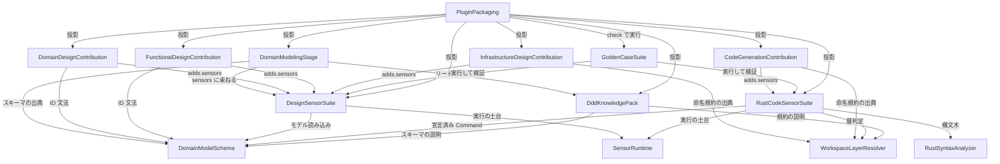

# コンポーネントカタログ — DDD プラグイン（AI-DLC v2）

## Sources

- `inception/requirements-analysis/requirements.md`（FR1〜FR11、NFR1〜NFR10、制約 CON1〜CON12）— 各コンポーネントの責務は要件IDに対応づけ、`traceability.json` に記録した
- `inception/domain-design/domain-design-questions.md`（Q1〜Q8 の確認済み回答）
- コード知識ベース `aidlc/spaces/default/codekb/aidlc-workflows/architecture.md`（プラグイン拡張機構、制約 C1〜C8、インタラクション図 T1〜T3）と `component-inventory.md`（`core-tools` / `core-sensors` / `core-knowledge` / `plugins` の責務と本件での制約）
- コード知識ベース `aidlc/spaces/default/codekb/ddd/architecture.md`（宣言と実装のギャップ、機構上の制約）と `component-inventory.md`（`stages-contribution` / `overlays-contribution` / `sensors-contribution` / `knowledge-contribution` / `tools-contribution` の5つの空の足場）
- `decisions.md`（ADR-001〜ADR-010）
- エンジン実装の確認結果（レビュー所見 R-02 への回答）: コアの `code-generation` ステージは `produces` に `code-summary` を宣言している（`.claude/aidlc-common/stages/construction/code-generation.md` frontmatter）。ゲート発火では、宣言された各成果物パスに対してマニフェストの `matches` glob を照合し、一致した成果物にだけセンサーを起動する（`.claude/tools/aidlc-state.ts` の `gateSensorMatchesOutput` と `fireGateSensors`）。したがって `matches` を `**/code-summary.md` に限定すれば Unit ごとに1回だけ発火する
- コアの方法論ナレッジ `.claude/knowledge/aidlc-architect-agent/ddd-patterns.md`（OQ6 の矛盾洗い出しの対象。決着は `decisions.md` ADR-010）

本カタログは、`ddd/component-inventory.md` が「scaffolded-empty」と記録した5つの貢献面（stages / contributions / sensors / knowledge / tools）を、実装可能な論理コンポーネントに分解したものである。デプロイ形態（プラグイン1つとして投影される）は Units Generation で扱い、ここでは扱わない。

---

## Part A — 機械可読カタログ

```yaml
components:
  - name: DomainModelingStage
    summary: 新設ステージ domain-modeling の定義（frontmatter と手順本文）
    behaviour: >
      inception フェーズに置く新設ステージ。requirements-analysis の後に位置し（requires_stage）、
      user-stories 等を任意入力として受け取るか、入力がなければ対話でドメイン語彙を引き出す。
      ユーザーストーリーからドメインイベントを逆算して集約候補を導出し、正規モデル
      （domain-model.md と domain-model.yaml）を生成する。完了条件は機械条件 (i)〜(v)（DesignSensorSuite が検査）と
      人間承認。lead_agent はコアの aidlc-architect-agent、mode は inline、reviewer は
      aidlc-architecture-reviewer-agent（advisory）。scopes は enterprise / feature / mvp / classic / workshop / refactor。
      Aggregate 境界までを所有し、モジュール・デプロイ単位・ユースケース手順は所有しない。
    responsibilities:
      - stages/inception/domain-modeling.md の frontmatter（plugin, produces, consumes, requires_stage, scopes, sensors, reviewer）
      - イベント逆算から集約候補を導く手順本文と質問トピック
      - 単独実行（--single）と入力なし対話の手順
      - 成果物 ddd-domain-model（Markdown）と ddd-domain-model-yaml（YAML）の生成指示
    depends_on:
      - component: DomainModelSchema
        interaction: 生成する domain-model.yaml の構造・ID体系・整合規則の出典
        style: sync
      - component: DesignSensorSuite
        interaction: frontmatter の sensors に完了条件 (i)〜(v) と (f) の検査を束ねる
        style: sync
      - component: DddKnowledgePack
        interaction: リード（architect）がステージ開始時に読む方法論ナレッジ
        style: sync
    dependents:
      - component: PluginPackaging
        interaction: stages/ として投影する
    external_dependencies:
      - name: AI-DLC compose フック
        kind: other
        purpose: ステージをグラフに合成し、requires_stage と scopes を解決する
    entities: []

  - name: DomainModelSchema
    summary: 正規モデル（Always Valid Domain Model）のスキーマ、ID体系、系譜規則、読み込み器
    behaviour: >
      domain-model.yaml の構造（Bounded Context → Aggregate → 要素・不変条件・Command/Event・Domain Error・
      State Transition・Factory Rule・Process Manager）を JSON Schema と TypeScript 型で定義し、
      読み込み・構造検証・要素索引を提供する。安定ID（bc.* / aggregate.* / entity.* / primitive.* /
      invariant.* / transition.* など）の文法、element_id と name の分離、rename / split / merge / 廃止の
      系譜規則、Command の冪等性戦略属性、Domain Error 必須、Process Manager 要素を含む。
      domain-model.md との整合検査に使う要素索引も提供する。yaml を正とする。
    responsibilities:
      - domain-model.yaml のスキーマ定義（JSON Schema + 型）
      - 安定IDの文法と参照解決（未定義・廃止・循環置換の検出に必要な索引）
      - ID系譜（ElementLineage）の規則
      - 読み込み器と構造検証器（センサーとテストが共用）
    depends_on: []
    dependents:
      - component: DomainModelingStage
        interaction: 生成する成果物の構造の出典
      - component: DomainDesignContribution
        interaction: 写像先が参照する ID の文法
      - component: FunctionalDesignContribution
        interaction: ユースケース宣言が参照する ID の文法
      - component: DesignSensorSuite
        interaction: 読み込み器・索引・スキーマ検証を呼ぶ
      - component: RustCodeSensorSuite
        interaction: モデルに宣言された Command 集合を参照する（setter 検出 (b)、復元経路 (c)(n)）
      - component: DddKnowledgePack
        interaction: ナレッジがスキーマと ID 体系を説明する
    external_dependencies: []
    entities:
      - name: BoundedContext
        identifier: element_id
        attributes: [element_id, name, aggregates]
      - name: Aggregate
        identifier: element_id
        attributes: [element_id, name, bounded_context, root_element, elements, invariants, commands, events, transitions, factory_rules, process_managers]
        references:
          - entity: BoundedContext
            owned_by: DomainModelSchema
            relationship: 各 Aggregate はちょうど1つの BoundedContext に属する
      - name: DomainElement
        identifier: element_id
        attributes: [element_id, kind, name, aggregate, attributes]
        references:
          - entity: Aggregate
            owned_by: DomainModelSchema
            relationship: 各 DomainElement（Entity / Value Object / Domain Primitive）は1つの Aggregate に属する
      - name: Invariant
        identifier: element_id
        attributes: [element_id, name, aggregate, statement]
        references:
          - entity: Aggregate
            owned_by: DomainModelSchema
            relationship: 各 Invariant は1つの Aggregate が保証する
      - name: Command
        identifier: element_id
        attributes: [element_id, name, aggregate, transitions, domain_errors, events, idempotency_strategy, idempotency_retention]
        references:
          - entity: Aggregate
            owned_by: DomainModelSchema
            relationship: 各 Command は1つの Aggregate に対する業務操作
      - name: DomainEvent
        identifier: element_id
        attributes: [element_id, name, aggregate, produced_by]
        references:
          - entity: Command
            owned_by: DomainModelSchema
            relationship: 各 DomainEvent は1つの Command が発生させる
      - name: DomainError
        identifier: element_id
        attributes: [element_id, name, command, condition]
        references:
          - entity: Command
            owned_by: DomainModelSchema
            relationship: 各 DomainError は1つの Command の失敗条件
      - name: StateTransition
        identifier: element_id
        attributes: [element_id, name, aggregate, from_state, to_state, command]
        references:
          - entity: Command
            owned_by: DomainModelSchema
            relationship: 各 StateTransition は1つの Command が引き起こす
      - name: FactoryRule
        identifier: element_id
        attributes: [element_id, name, target_element, preconditions]
        references:
          - entity: DomainElement
            owned_by: DomainModelSchema
            relationship: 各 FactoryRule は1つの DomainElement の生成条件
      - name: ProcessManager
        identifier: element_id
        attributes: [element_id, name, aggregates, steps, compensations]
        references:
          - entity: Aggregate
            owned_by: DomainModelSchema
            relationship: 各 ProcessManager は複数の Aggregate に跨がる流れを調整する
      - name: ElementLineage
        identifier: lineage_id
        attributes: [lineage_id, element_id, relation, successors, replaced_by, deprecated_at]

  - name: DomainDesignContribution
    summary: コアステージ domain-design への contribution（正規モデルの入力化、写像属性、2軸宣言、参照ID必須化）
    behaviour: >
      contributions/inception/domain-design.md。adds.consumes で ddd-domain-model-yaml を入力に加え、
      adds.produces で ddd-aggregate-mapping（集約→型・モジュール・ポート・リポジトリ境界の写像と2軸宣言）を追加し、
      adds.sensors で参照ID検査・正規モデル存在検査・宣言検査を束ねる。fragments（実装済み anchor のみ）で
      「参照IDを記載せよ」「集約ごとにプログラミングモデルと永続化方式を宣言せよ」の手順を挿入する。
      Entity / Aggregate / 不変条件を再定義しない。
    responsibilities:
      - contribution frontmatter（target, plugin, adds.consumes / produces / sensors, fragments）
      - ddd-aggregate-mapping の記載形式（参照ID必須、2軸宣言）
      - after-step:4 等への手順断片
    depends_on:
      - component: DomainModelSchema
        interaction: 写像が参照する ID の文法
        style: sync
      - component: DesignSensorSuite
        interaction: adds.sensors に束ねるセンサーID
        style: sync
    dependents:
      - component: PluginPackaging
        interaction: contributions/ として投影する
    external_dependencies:
      - name: AI-DLC compose フック
        kind: other
        purpose: adds.* と fragments をコアステージへマージする（追加のみ）
    entities:
      - name: AggregateMapping
        identifier: aggregate_ref
        attributes: [aggregate_ref, programming_model, persistence_method, crate, module, ports, repository, reference_ids]
        references:
          - entity: Aggregate
            owned_by: DomainModelSchema
            relationship: 各 AggregateMapping はちょうど1つの Aggregate を写像する

  - name: FunctionalDesignContribution
    summary: コアステージ functional-design への contribution（ユースケース層の規約、必須6項目、センサー束ね）
    behaviour: >
      contributions/construction/functional-design.md。adds.produces で ddd-use-case-declarations を追加し、
      各ユースケースに対象集約・使用コマンド・再実行可能性・回復方針・複数集約時の戦略・読み取りモデル公開範囲の
      6項目を必須宣言させる。fragments で規約5点セット、進行役原則、強整合／弱整合の境界、再実行可能性の
      設計手順を挿入する。adds.sensors で (g)(h)(i)(d)(j) と6項目検査を束ねる。複数集約更新は advisory。
    responsibilities:
      - contribution frontmatter と fragments
      - ddd-use-case-declarations の記載形式（6項目、参照ID）
    depends_on:
      - component: DomainModelSchema
        interaction: 宣言が参照する Aggregate / Command / ProcessManager の ID 文法
        style: sync
      - component: DesignSensorSuite
        interaction: adds.sensors に束ねるセンサーID
        style: sync
    dependents:
      - component: PluginPackaging
        interaction: contributions/ として投影する
    external_dependencies:
      - name: AI-DLC compose フック
        kind: other
        purpose: adds.* と fragments をコアステージへマージする
    entities:
      - name: UseCaseDeclaration
        identifier: use_case_id
        attributes: [use_case_id, name, target_aggregates, commands, re_execution_basis, recovery_policy, multi_aggregate_strategy, read_model_exposure]
        references:
          - entity: Aggregate
            owned_by: DomainModelSchema
            relationship: 各 UseCaseDeclaration は1つ以上の Aggregate を対象にする
          - entity: Command
            owned_by: DomainModelSchema
            relationship: 各 UseCaseDeclaration は使用する Command を参照IDで指す
          - entity: ProcessManager
            owned_by: DomainModelSchema
            relationship: 複数集約に跨がる場合、アクターモデル宣言では ProcessManager を参照する

  - name: InfrastructureDesignContribution
    summary: コアステージ infrastructure-design への contribution（IA 層の構造宣言、ポート規約、永続化基盤、RMU）
    behaviour: >
      contributions/construction/infrastructure-design.md。adds.produces で ddd-layer-structure
      （非 CQRS / CQRS の層構造、コマンド側・クエリ側・RMU のクレート、ポートとリポジトリ、永続化基盤）を追加し、
      fragments でポート・リポジトリ規約、永続化基盤の選定、RMU 設計の手順を挿入する。
      adds.sensors で DesignSensorSuite の aidlc-ddd-layer-structure（(k)(l)(m)(n) を宣言に対して検査する設計側の
      blocking 検査）と aidlc-ddd-design-advisories（リポジトリのスコープ違反と store の upsert 判定、advisory）を束ねる。
      (k)(l)(m)(n) のコード側検査は RustCodeSensorSuite が code-generation のゲートで行う（FR5.4 は設計側、FR7.8〜FR7.11 はコード側）。
      宣言には各クレートの依存先（(k)(l) の検査根拠）、リポジトリ名（(m)）、集約ごとの復元経路（(n)）を必須で書かせる。
      クレート命名は WorkspaceLayerResolver の規約に従わせる。
    responsibilities:
      - contribution frontmatter と fragments
      - ddd-layer-structure の記載形式（クレート依存先、リポジトリ名、復元経路を含む）
    depends_on:
      - component: DesignSensorSuite
        interaction: adds.sensors に束ねるセンサーID
        style: sync
      - component: WorkspaceLayerResolver
        interaction: 手順が指示するクレート命名・配置規約（層、CQRS 側、composition root）の出典
        style: sync
    dependents:
      - component: PluginPackaging
        interaction: contributions/ として投影する
    external_dependencies:
      - name: AI-DLC compose フック
        kind: other
        purpose: adds.* と fragments をコアステージへマージする
    entities:
      - name: LayerStructureDeclaration
        identifier: context_ref
        attributes: [context_ref, cqrs, command_side_crates, query_side_crates, rmu_crates, crate_dependencies, ports, repositories, restoration_paths, persistence_backend]
        references:
          - entity: BoundedContext
            owned_by: DomainModelSchema
            relationship: 各 LayerStructureDeclaration は1つの BoundedContext の層構造を宣言する
          - entity: AggregateMapping
            owned_by: DomainDesignContribution
            relationship: 永続化基盤の選定は各 Aggregate の永続化方式宣言と整合する

  - name: CodeGenerationContribution
    summary: コアステージ code-generation への contribution（Rust コードセンサーの束ね、実装規約の手順）
    behaviour: >
      contributions/construction/code-generation.md。adds.sensors で RustCodeSensorSuite の3マニフェストを
      code-generation のゲートに束ねる。成果物は追加しない（adds.produces なし）。発火の契機となる code-summary は
      コアの code-generation が produces に宣言済みの成果物であり、マニフェストの matches で
      その成果物だけに絞り込む（Sources のエンジン確認結果を参照）。fragments で、開発者が従うべきクレート命名・配置規約（層、CQRS 側、
      composition root）と、正規モデルの Command 以外の状態変更メソッドを書かないこと等の実装規約を手順として挿入する。
    responsibilities:
      - contribution frontmatter（adds.sensors）と fragments
    depends_on:
      - component: RustCodeSensorSuite
        interaction: adds.sensors に束ねるセンサーID
        style: sync
      - component: WorkspaceLayerResolver
        interaction: 手順が指示する命名・配置規約の出典
        style: sync
    dependents:
      - component: PluginPackaging
        interaction: contributions/ として投影する
    external_dependencies:
      - name: AI-DLC compose フック
        kind: other
        purpose: adds.sensors と fragments をコアステージへマージする
    entities: []

  - name: DesignSensorSuite
    summary: 設計成果物を検査するセンサー群（マニフェストと実行スクリプト）
    behaviour: >
      成果物単位でまとめた blocking マニフェストと、レビュー行きの advisory マニフェストを提供する。
      model-completeness（domain-modeling: 完了条件 (i)〜(v) と (f) md/yaml 整合）、model-presence
      （domain-design: 正規モデルの存在と参照ID解決。aidlc-state.md の Stage Progress 行で domain-modeling が
      EXECUTE のときだけ検査し、SKIP なら pass）、reference-ids（domain-design / functional-design: (e) 未定義・廃止ID、
      循環置換）、mapping-declarations（domain-design: 2軸宣言、functional-design: 6項目と (j) 冪等性戦略）、
      layer-structure（infrastructure-design: ddd-layer-structure 宣言に対する (k) コマンド側⇄クエリ側の依存宣言、
      (l) クエリ側クレートの依存先にドメイン層クレートやリポジトリポートが含まれる宣言、(m) リポジトリ名の規約、
      (n) 集約ごとの復元経路が完全コンストラクタ経由と宣言されていること。宣言に対する検査であり、コードは見ない）、
      design-advisories（advisory: 複数集約更新、リポジトリスコープ、store の upsert）。
      各スクリプトは SensorRuntime の契約で起動し、DomainModelSchema で正規モデルを読む。
      意味判断が必要な指摘は止めずに報告する。
    responsibilities:
      - sensors/aidlc-ddd-model-completeness.md / aidlc-ddd-model-presence.md / aidlc-ddd-reference-ids.md / aidlc-ddd-mapping-declarations.md / aidlc-ddd-layer-structure.md / aidlc-ddd-design-advisories.md
      - tools/ddd-sensor-model-completeness.ts ほか対応する実行スクリプト（6本）
      - 設計成果物（domain-model.yaml、ddd-aggregate-mapping、ddd-use-case-declarations、ddd-layer-structure）の解析
    depends_on:
      - component: DomainModelSchema
        interaction: 正規モデルの読み込み・索引・構造検証
        style: sync
      - component: SensorRuntime
        interaction: 引数解釈、記録ディレクトリと状態ファイルの解決、verdict と詳細ファイルの出力
        style: sync
    dependents:
      - component: DomainModelingStage
        interaction: frontmatter の sensors で束ねる
      - component: DomainDesignContribution
        interaction: adds.sensors で束ねる
      - component: FunctionalDesignContribution
        interaction: adds.sensors で束ねる
      - component: InfrastructureDesignContribution
        interaction: adds.sensors で束ねる
      - component: GoldenCaseSuite
        interaction: ゴールデンケースで実行し verdict を検証する
      - component: PluginPackaging
        interaction: sensors/ と tools/ として投影する
    external_dependencies:
      - name: AI-DLC センサーディスパッチャ
        kind: other
        purpose: fire_on gate で成果物ごとに起動し、verdict を読む
    entities: []

  - name: RustCodeSensorSuite
    summary: Rust コードを検査するセンサー群（層ごとの3マニフェストと規則モジュール (a)〜(n)）
    behaviour: >
      rust-domain（(a) 公開フィールド、(b) 宣言外の状態変更メソッド、(c) 不完全な生成経路、(d) ドメイン層からの getter 呼出）、
      rust-use-case（(g) DIP 違反、(h) execute 引数違反、(i) ユースケース間呼出、(d) ユースケース層からの getter 呼出）、
      rust-interface-adapter（(k) コマンド側⇄クエリ側相互参照、(l) クエリ側でのドメイン型参照、(m) リポジトリ命名、
      (n) 復元経路の検査迂回）の3マニフェストをすべて blocking で code-generation のゲートに束ねる。
      code-summary 成果物を契機に発火し、同じ Unit の source-manifest.json が申告する Rust ファイルを検査対象にする。
      各規則は独立したモジュールで、RustSyntaxAnalyzer の構文木事実と WorkspaceLayerResolver の層判定だけから
      判定する（実行時の意味判断なし）。違反ごとに規則ID・ファイル・行・説明を報告する。
      言語横断の規則定義と Rust 固有の判定を分離し、第2言語の検査器を追加できる構造にする。
    responsibilities:
      - sensors/aidlc-ddd-rust-domain.md / aidlc-ddd-rust-use-case.md / aidlc-ddd-rust-interface-adapter.md
      - tools/ddd-sensor-rust-domain.ts ほか対応する実行スクリプト
      - tools/ddd/lib/rules/ の規則モジュール (a)〜(n) と層依存方向 (FR9.5) の検査
    depends_on:
      - component: RustSyntaxAnalyzer
        interaction: ファイルの構文木と問い合わせ（フィールド可視性、impl メソッド、fn 引数、use パス、生成経路）
        style: sync
      - component: WorkspaceLayerResolver
        interaction: 各ファイルの所属クレートの層・CQRS 側・composition root 判定
        style: sync
      - component: SensorRuntime
        interaction: 引数解釈、source-manifest.json の申告パス解決、verdict と詳細ファイルの出力
        style: sync
      - component: DomainModelSchema
        interaction: 正規モデルに宣言された Command 集合と写像（(b)(c)(n) の判定根拠）
        style: sync
    dependents:
      - component: CodeGenerationContribution
        interaction: adds.sensors で束ねる
      - component: GoldenCaseSuite
        interaction: ゴールデンケースで実行し verdict を検証する
      - component: PluginPackaging
        interaction: sensors/ と tools/ として投影する
    external_dependencies:
      - name: AI-DLC センサーディスパッチャ
        kind: other
        purpose: code-generation のゲートで code-summary を契機に起動する
    entities: []

  - name: RustSyntaxAnalyzer
    summary: tree-sitter-rust（WASM）による Rust 構文解析と問い合わせ
    behaviour: >
      tools/ddd/lib/rust/ に置く。同梱の tools/ddd/wasm/tree-sitter-rust.wasm を web-tree-sitter ランタイムで
      bun から読み込み、Rust ファイルを構文木にする。規則モジュールが必要とする問い合わせ（struct のフィールドと
      可視性、impl ブロックのメソッドと self の受け方、fn の引数型、use 宣言の解決前パス、コンストラクタ・
      Default・setter 形状の検出、マクロ呼び出しの存在）を決定的に返す。型推論や実行は行わない。
      cargo を要求しない。
    responsibilities:
      - WASM ランタイムの初期化と文法の読み込み（同梱ファイルのみ）
      - 構文木の問い合わせ API（規則モジュール向け）
      - 解析できない構文（マクロ展開が必要な箇所）の明示的な報告
    depends_on: []
    dependents:
      - component: RustCodeSensorSuite
        interaction: 構文木事実の供給
    external_dependencies:
      - name: web-tree-sitter
        kind: other
        purpose: WASM 文法を実行するランタイム（tools/ddd/ 配下に同梱）
      - name: tree-sitter-rust.wasm
        kind: other
        purpose: Rust 文法（tools/ddd/wasm/ に同梱）
    entities: []

  - name: WorkspaceLayerResolver
    summary: Cargo workspace のクレートを層・CQRS 側・composition root に対応づける判定器
    behaviour: >
      tools/ddd/lib/workspace/ に置く。ワークスペースの Cargo.toml と各メンバーの Cargo.toml を読み、
      クレート名・パス・ターゲット種別（[[bin]]）を集める。層はクレート名の接尾辞（-domain / -use-case /
      -interface-adapter / -infrastructure）またはディレクトリ配置（packages|modules/<layer>/）で判定し、
      どちらにも該当しなければ「層不明」を返す（センサー側で blocking 違反）。CQRS 側はセグメント
      （-command- / -query- / -rmu）またはディレクトリ（packages/command|query|rmu/）で判定し、印がなければ非 CQRS。
      composition root は [[bin]] ターゲット、接尾辞 -composition-root、ディレクトリ packages/composition-root/
      のいずれかで判定し、層規則の対象外とする。許可する依存方向（IA → use-case・domain、use-case → domain、
      infrastructure → 任意）の表も所有する。設定ファイルは読まない。
    responsibilities:
      - Cargo workspace の走査とクレート一覧
      - 層・CQRS 側・composition root の判定規約の実装
      - ファイルパス → 所属クレート → CrateLayerAssignment の解決
      - 許可依存方向の表
    depends_on: []
    dependents:
      - component: RustCodeSensorSuite
        interaction: 層判定と依存方向の供給
      - component: InfrastructureDesignContribution
        interaction: 手順が指示する命名・配置規約の出典
      - component: CodeGenerationContribution
        interaction: 手順が指示する命名・配置規約の出典
      - component: DddKnowledgePack
        interaction: ナレッジが説明する命名・配置規約の出典
    external_dependencies:
      - name: Cargo.toml
        kind: other
        purpose: ワークスペースメンバーとターゲット種別の読み取り（bun 組み込みの TOML 解析）
    entities:
      - name: CrateLayerAssignment
        identifier: crate_name
        attributes: [crate_name, path, layer, cqrs_side, is_composition_root, targets]

  - name: SensorRuntime
    summary: センサー実行スクリプト共通のランタイム（ディスパッチャ契約、記録ディレクトリ解決、verdict 出力）
    behaviour: >
      tools/ddd/lib/runtime/ に置く。ディスパッチャが付ける --stage と --output-path を解釈し、成果物パスから
      記録ディレクトリ・ステージディレクトリ・Unit ディレクトリを辿る。aidlc-state.md の Stage Progress 行から
      指定ステージの EXECUTE / SKIP を読む。code-generation では同じ Unit の source-manifest.json から申告された
      ソースパスを読む。所見（規則ID、ファイル、行、説明、重大度）を集め、詳細ファイルを書き、最終行に
      compact JSON verdict（fire_id, sensor_id, stage, output_path, result, detail_path, note）を出力し、
      終了コードを返す。タイムアウト内で終わらない場合は失敗として報告する。ネットワークにアクセスしない。
    responsibilities:
      - 引数契約と終了コード・verdict 出力
      - 記録ディレクトリ／状態ファイル／source-manifest.json の解決
      - 所見の集約と詳細ファイルの形式
    depends_on: []
    dependents:
      - component: DesignSensorSuite
        interaction: 実行スクリプトの土台
      - component: RustCodeSensorSuite
        interaction: 実行スクリプトの土台
    external_dependencies:
      - name: 記録ディレクトリ（aidlc-state.md、source-manifest.json）
        kind: other
        purpose: 実行対象の判定と申告ソースの解決
    entities:
      - name: SensorVerdict
        identifier: fire_id
        attributes: [fire_id, sensor_id, stage, output_path, result, detail_path, note]
      - name: SensorFinding
        identifier: finding_id
        attributes: [finding_id, sensor_id, rule_id, file, line, message, severity]
        references:
          - entity: SensorVerdict
            owned_by: SensorRuntime
            relationship: 各 SensorFinding は1つの SensorVerdict の詳細に属する

  - name: DddKnowledgePack
    summary: プラグインが提供する方法論ナレッジ（言語横断の基盤と Rust 固有、役割別に配置）
    behaviour: >
      knowledge/aidlc-architect-agent/ に基盤ナレッジ（Always Valid Domain Model と Domain Primitive、ADT 原則、
      4種分類、集約＝FSM、集約間参照はID、ユビキタス言語、upstream-contracts、ユースケース規約と進行役原則、
      CQS の適用範囲、強整合／弱整合、冪等性、プロセスマネージャー、CQRS 層構造）と設計規約、
      knowledge/aidlc-developer-agent/ に Rust コード規約（field-visibility、tell-dont-ask、factory-naming、
      interior-mutability、module-visibility、domain-equality、error-handling、first-class-collections、
      スタティックバインディング、event-store-adapter-rs 準拠）、knowledge/aidlc-aws-platform-agent/ に IA 層
      （ポート設計規約、永続化基盤の選定、RMU 設計）、knowledge/aidlc-shared/ に層境界と依存方向の原則だけを置く。
      ファイル名は ddd- 接頭辞で既存と衝突させず、コアの ddd-patterns.md と矛盾する箇所は decisions.md ADR-010 で
      確定した一覧（4件）をナレッジ本文に転記し、衝突した記述・適用範囲・採用理由を残す。
      メタ規律（衝突時の優先順位、例外理由の記録、失効ルールの残し方）を含む。
    responsibilities:
      - 役割別ディレクトリ配置（slug 完全一致）
      - 基盤ナレッジと Rust ナレッジの本文
      - コア ddd-patterns.md との矛盾一覧（ADR-010 の内容の転記）
    depends_on:
      - component: DomainModelSchema
        interaction: ナレッジが説明するスキーマと ID 体系の出典
        style: sync
      - component: WorkspaceLayerResolver
        interaction: ナレッジが説明する命名・配置規約の出典
        style: sync
    dependents:
      - component: DomainModelingStage
        interaction: リードが読む方法論ナレッジ
      - component: PluginPackaging
        interaction: knowledge/ として投影する
    external_dependencies:
      - name: AI-DLC compose フック
        kind: other
        purpose: knowledge/<agent-slug>/ を Tier 1 へ投影する
    entities: []

  - name: GoldenCaseSuite
    summary: センサーごとの違反あり／なしゴールデンケースと、それを実行する bun:test テスト
    behaviour: >
      tests/golden/ に、規則 (a)〜(n)・設計検査ごとの fixture（違反を含む Rust ワークスペースと設計成果物、
      違反のない対）を置き、各センサースクリプトを SensorRuntime の契約どおりに起動して verdict と所見
      （規則ID・ファイル・行）を検証する。同一 fixture の反復実行で verdict が一致すること（NFR1）、
      cargo 未導入・ネットワーク遮断でも動くこと（NFR2）も検証する。fixture は tools/ 配下に置かない。
    responsibilities:
      - fixture の構成規約（違反あり／なしの対、期待所見）
      - センサー起動と verdict 検証のテスト
      - 決定性と実行時依存のテスト
    depends_on:
      - component: DesignSensorSuite
        interaction: 実行して verdict を検証する
        style: sync
      - component: RustCodeSensorSuite
        interaction: 実行して verdict を検証する
        style: sync
    dependents:
      - component: PluginPackaging
        interaction: bun run check から実行する
    external_dependencies:
      - name: bun:test
        kind: other
        purpose: テストランナー
    entities:
      - name: GoldenCase
        identifier: case_id
        attributes: [case_id, sensor_id, rule_id, fixture_path, expected_result, expected_findings]

  - name: PluginPackaging
    summary: プラグインマニフェスト、ビルド・検証・テストの配線、README とリリース品質
    behaviour: >
      .aidlc-plugin/plugin.json（contributes: stages / overlays / sensors / knowledge / tools の5面、
      agents と scopes は宣言しない）、package.json の validate / build:claude / build:codex / check、
      biome 設定、README（拡張ポイント、対応ハーネス、命名規約、センサー一覧、導入手順、既知の制約）、
      CHANGELOG、LICENSE を所有する。aidlc-plugin-test --install の3条件（drop なし、グラフに載る、
      バイト安定）を満たすことを統合テストで確認する。成果物論理名は ddd- 接頭辞。
    responsibilities:
      - plugin.json と成果物論理名の宣言
      - ビルド・検証・テストの配線（親リポジトリのエンジンツールへ委譲）
      - README / CHANGELOG / LICENSE
      - compose 統合テスト（aidlc-plugin-test）
    depends_on:
      - component: DomainModelingStage
        interaction: stages/ として投影する
        style: sync
      - component: DomainDesignContribution
        interaction: contributions/ として投影する
        style: sync
      - component: FunctionalDesignContribution
        interaction: contributions/ として投影する
        style: sync
      - component: InfrastructureDesignContribution
        interaction: contributions/ として投影する
        style: sync
      - component: CodeGenerationContribution
        interaction: contributions/ として投影する
        style: sync
      - component: DesignSensorSuite
        interaction: sensors/ と tools/ として投影する
        style: sync
      - component: RustCodeSensorSuite
        interaction: sensors/ と tools/ として投影する
        style: sync
      - component: DddKnowledgePack
        interaction: knowledge/ として投影する
        style: sync
      - component: GoldenCaseSuite
        interaction: bun run check から実行する
        style: sync
    dependents: []
    external_dependencies:
      - name: aidlc-plugin-validate / build / test（親リポジトリのエンジンツール）
        kind: other
        purpose: 検証・投影・compose 統合テスト
      - name: bun
        kind: other
        purpose: ランタイムとテストランナー
      - name: biome
        kind: other
        purpose: lint / format
    entities:
      - name: PluginManifest
        identifier: name
        attributes: [name, version, description, dependencies, contributes]
```

---

## Part B — 人間向けビュー

### Component Diagram



<!-- Text fallback: PluginPackaging が根で、ステージ（DomainModelingStage）、4つの contribution（DomainDesign / FunctionalDesign / InfrastructureDesign / CodeGeneration）、2つのセンサー群（DesignSensorSuite / RustCodeSensorSuite）、ナレッジ（DddKnowledgePack）、テスト（GoldenCaseSuite）を投影・実行する。ステージと contribution はセンサー群に sensors を束ね、DomainModelSchema に ID 文法を依存する。DesignSensorSuite は DomainModelSchema と SensorRuntime に、RustCodeSensorSuite はさらに RustSyntaxAnalyzer と WorkspaceLayerResolver に依存する。DddKnowledgePack は DomainModelSchema と WorkspaceLayerResolver を出典として参照する。葉は DomainModelSchema / RustSyntaxAnalyzer / WorkspaceLayerResolver / SensorRuntime の4つで、循環はない。 -->

### Component Summary

| Component | Purpose | Depends On | Dependents | Entities Owned |
|---|---|---|---|---|
| DomainModelingStage | 新設ステージ `domain-modeling` の定義 | DomainModelSchema, DesignSensorSuite, DddKnowledgePack | PluginPackaging | — |
| DomainModelSchema | 正規モデルのスキーマ、ID 体系、系譜規則、読み込み器 | — | DomainModelingStage, DomainDesignContribution, FunctionalDesignContribution, DesignSensorSuite, RustCodeSensorSuite, DddKnowledgePack | BoundedContext, Aggregate, DomainElement, Invariant, Command, DomainEvent, DomainError, StateTransition, FactoryRule, ProcessManager, ElementLineage |
| DomainDesignContribution | `domain-design` への contribution（入力化、写像、2軸宣言、参照ID） | DomainModelSchema, DesignSensorSuite | PluginPackaging | AggregateMapping |
| FunctionalDesignContribution | `functional-design` への contribution（ユースケース層の規約、必須6項目） | DomainModelSchema, DesignSensorSuite | PluginPackaging | UseCaseDeclaration |
| InfrastructureDesignContribution | `infrastructure-design` への contribution（IA 層の構造、ポート規約、RMU） | DesignSensorSuite, WorkspaceLayerResolver | PluginPackaging | LayerStructureDeclaration |
| CodeGenerationContribution | `code-generation` への contribution（Rust センサーの束ね、実装規約） | RustCodeSensorSuite, WorkspaceLayerResolver | PluginPackaging | — |
| DesignSensorSuite | 設計成果物を検査するセンサー群（6マニフェスト） | DomainModelSchema, SensorRuntime | DomainModelingStage, DomainDesignContribution, FunctionalDesignContribution, InfrastructureDesignContribution, GoldenCaseSuite, PluginPackaging | — |
| RustCodeSensorSuite | Rust コードを検査するセンサー群（層ごと3マニフェスト、規則 (a)〜(n)） | RustSyntaxAnalyzer, WorkspaceLayerResolver, SensorRuntime, DomainModelSchema | CodeGenerationContribution, GoldenCaseSuite, PluginPackaging | — |
| RustSyntaxAnalyzer | tree-sitter-rust（WASM）による構文解析と問い合わせ | — | RustCodeSensorSuite | — |
| WorkspaceLayerResolver | クレート → 層・CQRS 側・composition root の判定器 | — | RustCodeSensorSuite, InfrastructureDesignContribution, CodeGenerationContribution, DddKnowledgePack | CrateLayerAssignment |
| SensorRuntime | センサー共通ランタイム（契約、記録ディレクトリ解決、verdict 出力） | — | DesignSensorSuite, RustCodeSensorSuite | SensorVerdict, SensorFinding |
| DddKnowledgePack | 役割別に配置する方法論ナレッジ | DomainModelSchema, WorkspaceLayerResolver | DomainModelingStage, PluginPackaging | — |
| GoldenCaseSuite | ゴールデンケース fixture とセンサー検証テスト | DesignSensorSuite, RustCodeSensorSuite | PluginPackaging | GoldenCase |
| PluginPackaging | マニフェスト、ビルド・検証・テストの配線、README | 上記9コンポーネント（投影対象と GoldenCaseSuite） | — | PluginManifest |

### Entity Ownership

| Entity | Owning Component | Identifier | Attributes | References |
|---|---|---|---|---|
| BoundedContext | DomainModelSchema | element_id | element_id, name, aggregates | — |
| Aggregate | DomainModelSchema | element_id | element_id, name, bounded_context, root_element, elements, invariants, commands, events, transitions, factory_rules, process_managers | BoundedContext |
| DomainElement | DomainModelSchema | element_id | element_id, kind, name, aggregate, attributes | Aggregate |
| Invariant | DomainModelSchema | element_id | element_id, name, aggregate, statement | Aggregate |
| Command | DomainModelSchema | element_id | element_id, name, aggregate, transitions, domain_errors, events, idempotency_strategy, idempotency_retention | Aggregate |
| DomainEvent | DomainModelSchema | element_id | element_id, name, aggregate, produced_by | Command |
| DomainError | DomainModelSchema | element_id | element_id, name, command, condition | Command |
| StateTransition | DomainModelSchema | element_id | element_id, name, aggregate, from_state, to_state, command | Command |
| FactoryRule | DomainModelSchema | element_id | element_id, name, target_element, preconditions | DomainElement |
| ProcessManager | DomainModelSchema | element_id | element_id, name, aggregates, steps, compensations | Aggregate |
| ElementLineage | DomainModelSchema | lineage_id | lineage_id, element_id, relation, successors, replaced_by, deprecated_at | — |
| AggregateMapping | DomainDesignContribution | aggregate_ref | aggregate_ref, programming_model, persistence_method, crate, module, ports, repository, reference_ids | Aggregate |
| UseCaseDeclaration | FunctionalDesignContribution | use_case_id | use_case_id, name, target_aggregates, commands, re_execution_basis, recovery_policy, multi_aggregate_strategy, read_model_exposure | Aggregate, Command, ProcessManager |
| LayerStructureDeclaration | InfrastructureDesignContribution | context_ref | context_ref, cqrs, command_side_crates, query_side_crates, rmu_crates, crate_dependencies, ports, repositories, restoration_paths, persistence_backend | BoundedContext, AggregateMapping |
| CrateLayerAssignment | WorkspaceLayerResolver | crate_name | crate_name, path, layer, cqrs_side, is_composition_root, targets | — |
| SensorVerdict | SensorRuntime | fire_id | fire_id, sensor_id, stage, output_path, result, detail_path, note | — |
| SensorFinding | SensorRuntime | finding_id | finding_id, sensor_id, rule_id, file, line, message, severity | SensorVerdict |
| GoldenCase | GoldenCaseSuite | case_id | case_id, sensor_id, rule_id, fixture_path, expected_result, expected_findings | — |
| PluginManifest | PluginPackaging | name | name, version, description, dependencies, contributes | — |

### External Dependencies

| Component | Dependency | Kind | Purpose |
|---|---|---|---|
| DomainModelingStage | AI-DLC compose フック | other | ステージをグラフに合成し、requires_stage と scopes を解決する |
| DomainDesignContribution | AI-DLC compose フック | other | adds.* と fragments をコアステージへマージする（追加のみ） |
| FunctionalDesignContribution | AI-DLC compose フック | other | adds.* と fragments をコアステージへマージする |
| InfrastructureDesignContribution | AI-DLC compose フック | other | adds.* と fragments をコアステージへマージする |
| CodeGenerationContribution | AI-DLC compose フック | other | adds.sensors と fragments をコアステージへマージする |
| DesignSensorSuite | AI-DLC センサーディスパッチャ | other | `fire_on: gate` で成果物ごとに起動し verdict を読む |
| RustCodeSensorSuite | AI-DLC センサーディスパッチャ | other | `code-generation` のゲートで `code-summary` を契機に起動する |
| RustSyntaxAnalyzer | web-tree-sitter | other | WASM 文法を実行するランタイム（同梱） |
| RustSyntaxAnalyzer | tree-sitter-rust.wasm | other | Rust 文法（`tools/ddd/wasm/` に同梱） |
| WorkspaceLayerResolver | Cargo.toml | other | ワークスペースメンバーとターゲット種別の読み取り |
| SensorRuntime | 記録ディレクトリ（aidlc-state.md、source-manifest.json） | other | EXECUTE/SKIP の判定と申告ソースの解決 |
| DddKnowledgePack | AI-DLC compose フック | other | knowledge/<agent-slug>/ を Tier 1 へ投影する |
| GoldenCaseSuite | bun:test | other | テストランナー |
| PluginPackaging | aidlc-plugin-validate / build / test | other | 検証・投影・compose 統合テスト（親リポジトリに委譲） |
| PluginPackaging | bun | other | ランタイムとテストランナー |
| PluginPackaging | biome | other | lint / format |

### Rationale

| Component | 独立させる理由 |
|---|---|
| DomainModelingStage | 唯一の新設ステージであり、compose の合成単位（`stages/`）と変更理由（手順の改訂）が他と異なる |
| DomainModelSchema | 正規モデルの「唯一の定義」（FR2、FR4 の所有権）。ステージ・3つの contribution・2つのセンサー群・ナレッジが同じ定義を参照するため、どこかに埋め込むと不整合の温床になる |
| DomainDesignContribution / FunctionalDesignContribution / InfrastructureDesignContribution / CodeGenerationContribution | contribution はコアステージ1つにつき1ファイル（`target`）で、それぞれ対象ステージの改訂に追随する。合成単位と変更理由が別 |
| DesignSensorSuite | 設計成果物（YAML / Markdown）の解析で、Rust 解析ランタイムを必要としない。層で分けず成果物で分けるのは、ゲートが成果物ごとに発火するため。(k)(l)(m)(n) の設計側検査（FR5.4）も、宣言を読むだけでコードを見ないため、ここに置く |
| RustCodeSensorSuite | Rust 解析と層判定に依存し、code-generation の Unit ごとの発火という別のライフサイクルを持つ。層ごとの3マニフェストは重大度が同じ（blocking）でも所見の出どころを層で分けるため |
| RustSyntaxAnalyzer | 唯一の外部ランタイム依存（WASM）を閉じ込め、第2言語の検査器を並置できる境界にする（FR8.6） |
| WorkspaceLayerResolver | 層・CQRS 側・composition root の判定規約は設計書と要件で独立に定義されており、規則モジュールから分離することでナレッジと contribution の出典にもなる |
| SensorRuntime | ディスパッチャ契約と記録ディレクトリの構造は AI-DLC 側の変更に追随する。両センサー群から切り離すことで、契約変更が1か所で済む |
| DddKnowledgePack | 内容の変更理由が方法論の改訂であり、コードとは独立。役割別ディレクトリ配置の規約（slug 完全一致）を1か所で守る |
| GoldenCaseSuite | fixture は `tools/` に置けない（投影時に除外される）ため、別の場所と別のライフサイクルを持つ。センサーの受け入れ基準（FR8.7）そのもの |
| PluginPackaging | マニフェストとビルド配線はプラグイン全体の投影単位であり、他のどのコンポーネントにも属さない |

#### 検討した分解の選択肢と却下したもの（Alternatives Rejected）

- **センサーの分割単位**（Q1）: 1ルール1マニフェスト（約20本）は重大度の粒度は最も細かいがゲートでの起動回数と保守対象が3倍になるため却下。バインド先ステージごと（約7本）は domain-design と functional-design が同じ参照ID検査を共有する点で重複が出るため却下。全ルール1マニフェストは advisory と blocking を分けられないため却下。採用は層ごと・設計成果物ごと（DesignSensorSuite 6本 + RustCodeSensorSuite 3本。Q1 の「約8本」から、FR5.4 の設計側検査を担う `aidlc-ddd-layer-structure` を1本足した）。
- **(k)(l)(m)(n) の設計側検査を RustCodeSensorSuite に置く**: `infrastructure-design` のゲートには Rust コードがまだ無く、宣言（`ddd-layer-structure`）しか検査対象がない。コード用の規則モジュールを宣言に流用すると入力形式が二重になるため却下し、宣言専用の検査を DesignSensorSuite に置いた。コード側は code-generation で RustCodeSensorSuite が検査する。
- **共有コードの置き場**（Q2）: `src/` からのバンドルは投影物が自己完結する利点があるが、ビルド工程が増え、ゴールデンケースが実行するのがバンドル前後のどちらかという曖昧さを生むため却下。複製は規則変更のたびに全スクリプトを直すことになるため却下。別 npm パッケージは OSS 公開前に依存関係を増やすため却下。採用は `tools/ddd/lib/`（`tools/` は再帰コピーされる）。
- **Rust センサーの発火**（Q3）: 全 `*.rs` 走査は既存コード（プラグイン導入前のコード）の違反で新規生成を止めてしまうため却下。`build-and-test` ゲートは生成の1ステージ後になり SM3 の「生成直後に止める」から遠いため却下。両方は重複実行になるため却下。採用は `code-generation` ゲート + `source-manifest.json` の申告ソース。
- **DomainModelSchema を DesignSensorSuite に埋め込む**: ステージ本文とナレッジが同じスキーマを説明する必要があるため、独立させた。
- **WorkspaceLayerResolver を RustSyntaxAnalyzer に統合する**: 層判定は Cargo.toml だけで決まり Rust 構文に依存しないため、分離した。
