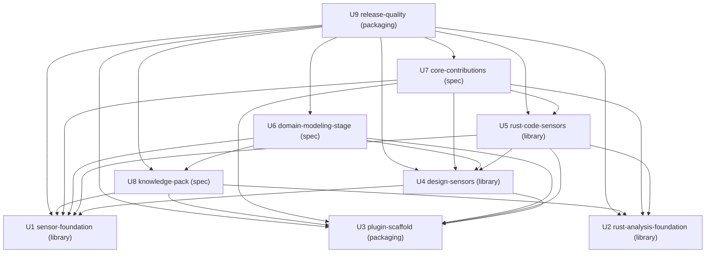

# Unit 依存グラフ — DDD プラグイン（AI-DLC v2）

## Sources

- `inception/units-generation/unit-of-work.md`（U1〜U9 の定義）
- `inception/domain-design/components.md`（コンポーネント間の `depends_on` を Unit 単位に畳み込んだ）
- `inception/domain-design/decisions.md`（ADR-001、ADR-003、ADR-009 が辺の根拠）
- `inception/requirements-analysis/requirements.md`（FR8.7 のゴールデンケース同梱、FR11.4 の統合テストが U9 の辺の根拠）
- `inception/units-generation/units-generation-questions.md`（Q8: 基盤が揃うまで直列、その後は並列可）

本書は Unit 間の位相（何が何に依存できるか）だけを記す。どの Unit から作るか、どれが最短経路かは決めない。

## 依存グラフ（機械可読）

```yaml
units:
  - name: u1-sensor-foundation
    kind: library
    depends_on: []
  - name: u2-rust-analysis-foundation
    kind: library
    depends_on: []
  - name: u3-plugin-scaffold
    kind: packaging
    depends_on: []
  - name: u4-design-sensors
    kind: library
    depends_on: [u1-sensor-foundation, u3-plugin-scaffold]
  - name: u5-rust-code-sensors
    kind: library
    depends_on: [u1-sensor-foundation, u2-rust-analysis-foundation, u3-plugin-scaffold, u4-design-sensors]
  - name: u6-domain-modeling-stage
    kind: spec
    depends_on: [u1-sensor-foundation, u3-plugin-scaffold, u4-design-sensors, u8-knowledge-pack]
  - name: u7-core-contributions
    kind: spec
    depends_on: [u1-sensor-foundation, u2-rust-analysis-foundation, u3-plugin-scaffold, u4-design-sensors, u5-rust-code-sensors]
  - name: u8-knowledge-pack
    kind: spec
    depends_on: [u1-sensor-foundation, u2-rust-analysis-foundation, u3-plugin-scaffold]
  - name: u9-release-quality
    kind: packaging
    depends_on: [u1-sensor-foundation, u2-rust-analysis-foundation, u3-plugin-scaffold, u4-design-sensors, u5-rust-code-sensors, u6-domain-modeling-stage, u7-core-contributions, u8-knowledge-pack]
```

## 依存グラフ（図）



<!-- Text fallback: 矢印は「依存する → 依存される」。U1・U2・U3 は葉（依存なし）。U4 は U1・U3 に、U5 は U1・U2・U3・U4 に、U6 は U1・U3・U4・U8 に、U7 は U1〜U5 に、U8 は U1・U2・U3 に、U9 は U1〜U8 すべてに依存する。循環はない。 -->

## 辺の根拠

| 辺 | 根拠 |
|---|---|
| U4 → U1 | 設計センサーは SensorRuntime の契約で起動し、DomainModelSchema の読み込み器と索引で正規モデルを読む（ADR-001） |
| U4 → U3 | マニフェストとスクリプトが投影されるには plugin.json の `contributes.sensors` / `tools` 宣言が要る |
| U5 → U1 | 同上（ランタイム契約と、宣言済み Command 集合の参照 (b)(c)(n)） |
| U5 → U2 | 構文木の問い合わせと層判定を RustSyntaxAnalyzer / WorkspaceLayerResolver から得る |
| U5 → U3 | 投影に plugin.json の宣言が要る |
| U5 → U4 | ゴールデンケースの fixture 規約とテストランナーは U4 で確定したものに従う（Q4） |
| U6 → U1 | 生成する `domain-model.yaml` の構造と ID 体系の出典が DomainModelSchema |
| U6 → U3 | 投影に plugin.json の `contributes.stages` が要る |
| U6 → U4 | frontmatter の `sensors` に束ねる model-completeness の ID が確定している必要がある |
| U6 → U8 | ステージのリード（architect）が開始時に読む方法論ナレッジ（`components.md` の DomainModelingStage → DddKnowledgePack）。ナレッジ無しではステージ手順が参照する規約の出典が無い |
| U7 → U1 | 写像・宣言が参照する ID 文法の出典 |
| U7 → U2 | infrastructure-design / code-generation の手順が指示する命名・配置規約の出典（ADR-005） |
| U7 → U3 | 投影に plugin.json の `contributes.overlays` が要る |
| U7 → U4、U5 | `adds.sensors` に束ねるマニフェスト ID が確定している必要がある（ADR-009 で設計側は U4、コード側は U5） |
| U8 → U1、U2 | ナレッジが説明するスキーマと命名規約の出典（ADR-006） |
| U8 → U3 | 投影に plugin.json の `contributes.knowledge` が要る |
| U9 → U1〜U8 | README のセンサー一覧・拡張ポイント、compose 統合テスト（FR11.4）、`bun run check`（FR11.3）はすべての Unit が揃って初めて確定する |

## 統合点

| 統合点 | 提供側 | 利用側 | 形 |
|---|---|---|---|
| センサー実行契約（引数、verdict、詳細ファイル） | U1 | U4、U5 | TypeScript API（`tools/ddd/lib/runtime/`）。エンジンのディスパッチャ契約に整合 |
| 正規モデル読み込み器・スキーマ・索引 | U1 | U4、U5、U6、U7、U8 | TypeScript API と JSON Schema（`tools/ddd/lib/schema/`）。U6・U7・U8 は文書としてスキーマを参照 |
| 構文木問い合わせ API | U2 | U5 | TypeScript API（`tools/ddd/lib/rust/`） |
| クレート → 層判定と許可依存方向 | U2 | U5、U7、U8 | TypeScript API（`tools/ddd/lib/workspace/`）。U7・U8 は規約の文書として参照 |
| マニフェスト ID（`aidlc-ddd-*`） | U4、U5 | U6、U7 | frontmatter の `sensors` / `adds.sensors` に列挙する文字列 |
| 成果物論理名（`ddd-domain-model`、`ddd-domain-model-yaml`、`ddd-aggregate-mapping`、`ddd-use-case-declarations`、`ddd-layer-structure`） | U6、U7 | U4（解析対象）、U9（README） | `produces` / `adds.produces` の論理名と、それに対応するファイル形式 |
| fixture 規約（違反あり／なしの対、期待所見の書式） | U4 | U5 | `tests/golden/` のディレクトリ構成とテストランナー |
| plugin.json の `contributes` 宣言 | U3 | U4〜U8 | 各面のディレクトリを投影対象にする宣言 |

## 並列開発の余地

依存のない Unit の組（複数のトポロジカル順が存在する）:

- U1、U2、U3 は互いに独立。
- U8 は U4・U5 に依存せず、U4・U5・U7 と独立。
- U6 は U5・U7 と独立（U6 は U5 に依存せず、U7 は U6 に依存しない）。
- U7 と U8 は互いに独立。

Q8 の方針: U1〜U4（共有ライブラリと fixture 規約）が揃うまでは直列で進め、その後は上の独立関係だけを制約として並列を許す。理由は `tools/ddd/lib/` の共通コードと `tests/golden/` の規約が固まる前に並列にすると、同じファイルへの変更が衝突しやすいため。どの順で着手するかは本書では決めない。
