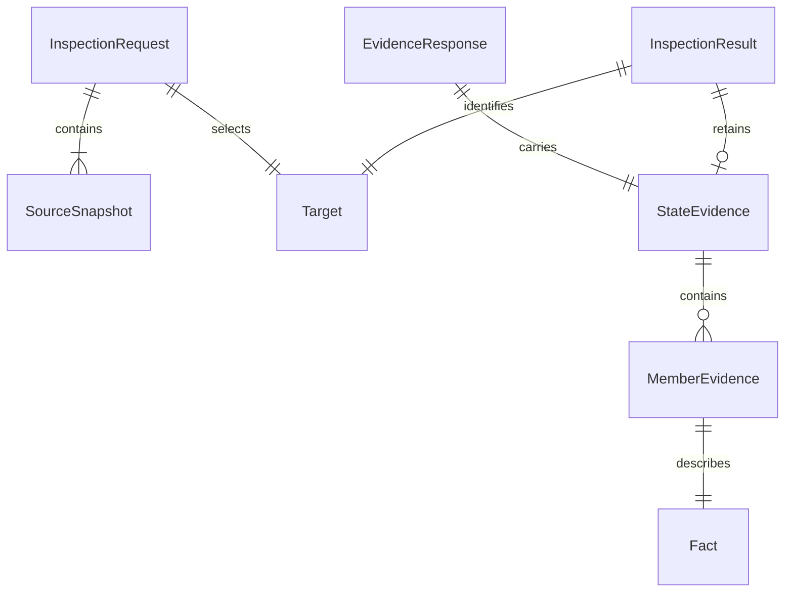

# U1 共通検査 — 機能仕様

## Sources

- [作業単位](../../../inception/units-generation/unit-of-work.md)、[ストーリー対応](../../../inception/units-generation/unit-of-work-story-map.md): U1の主担当とU2との協力範囲。
- [要件](../../../inception/requirements-analysis/requirements.md)、[ストーリー](../../../inception/user-stories/stories.md): US1.3の七受入条件と品質条件。
- [構成要素](../../../inception/domain-design/components.md): StateExposureInspectionの所有と独立性。
- [契約](../../../inception/contract-design/contract-summary.md): C1の値、公開入口、検証と失敗規約。
- [機能設計の確認](functional-design-questions.md): 今回の具体化についての確認記録。

## Responsibility and Boundaries

U1はStateExposureInspectionの内部処理を設計する。公開入口と返却形式は承認済みC1を維持し、検査領域の内部の責務を以下へ分ける。これは新しい作業単位・サービス・公開APIを追加する分割ではない。

| 内部責務 | 入力 | 出力 | 副作用 |
|---|---|---|---|
| 入力と要求の検証 | 未検証の値 | 検証済み値または入力エラー | なし |
| 正規化と識別 | 検証済み入力または要求 | 派生スナップショット・要求識別 | なし |
| 実行と応答の検証 | 有効な要求と未検証の実行値 | 実行状態、検証済み証跡または拒否理由 | なし |
| 規則判定 | 検証済み証跡と実行状態 | 規則結果と確定所見・理由 | なし |
| 結果の構成 | 上記の検証結果 | 対象と証跡を保持した独立した結果値 | なし |

入力の形状検証と規則判定は、別の責務と試験境界にする。内部の検証済み値には未検証の値が混入しない経路を設け、単なる型注釈で検証済み扱いにしない。

## Value Relationships

次の図はentities.mdの値の包含関係から導いた表示である。独立した可変エンティティや永続化の多重度を追加する図ではない。

テキスト表現: 検査要求は一つの対象と一個以上のソーススナップショットを持つ。共通応答は証跡を持ち、対象が解決できた証跡はメンバーごとのFactを含む。結果は対象と、検証できた場合の証跡を保持する。規範は[値モデル](entities.md)とC1であり、図のStateEvidenceからMemberEvidenceへの辺はresolved分岐にだけ適用する。

## Workflow WF1.1: 要求を準備する

1. 未検証入力がJSON互換の値であることを確認する。循環は祖先経路で判別し、循環ではない同一オブジェクトの共有参照を誤って循環としない。必要な検証と正規化を、入力の深さだけで実装の呼出しスタックが尽きない走査として設計する。
2. 必須フィールド、言語と表現の組合せ、ソースの一意性、対象との対応、ツールの名前・版、設定の値を検証する。失敗はinput-rejectedとして位置ではなく入力フィールドをsubjectに示せる。
3. 各ソース本文のUTF-8からハッシュ、バイト長、行開始位置を導出する。改行やBOMを消さず、C1の改行規約を適用する。空ファイルの行開始位置は0だけになる。
4. ソースをpath順、ツールをname順へ整列する。settingsの未知キーも含め、すべての値を正規化する。ルールと契約の版を固定した要求の既知フィールドから識別を計算する。
5. 入力から独立したprepared / requestを返す。元のソース文字列を読み直す経路や、ファイルを探索する経路を設けない。

## Workflow WF1.2: 応答を検査する

1. 要求の形状、版、対象との対応、スナップショットの整列・範囲、正規化識別を検証する。不正ならinput-rejectedとし、規則結果を作らない。
2. 実行状態の外枠を検証する。completedではresponseキーとJSON互換の値が必須、unavailableとfailedでは理由が一件以上必要である。外枠不正はinput-rejected。
3. unavailableまたはfailedなら、その実行状態と理由に基づくunresolved結果を構成する。targetを要求から保持し、checkedEvidenceはnull、確定所見は空とする。
4. completedでresponseがnullなら、応答なしのinvalid-responseでunresolvedとする。JSON互換の非null値については、応答の最小外枠と版、要求識別、証跡の形状と不変条件を順に検証する。
5. 応答の外枠が不正ならinvalid-response、識別可能な未知版ならunknown-version、正しい版で要求対応が異なればidentity-mismatchとする。証跡の検証へ進む前にこれらを処理し、未来の版の本文を現在の版で解釈しない。対象・メンバー・位置・Factの不変条件違反はinvalid-responseとする。
6. 応答不正は全体を不採用とし、部分的な所見の救出を行わない。要求は有効なのでevaluated / completed / unresolvedを返し、checkedEvidenceはnullにする。
7. 正しい証跡のtargetStatusがunresolvedなら、その理由を保持する。resolvedならメンバーを走査し、resolved / trueだけから確定所見を作る。partialの一覧理由と、unresolvedのFactの理由を集約する。
8. 必要情報に未解決があればunresolved、なければ所見の有無でviolationまたはpassにする。未解決があることを理由に、独立して検証できた確定違反を削除しない。
9. WF1.3で結果を構成して返す。

## Workflow WF1.3: 結果を複製・整列する

1. targetを検証済み要求から複製する。証跡全体の検証に成功している場合は、その既知フィールドをcheckedEvidenceへ複製する。正常時もtargetEvidence・完全性・各Factと位置を残す。
2. checkedEvidenceのメンバーをmemberId順、各根拠位置をfile・byteStart・byteEnd順に整列する。所見もmemberId順にし、すべての理由配列へC1のcode・subject・位置・messageの順序を適用する。
3. 同値比較では文字列をUnicodeスカラー値順、数値を数値順に扱う。nullの位置は非nullより前とする。整列は根拠の削除や重複排除を伴わない。
4. 入力の可変辞書・配列を結果と共有しない。返却後に呼出し側が入力を変えても、既存の結果値の証跡は変わらない。並行した二つの呼出しが、可変の共有キャッシュや実行状態を参照しない。
5. passとviolationでは未解決理由なし、unresolvedでは一件以上という不変条件を満たす結果を返す。正常の根拠だけが変わった結果も、C2で比較可能な形にする。

## Transitions and Outcomes

以下は一回の呼出し内の処理状態であり、保存される業務エンティティのライフサイクルではない。

| 現在 | 条件 | 次または返却 |
|---|---|---|
| 要求検証 | 要求が不正 | input-rejected |
| 要求検証 | 要求が妥当 | 実行の外枠検証 |
| 実行の外枠検証 | responseキーなし、非JSON値、または他の外枠不正 | input-rejected |
| 実行の外枠検証 | unavailable / failed | 対応する実行状態のunresolved |
| 応答検証 | response:null、形式・版・識別・証跡の不正 | completed / unresolved、checkedEvidence:null |
| 判定 | 正しい証跡に必要情報の未解決あり | completed / unresolved、検証済み証跡と確定違反を保持 |
| 判定 | 完全・確定・公開あり | completed / violation |
| 判定 | 完全・確定・公開なし | completed / pass、正常の根拠を保持 |

一つの不正入力に複数の欠陥があれば、上記検証段階で先に見つかる欠陥を優先する。同じ段階で返す複数理由は決定的に整列する。試験は狙う欠陥以外を妥当にし、別の条件が先に拒否されたことを確認済みの根拠にしない。

## Derived Rules Summary

| 規則 | 目的 |
|---|---|
| BR1.1 | 入力をJSON互換の値として検証する |
| BR1.2 | 要求の入力条件と識別を固定する |
| BR1.3 | 実行状態の外枠と応答なしを区別する |
| BR1.4 | 検証できない応答全体を判定へ渡さない |
| BR1.5 | 根拠と位置を同じ要求に対応付ける |
| BR1.6 | 不在・一覧の完全性・意味の未解決を分ける |
| BR1.7 | 正常・違反・検査不能の優先順位を守る |
| BR1.8 | 正常を含む検証済みの証跡を結果へ残す |
| BR1.9 | 比較可能な順序と独立した値を返す |
| BR1.10 | 共通判定を解析器から独立させる |

規範となる文と判断条件は[rules.md](rules.md)のYAMLを参照する。

## Acceptance and Test Boundaries

| 受入条件 | U1で確認する内容 |
|---|---|
| AC1.3.1 | 要求と応答の識別、対象・位置の追跡、別入力・設定の拒否 |
| AC1.3.2 | partialな空一覧を正常や不在の証明にしない |
| AC1.3.3 | 検査不能と確定違反を同時に保持し、証跡を結果から追える |
| AC1.3.4 | 未知版、不正・欠落・識別不一致を拒否し、不正応答から所見を捏造しない |
| AC1.3.5 | 実行状態と規則結果を分け、起動不能・失敗を正常へ変換しない |
| AC1.3.6 | 正常に必要な完全性と非公開・不在の根拠を要求する。初版ではnot-applicableを扱わない |
| AC1.3.7 | 同じ意味の共通情報について四つの結果条件を解析器なしで比較する。位置はそれぞれの入力に対応させる |

各試験境界は正常系と二つ以上の異常・境界条件を含める。入力のキー順・ソース順・ツール順の差、本文・設定・対象・版の差、ASCII以外の文字、CRLF・LF・空ファイル・末尾改行、範囲境界、共有参照と循環、返却後の入力変更を区別する。responseキーなし、response:null、不正なJSON互換値は別ケースとする。

U1が提供する契約・判定試験は、US1.1・US1.2の実ソース検査とUS1.4の結合検証にも使う。U2が担当する抽出やコマンド実行を、U1の七受入条件の完了に置き換えない。正常の根拠だけを変えた比較と、JSON往復でもその根拠が残る確認は、U1の結果仕様とU2の比較処理の両方で行う。

## Implementation Handoff

実装と単独試験の所有範囲はunit-of-work.mdのU1を維持する。公開入口・版・データ形式はC1を変更しない。内部責務の関数・ファイルへの具体的な割当てと実装コードは、コード生成の計画へ渡す。U1の機能設計から解析器・UI・保存基盤・独立サービスを追加しない。
