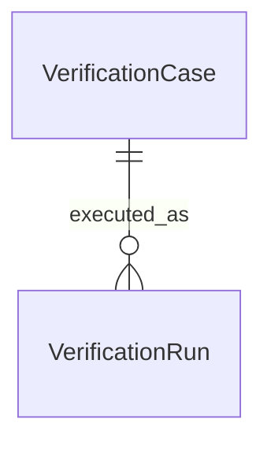

# U2 言語別抽出と検証実行 — 機能仕様

## Sources

- [作業単位](../../../inception/units-generation/unit-of-work.md)、[対応表](../../../inception/units-generation/unit-of-work-story-map.md): U2の主担当と所有範囲。
- [要件](../../../inception/requirements-analysis/requirements.md)、[ストーリー](../../../inception/user-stories/stories.md): US1.1・US1.2・US1.4の16受入条件。
- [構成要素](../../../inception/domain-design/components.md)、[契約](../../../inception/contract-design/contract-summary.md): U1との接続とC2。
- [言語共通の設計](../../../../../../../../ddd/docs/developers/language-independent-design.ja.md): 合意済みのコンパニオン例。
- [確認記録](functional-design-questions.md): 対応形状と検証手順の確認。
- [Rust試作の入口](../../../../../../../../ddd/experiments/rust-syn/src/main.rs)、[構文抽出](../../../../../../../../ddd/experiments/rust-syn/src/analysis.rs)、[既存の比較検証](../../../../../../../../ddd/scripts/verify-rust-syn.ts): 版1の入力・出力と入力上限の確認元。

## Responsibility and Boundaries

Rustの根拠抽出、TypeScriptの根拠抽出、固定ケースの検証実行をU2内で分ける。共通型の意味・要求識別・最終判定はU1を利用する。ソース本文を実行せず、構文・型の確認から得た情報だけを共通値へ変換する。

## Entity Relationships



図のテキスト表現: 一つのVerificationCaseにはゼロ回以上のVerificationRunが対応し、一つのVerificationRunは一つのケースを実行する。C2のコマンド一回の報告は、これら個別記録をまとめる値である。規範はentities.mdのYAMLに置く。

## Supported Source Shapes

| 表現 | 初版で確認する形状 | 未解決として残す境界 |
|---|---|---|
| Rust | 指定ファイルの直接宣言またはインラインモジュール内の名前付き・タプル構造体。一意な宣言経路、非公開・pub・制限付き公開のフィールド | 外部モジュールの探索、未展開マクロや条件付き構文により対象・一覧・フィールドの成立を確認できない範囲 |
| TypeScript class | 指定ファイルの直接宣言、継承なし、静的に列挙できるインスタンスのフィールド・操作メソッド。初版の正常代表例は非公開フィールドに状態を保持する | 継承、未対応の計算名・アクセサ・decorator・実体を確定できない宣言、追加メンバーを作る未対応構文 |
| TypeScriptの型＋同名コンパニオン | 同一ファイルで型とコンパニオンが対応し、非公開unique symbolブランドを持つ局所オブジェクトを生成する。状態はクロージャに置き、操作メソッドはそのオブジェクト内に置く | 外部ファクトリ、型アサーション、spread、追跡不能な別名・再代入・戻り経路、ブランドの識別や非公開性を確認できない形状 |

Rustのフィールド型の一般解決は行わない。可視性の構文根拠と、型・フィールド自体が成立している根拠を区別する。TypeScriptのprivate修飾子だけでは実行時の非公開を証明しない。初期値や明示的な代入で実体を確認できる通常の名前付きインスタンスフィールドは、readonlyやprivate修飾子だけを理由に非公開と判定しない。実体を確認できないdeclare・abstract等は未解決とする。

classのstaticメンバーとコンパニオン自身のstatic相当メソッドは、検査対象インスタンスの保持状態の一覧と分ける。初版は、宣言されたインスタンスの直接の状態公開という範囲を検査し、操作メソッドの副作用・可変参照の漏出全般を証明しない。必要一覧を変え得る未対応構文を検知した場合は、完全としない。

## Workflow WF2.1: 入力を準備する

1. C2の引数と固定ケース定義を検証する。未知・重複オプション、未知caseId、空集合、不正な期待値を解析器起動前に拒否する。
2. 明示されたソースと有効設定を一度読み、変更しない入力値として保持する。対象が要求したファイル・宣言・表現に対応することを確認する。
3. 実行に必要なツールと版を確認する。Rust試作は下記の明示的な準備コマンドと生成先を使い、検証中の依存ダウンロードや無制限ビルドをしない。TypeScript側の標準ライブラリも、記録した解析器版に結び付く準備済み資産を使う。
4. U1の要求準備を呼ぶ。成功した要求と同じソース文字列・設定・ツール版を解析器へ渡す。一般のパッケージ・依存探索や、指定されないプロジェクトソースの読み込みを追加しない。
5. 解析器へ渡す入力と、返された応答の対応を要求ごとに保つ。複数ケースを扱う場合も、出力や診断を別ケースへ混ぜない。

### Rust試作の明示的な準備

作業ディレクトリはリポジトリ内のdddとする。以下は現在のmacOS開発環境向けに定める準備手順であり、他OSで実行済みという保証ではない。Cargoとrustcは同じ選択済みツールチェーンを使う。

依存キャッシュが不足している場合だけ、検証とは分けて取得する。ロックファイルを更新しない。

```sh
cargo fetch --locked --manifest-path experiments/rust-syn/Cargo.toml
```

続いてネイティブのhostターゲットを明示してビルドし、C2の参照先へ配置する。途中で失敗したら配置しない。

```sh
(
  set -eu
  rust_host_target="$(rustc -vV | sed -n 's/^host: //p')"
  test -n "$rust_host_target"
  cargo build --locked --offline --release --manifest-path experiments/rust-syn/Cargo.toml --target-dir experiments/rust-syn/target --target "$rust_host_target"
  mkdir -p experiments/rust-syn/target/state-exposure
  cp "experiments/rust-syn/target/$rust_host_target/release/ddd-rust-syn-spike" experiments/rust-syn/target/state-exposure/ddd-rust-syn-spike
)
```

Cargoの生成先はexperiments/rust-syn/target内のhostターゲット別releaseディレクトリ、配置先は `ddd/experiments/rust-syn/target/state-exposure/ddd-rust-syn-spike` とする。新しい検証入口は、この配置先をdddパッケージルートから解決して使い、PATH上の同名ファイルや既存の比較用一時コピーを探索しない。CARGO_BUILD_TARGET等の暗黙のターゲット設定に生成先を任せず、上の--targetを使う。

準備は内部版2を追加したソースに対して実行する。配置先がない・実行できない場合はC2のexecution-errorとし、検証入口からfetch・build・コピーを再実行しない。ビルド後にソースやロックを変えた場合は、上の準備を明示的にやり直す。実際の版2要求への応答と期待値を検証するため、存在するだけの古い版1バイナリで成功したとは扱わない。

既存の `bun run experiment:rust-syn` は、内部でビルドして版1を比較する回帰コマンドとして維持する。これをC2の入口から呼んで事前準備を代用しない。通常の検証への接続では、明示的な準備、版1の回帰、新C2の検証を別の実行として記録する。

## Workflow WF2.2: Rustの根拠を抽出する

1. Rust内部で構文を解析し、指定ファイルとインラインモジュールの宣言経路で対象を同定する。別名の一般解決、外部モジュール探索を行わない。
2. 対象が存在しない・複数候補・成立不明なら、その理由でtargetStatusをunresolvedとする。ファイル全体の構文が不正で範囲を信頼できなければ、部分的な違反を確定しない。
3. 成立が確認できる構造体のフィールドを、名前付きとタプルの位置を区別して列挙する。非公開はstateExposureのresolved/false、pubと制限付き公開はresolved/trueとし、同じソース上の位置を付ける。
4. 属性や条件付き構文がフィールドの成立へ影響する場合、そのFactをunresolvedにする。未知のメンバーが増える可能性がある場合は一覧をpartialとする。型全体の成立を左右する属性・マクロなら対象自体をunresolvedにする。影響がないと証明できない範囲を黙って無視しない。
5. 安定したメンバー識別は、対象の宣言経路とフィールド名またはタプル位置に結び付ける。走査中の一時カウンターだけで同じ入力の識別を変えない。
6. Rust側で同じ本文のUTF-8位置を取得し、U2内の変換でC1の共通行規約へ揃える。TypeScript側でRustソースを文字列照合し直してメンバーを推測しない。

### 既存試作との接続

今回確認した既存試作はprotocol_version=1とfilesを受け取り、ファイル単位の情報を返す。既存の版1の要求・応答と8 MiBの入力上限を維持し、新経路用に内部版2を追加する。版2は要求識別、指定対象、本文ダイジェスト、対象とフィールドの確定性・完全性・バイト位置を返す形としてRustStateEvidence内で完結させる。

U2は版2の外枠・要求識別・本文ダイジェスト・対象・形状を検証し、共通証跡へ変換する。内部版2をC1のstate-exposure/1と混同しない。旧版1の応答に欠けている情報を空値で埋めて版2相当とみなさない。既存の試作比較スクリプトは版1の回帰対照として維持し、必要な新ケースは別途追加する。

## Workflow WF2.3: TypeScriptの根拠を抽出する

1. 固定入力と設定から構文・シンボル・型を確認する解析環境を作る。対象の型と値の名前空間を区別し、同名という文字列一致だけで対象やコンパニオンと判定しない。
2. 指定ファイル・宣言経路・表現の対象を一意に同定する。入力の外のimport・再公開・生成物等が必要なら、その解決を推測して追加せず未解決とする。
3. classでは対応する静的なインスタンスメンバーを列挙する。非公開フィールドは非公開の根拠、実体のある名前付きの公開データメンバーは公開の根拠へ変換する。操作メソッドやstaticメンバーは、保持状態と区別した確認済みの根拠を持つ場合だけabsentとして扱える。
4. コンパニオンでは同一ファイルの型・同名の値・生成関数・ブランドを照合する。ブランドは非公開unique symbolであり、型の印とインスタンスの計算名が同じシンボルを指すことを確認する。ブランドの名前や存在だけを状態隠蔽の証明にしない。
5. 生成関数の戻り経路を、内側のメソッドや関数の戻りと分けて調べる。対応するのは、直接のオブジェクト返却、再代入されない局所constのオブジェクト返却、および合意済み例のok:true/valueでそのインスタンスを包む局所の成功経路とする。局所のok:false/error経路はインスタンスを返さないことだけを確認し、エラー集合の正しさは検査しない。
6. 成功値の識別は、生成関数の型と実際の返却式・シンボルの対応を合わせて確認する。外部Resultライブラリの呼出し、追えない戻り値、型アサーション、複数の異なるインスタンス形状は初版ではunresolvedとする。エラーラッパーのokやerrorを対象インスタンスの公開状態に数えない。
7. インスタンスのメンバーを確認する。クロージャ内の状態を公開オブジェクトへ直接データとして渡していれば公開の根拠になる。操作メソッドや確認済みブランドの印だけを状態公開にしない。ブランド用の計算名以外を無条件に受け付けず、spreadや未対応の計算名等が必要一覧を不確実にするならpartialにする。
8. 対応範囲で確認できたメンバーの根拠を保持し、未解決範囲と分ける。型全体や生成経路の同定を失った場合は対象をunresolvedにし、個別の構文候補から確定所見を作らない。
9. 同じソースに対する位置を、C1の行・UTF-8バイト範囲へ変換する。解析器の文字位置をそのまま別言語の列番号と比較しない。

## Workflow WF2.4: 実行状態とC1への受渡し

1. 解析器を終了させられるプロセスまたはワーカー境界で起動し、C2の期限と出力上限を適用する。起動できなければunavailable、起動後の異常終了・期限・出力超過ならfailed、正常終了ならcompletedとする。この段階では応答の有無や妥当性で実行状態を変えない。
2. 終了を確認した後に、出力の有無・個数・版・形状を検証する。途中のJSON、複数応答、要求が異なる応答を採用しない。待機だけを打ち切って解析が動き続ける実装にしない。
3. completedで標準出力が空または空白だけならresponse:nullとする。非空だが解釈できない出力、複数応答、ネイティブ形式を検証できない出力は、responseに診断用の固定JSON文字列 `"invalid-native-response"` を渡す。U1はこれをinvalid-responseとして拒否する。有効な共通証跡を捏造せず、生の出力を契約値へ無条件に複製しない。応答不正だけでcompletedをfailedへ変更せず、ネイティブの診断は実行記録に残す。
4. 検証できた言語別情報をC1へ変換し、U1の検査を呼ぶ。共通の最終判定はU1だけが行う。returned targetとcheckedEvidenceを削除せずに保持する。
5. 起動不能・失敗に対するC1の結果を得た場合と、U1自体の想定外例外を区別する。後者ではInspectionResultを捏造せず、C2のexecution-errorへ進む。暗黙の再試行や旧センサーへの自動代替を行わない。

正常終了と応答の判定を分ける固定ケースを、次のとおり要求する。

| 実行の観測 | U2がC1へ渡す値 | C1の結果 |
|---|---|---|
| 正常終了、空出力または空白のみ | completed / response:null | completed / unresolved、invalid-response |
| 正常終了、非空の不正JSONや複数応答 | completed / responseが固定文字列 | completed / unresolved、invalid-response |
| 正常終了、検証済みのネイティブ情報 | completed / responseがC1共通応答 | 証跡の内容に従うpass・violation・unresolved |
| 起動後に異常終了、期限・出力上限超過 | failed / reasons | failed / unresolved |
| 起動できない | unavailable / reasons | unavailable / unresolved |

## Workflow WF2.5: 比較・報告と回帰確認

1. ケースの期待値は固定入力に結び付け、U1の判定結果から生成しない。識別だけを入力から算出する場合も、規則結果・理由・根拠は独立した期待値であることを保つ。
2. C1の整列済み結果を全フィールドで比較する。正常のtarget・checkedEvidence、根拠位置だけの差、未解決理由の差もmismatchとする。時刻や実行全体のrunIdはこの比較へ混ぜない。
3. 意図した失敗ケースを期待どおり実行できた場合は比較可能な観測済み結果となる。一方、実際の必要ツールがない等でそのシナリオを実行できない場合はnot-runとし、期待した異常が観測できたことにしない。
4. caseId順にC2のJSON報告を一個出し、診断ログを標準出力へ混在させない。使用法の不正は2、実際の準備・実行の失敗は3、期待との不一致は1、必要ケースすべて一致した場合だけ0とする。
5. U1の独立試験、両言語の抽出、コマンドの実結合、既存Rustの基準試験と影響する試作比較を通常の自動検証へ登録する。準備コマンド・採用版・環境・対象ケース・成否を残し、期待値を弱めて回帰を隠さない。

## Execution State Transitions

| 個別実行の状態 | 条件 | 次の状態 |
|---|---|---|
| selected | ケース定義が妥当、実行準備が可能 | prepared |
| selected / prepared | 実際の必要条件が不足 | not-run |
| prepared | 解析器を起動 | running |
| running | シナリオの結果を観測し、C1の結果を取得 | observed |
| observed | 期待値と比較 | compared |
| compared / not-run | 全体の報告へ取り込む | reported |

observedには、意図した起動不能や実行失敗を観測したケースも含み得る。内部の実行記録の状態、ExtractionExecution、規則結果、期待値比較の成否は別の軸であり、同じfailedという一語へ潰さない。実行シナリオを成立させるツール自体がない場合はnot-runである。

## Derived Rules Summary

| 規則 | 目的 |
|---|---|
| BR2.1 | 同じ入力・設定・版で要求と抽出を対応付ける |
| BR2.2 | 指定した宣言を一意に同定する |
| BR2.3 | Rustの名前付き・タプルの可視性を根拠にする |
| BR2.4 | Rustの成立不明な範囲を未解決にする |
| BR2.5 | TypeScriptの静的なインスタンス状態を区別する |
| BR2.6 | コンパニオンのインスタンスとブランドを確認する |
| BR2.7 | 未対応のTypeScript形状を完全扱いしない |
| BR2.8 | 実行を実際に終了できる境界で管理する |
| BR2.9 | ネイティブ情報を検証してC1へ接続する |
| BR2.10 | 同じソースに結び付く共通位置を渡す |
| BR2.11 | 正常の根拠も含めて期待値と比較する |
| BR2.12 | 検証全体の成否と規則結果を分ける |
| BR2.13 | 回帰・自動検証・実行案内を維持する |
| BR2.14 | 独立試験と実際の抽出を通す試験を分ける |


## Acceptance and Fixture Plan

| 受入条件 | 固定ケースと検証内容 |
|---|---|
| AC1.1.1 | Rustの名前付き・タプルの非公開フィールド。正常と対象一致 |
| AC1.1.2 | Rustのpub・pub(crate)等の公開。型・メンバー・位置の一致 |
| AC1.1.3 | 対象欠落、同名の曖昧さ、対象結果不足。別型による代用の拒否 |
| AC1.1.4 | 構文不正、条件付き型・フィールド、未解決と独立した公開の混在 |
| AC1.1.5 | 起動不能・異常終了・終了コード0で応答なし／不正／不完全 |
| AC1.2.1 | classの非公開フィールドを使う対応形状 |
| AC1.2.2 | 非公開ブランド・局所instance・クロージャ・メソッド・成功値ラッパーを持つ合意済み例 |
| AC1.2.3 | classとコンパニオンでの直接公開、readonlyを含む |
| AC1.2.4 | 継承・spread・未対応計算名・型アサーション・追えない生成経路 |
| AC1.2.5 | TypeScriptの対象欠落・曖昧・構文不正・解析失敗 |
| AC1.4.1 | Rust二形式・TypeScript二形式の実抽出から共通判定までの正常・違反・検査不能 |
| AC1.4.2 | 入力・設定・版を固定した再実行。根拠と順序を含む一致 |
| AC1.4.3 | 期待と異なる理由の失敗、根拠だけの差、実際の準備不足、未実行と意図した異常の区別 |
| AC1.4.4 | 既存Rustの25件を比較の出発点とする回帰と、影響するsyn比較。件数は網羅率の保証ではない |
| AC1.4.5 | 共通型に解析器の型が漏れず、U1を解析器なしでも試験できる |
| AC1.4.6 | 実行条件・採用版・対応形状・コマンド・結果の英日記録と、C2のJSON報告 |

正常、違反、検査不能を各対応形式で別ケースにする。Unicode、CRLF・LF、末尾改行、バイト範囲と行の対応も確認する。混在ケースは、対象の成立を確認できる範囲内の確定メンバーと未解決範囲を用意し、無関係な構文エラーが先に全体を拒否しただけで成功にしない。

TypeScriptのclassおよびコンパニオンの全操作の効果、Rustのコンパイル全体、一般の型解決をこの固定ケースの成功から推定しない。対象ソース自体を実行して根拠を集める方式は採らない。

## Implementation Handoff

ソース・試験・文書・開発設定の所有はunit-of-work.mdのU2の範囲を維持する。実装で解析器とAPIの版を固定し、記録した版で必要な構文・シンボル・型の取得が成立することを先に確かめる。新しい版や外部ライブラリへ無検証で切り替えない。

Rust試作の準備コマンド・配置先・C2の参照先はWF2.1で確定した手順に従い、検証入口は準備済みの資産だけを使う。具体的な内部関数、型の実装、固定ケースファイル、プロセス管理コード、実行スクリプトはコード生成の計画で確定する。共通契約の変更が必要ならU1への影響を明示し、U2だけで契約の意味を変えない。
