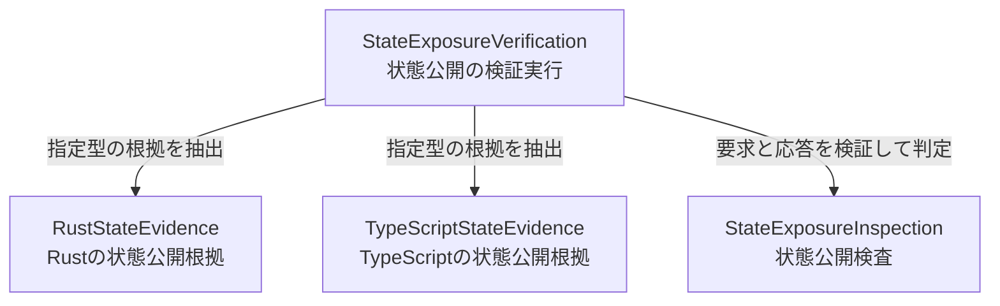

# 状態公開の共通検査 — 構成要素と所有

## Sources

- [requirements.md](../requirements-analysis/requirements.md): 承認済みのFR1〜FR6、NFR1〜NFR3。
- [stories.md](../user-stories/stories.md): 承認済みのUS1.1〜US1.4と受入条件。構成要素への直接の対応元。
- [domain-design-questions.md](domain-design-questions.md): Q1でAを選択し、四つの責務分担を`Looks correct`で確認した記録。
- [architecture.md](../../../../codekb/base/architecture.md): 現行のRust依存と、共通判定境界の不足。
- [component-inventory.md](../../../../codekb/base/component-inventory.md)、[dependencies.md](../../../../codekb/base/dependencies.md): 既存センサー、syn試作、検証経路と依存の調査結果。
- [用語集](../../../../../../../CONTEXT.ja.md)、[共通検査契約](../../../../../../../ddd/docs/developers/inspection-contract-design.ja.md): 言語共通の意味と今回の範囲。

対象は[Issue #38](https://github.com/amadeus-dlc/aidlc-ddd-plugin/issues/38)の開発用検証経路である。以下は今回実装する論理的な構成要素であり、実装済み機能の一覧や、デプロイ単位の指定ではない。

## Component Catalogue

次のYAMLを構成要素・呼出し・所有の正とする。`depends_on`と`dependents`は構成要素間の呼出しを示す。契約宣言への参照は、呼出しと区別して後述する。

```yaml
components:
  - name: StateExposureInspection
    summary: 状態公開の共通情報を検証し、一規則の結果を根拠付きで判定する。
    behaviour: >
      要求に対する応答の版・対象・入力・設定・根拠の対応を検証する。
      未検証の情報から合格や確定違反を作らず、必要情報が完全な場合に正常または違反を判定する。
      未解決事項が残れば全体を検査不能とし、独立に確定した違反も保持する。
      検証と判定の関数・試験は分け、解析器やファイル読取りを呼ばない。
    responsibilities:
      - 共通検査契約の宣言と版の対応方針を所有する。
      - InspectionRequestの意味と形状を所有する。属性はsnapshot、target、settings。
      - StateEvidenceの意味と形状を所有する。属性はrequestIdentity、members、completeness、reasons、evidenceLocations。
      - InspectionResultの意味と形状を所有する。属性はrequestIdentity、executionState、ruleResult、findings、unresolvedReasons。
      - 実行状態と規則結果を区別し、不正応答・不足・不一致を正常へ変換しない。
      - 受信情報の検証と状態公開の判定を、別々に試験できる境界を提供する。
    depends_on: []
    dependents:
      - component: StateExposureVerification
        interaction: 検査要求と抽出応答を検証し、共通の規則結果を得る。
    external_dependencies: []
    entities: []
  - name: RustStateEvidence
    summary: 指定したRust型から、状態公開の根拠と未解決範囲を抽出する。
    behaviour: >
      既存syn試作を利用し、指定型の名前付きフィールドとタプルフィールドを扱う。
      型の欠落・曖昧さ、構文エラー、判断できない条件付き構文を明示する。
      公開の構文候補と成立を確定できる根拠を区別し、共通形式へ変換する。
      解析器の起動不能・失敗や壊れたネイティブ応答を、正常な空結果へ置き換えない。
    responsibilities:
      - syn試作の起動とネイティブ応答の読取り・形式検証を所有する。
      - 指定型の同定と、対応するRust構文からの根拠抽出を所有する。
      - ネイティブ応答からStateEvidenceへの変換を所有する。共通形式の意味は変更しない。
      - 構文木・トークン・Rust固有の一時情報を内部に閉じる。
    depends_on: []
    dependents:
      - component: StateExposureVerification
        interaction: 明示したソースとRust型に対する根拠を要求する。
    external_dependencies:
      - name: syn
        kind: other
        purpose: 既存のRust試作を通じて構文と位置を取得する。
      - name: serde / serde_json
        kind: other
        purpose: Rust試作の要求と応答を直列化・逆直列化する。
    entities: []
  - name: TypeScriptStateEvidence
    summary: 指定したTypeScript型から、状態公開の根拠と未解決範囲を抽出する。
    behaviour: >
      Compiler APIのProgramとTypeCheckerを使って指定型を同定する。
      classと構造体＋同名コンパニオンの対応形状を調べ、根拠を共通形式へ変換する。
      ブランドの印や操作メソッドだけを公開状態と誤認せず、未対応形状や情報不足を明示する。
      型や構文の不確実な候補を確定違反にせず、解析失敗を正常な空結果へ置き換えない。
    responsibilities:
      - Program・TypeCheckerの構築と利用を所有する。
      - 指定型の同定と、二つの対応表現からの根拠抽出を所有する。
      - Compiler APIの情報からStateEvidenceへの変換を所有する。共通形式の意味は変更しない。
      - AST・シンボル・Compiler APIの型と一時情報を内部に閉じる。
    depends_on: []
    dependents:
      - component: StateExposureVerification
        interaction: 明示したソースとTypeScript型に対する根拠を要求する。
    external_dependencies:
      - name: TypeScript Compiler API
        kind: other
        purpose: 固定プロジェクト入力の構文・シンボル・型情報を確認する。
    entities: []
  - name: StateExposureVerification
    summary: 固定した検証ケースを実行し、実際の検査結果と期待値との差を報告する。
    behaviour: >
      検証ケースから入力・設定・対象を確定し、InspectionRequestを組み立てる。
      指定言語の抽出処理を呼び、応答と実行状態をStateExposureInspectionへ渡す。
      共通判定後に期待値との差を検証し、実行環境・ツール版・コマンドとともに記録する。
      必要ツール不足、期待値不一致、実行失敗を検証成功にせず、既存Rustの回帰確認も実行する。
    responsibilities:
      - VerificationCaseとVerificationRunを所有する。
      - 固定入力の読取り、入力の確定、解析器の選択、呼出し順序を所有する。
      - 期待値・再実行性・両言語の比較・既存Rust回帰の検証を所有する。
      - 検証コマンドの入口、自動検証への登録、英日での実行案内を所有する。
      - 検査結果を改変せず、実行成否・全体結果・確定違反・未解決理由を区別して報告する。
    depends_on:
      - component: RustStateEvidence
        interaction: 指定したRust型の根拠を抽出する。
        style: sync
      - component: TypeScriptStateEvidence
        interaction: 指定したTypeScript型の根拠を抽出する。
        style: sync
      - component: StateExposureInspection
        interaction: 要求と応答を検証し、状態公開を共通判定する。
        style: sync
    dependents: []
    external_dependencies:
      - name: Bun
        kind: other
        purpose: 既存の開発コマンドと自動試験の実行環境を利用する。
      - name: Cargo / rustc
        kind: other
        purpose: Rust試作のビルドと、必要な固定ケースのコンパイル対照を行う。
    entities:
      - name: VerificationCase
        identifier: caseId
        attributes: [label, request, expectedResult]
        references: []
      - name: VerificationRun
        identifier: runId
        attributes: [caseId, actualResult, comparison, toolVersions, command, environment]
        references: []
```

## Component Diagram



図のテキスト表現: StateExposureVerificationが指定言語のStateEvidence処理を呼び、その応答と要求をStateExposureInspectionへ渡して判定する。三つの呼出し辺に逆方向の呼出しや循環はない。両言語を一つの型へ同時に適用する意味ではなく、比較検証ではそれぞれの対応ケースを実行する。

`sync`は、要求に対応する応答を待って次の判定へ進む相互作用を表す。イベント配信やキューを追加しない。JavaScriptの同期I/Oを指定するものではなく、Rust試作の別プロセス境界も維持できる。

## Component Summary

| Component | Purpose | Depends On | Dependents | Entities Owned |
|---|---|---|---|---|
| StateExposureInspection | 共通契約の検証と一規則の判定 | なし | StateExposureVerification | なし |
| RustStateEvidence | 指定Rust型の根拠抽出と変換 | なし | StateExposureVerification | なし |
| TypeScriptStateEvidence | 指定TypeScript型の根拠抽出と変換 | なし | StateExposureVerification | なし |
| StateExposureVerification | 入力の確定、実行、期待値との比較、報告 | RustStateEvidence、TypeScriptStateEvidence、StateExposureInspection | なし | VerificationCase、VerificationRun |

### 契約宣言への参照

呼出し辺とは別に、RustStateEvidence・TypeScriptStateEvidence・StateExposureVerificationは、StateExposureInspectionが所有する共通契約の宣言を参照する。言語別抽出は宣言された形式へ変換し、規則の判定関数を呼ばない。共通検査側から言語別処理や検証実行への依存は作らない。

共通契約の所有者と実装言語別の宣言ファイルを同一視しない。別プロセス側に対応する宣言が必要になっても、意味を独自に定義し直さず、契約試験で一致を確認する。具体的な形式と版の同期方法は契約設計で定める。

## Entity Ownership

| Entity | Owning Component | Identifier | Attributes | References |
|---|---|---|---|---|
| VerificationCase | StateExposureVerification | caseId | label、request、expectedResult | 他の構成要素が所有するエンティティへの参照なし |
| VerificationRun | StateExposureVerification | runId | caseId、actualResult、comparison、toolVersions、command、environment | 他の構成要素が所有するエンティティへの参照なし |

VerificationCaseは、入力や期待値を改訂しても検証上の目的を追跡する単位である。VerificationRunは、同じケースを繰り返した実行を区別する記録であり、caseIdで同じ所有者のケースを指す。IDの生成方式・データ型・多重度・永続化方式は本書で定めない。検査要求の入力識別と、実行ごとのrunIdを混同しない。

### 値と一時情報の所有

| 情報 | 意味を所有する構成要素 | 属性名・識別の役割 | 作成・利用 |
|---|---|---|---|
| InspectionRequest | StateExposureInspection | snapshot、target、settingsが、何をどの条件で検査するかを表す | 検証実行が固定入力から組み立て、各抽出処理と共通検査へ渡す |
| StateEvidence | StateExposureInspection | requestIdentity、members、completeness、reasons、evidenceLocationsが、要求への対応と根拠を表す | 言語別抽出が作り、共通検査が検証して使用する |
| InspectionResult | StateExposureInspection | requestIdentity、executionState、ruleResult、findings、unresolvedReasonsが、検査の結果を表す | 共通検査が作り、検証実行が期待値と比較する |
| Rustの構文情報・ネイティブ応答 | RustStateEvidence | 対象を同定し、根拠を抽出するための一時情報 | Rust処理の内部だけで扱う |
| TypeScriptの構文・シンボル・型情報 | TypeScriptStateEvidence | 対象を同定し、根拠を抽出するための一時情報 | TypeScript処理の内部だけで扱う |

共通要求・証跡・判定結果は内容で扱う値であり、独立した可変の業務エンティティにはしない。YAMLの`entities`に架空の集約を追加しない。値の受け渡しは、その意味の所有権を利用側へ移すものではない。構成要素同士で内部の可変状態を共有しない。

表の属性名は形状を説明するもので、公開JSONキーの確定ではない。データ型、閉じた状態の定義、必須性、検証条件は契約設計・機能設計で具体化する。

## External Dependencies

| Component | Dependency | Kind | Purpose |
|---|---|---|---|
| RustStateEvidence | syn | other | 既存Rust試作を通じた構文と位置の抽出 |
| RustStateEvidence | serde / serde_json | other | Rust試作の要求・応答の直列化 |
| TypeScriptStateEvidence | TypeScript Compiler API | other | Program・TypeCheckerによる構文・シンボル・型情報の確認 |
| StateExposureVerification | Bun | other | 開発用コマンド・自動試験の実行 |
| StateExposureVerification | Cargo / rustc | other | 試作のビルドと必要なコンパイル対照 |

StateExposureInspectionは解析器の実行環境に依存しない。上表の技術は承認済み要件または既存経路から引き継ぐ依存であり、クラウド基盤を選定するものではない。必要版と実行条件は後続の検証結果に記録する。

## Rationale

| 構成要素 | 分離する理由 | 試験の境界 |
|---|---|---|
| StateExposureInspection | 一規則で必要な情報と、その情報を使う判定は同じ理由で変わる。情報の検証と判定の所有者を揃える | 解析器を起動せず、完全・部分・不正・欠落・不一致・違反混在の入力を試験する |
| RustStateEvidence | Rust構文、条件付き構文、syn応答の変更理由を共通判断から分ける | 名前付き・タプル、公開・非公開、未解決範囲、起動・応答失敗を試験する |
| TypeScriptStateEvidence | 二つの表現とCompiler APIの変更理由を共通判断から分ける | class・コンパニオン、非公開状態・公開状態、未対応形状、解析失敗を試験する |
| StateExposureVerification | ケース選択、ツールの準備、実行記録、期待値の更新を規則の意味から分ける | 両言語の代表例、コマンドの失敗検出、繰返し実行、既存Rust回帰を確認する |

**Alternatives Rejected:** Q1のB案では「状態公開の証跡」と「状態公開の判定」を別の構成要素にする。情報契約の所有を独立させられるが、一規則でも変更と試験の調整先が増える。今回のA案では内部の関数と試験を分け、将来、独立した変更理由が生じた時点で境界を分割できるようにする。選択の根拠は[ADR-001](decisions.md#adr-001-状態公開の共通契約と判定を同じ構成要素が所有する)に記録する。

### 既存実装との関係

- 既存の`InspectionContext`を新しい共通契約として使わない。Cargo・Rust固有型と本番の探索手順を、この一規則の前提にしない。
- syn試作はRustStateEvidenceの内部で利用する。既存JSONや終了コードを合格判定にせず、ネイティブ応答の読取りと共通契約の検証を通す。
- 本番Rustセンサーの入口・出力契約を維持する。検証実行が既存試験を回帰の対照として呼ぶことと、本番センサーを新経路へ切り替えることは別の変更である。
- 所見の整列など既存処理の再利用は、Rust固有型や旧来の合格判定を持ち込まない範囲で検討する。再利用のための全規則改修を先行条件にしない。

## Story Coverage

[traceability.json](traceability.json)では、承認済みの四つのストーリーを以下の主たる構成要素へ対応付ける。対応先一つだけで利用者の成果を実現するという意味ではなく、協力する構成要素の責務と試験境界も併記する。

| ストーリー | 主たる構成要素 | 協力する構成要素と試験境界 |
|---|---|---|
| US1.1: 指定したRust型の状態公開を確認する | RustStateEvidence | 指定型の同定、名前付き・タプルの根拠抽出、条件付き構文・起動失敗・不正応答を扱う。StateExposureInspectionが要求と根拠を検証して最終判定し、StateExposureVerificationが固定入力と実行を受け持つ。TypeScriptの抽出には依存しない |
| US1.2: 指定したTypeScript型を同じ基準で確認する | TypeScriptStateEvidence | class・同名コンパニオンの根拠抽出、対応外の形状、対象欠落・解析失敗を扱う。StateExposureInspectionとStateExposureVerificationはRust経路と同じ責務を持つ。Rustの抽出には依存しない |
| US1.3: 確定違反と検査不能を区別して判断する | StateExposureInspection | 共通契約の検証、実行状態と規則結果の分離、完全性・混在時の優先順位を所有する。言語別抽出が根拠の確実性と未解決範囲を伝え、検証実行が結果と理由を改変せず報告する。固定した共通情報で解析器を起動せず試験する |
| US1.4: 検証を再実行して回帰を検出する | StateExposureVerification | 入力・期待値・実行記録を所有し、三つの検査用構成要素の試験と既存Rust回帰を実行する。固定結果を用いる比較・失敗伝達の独立試験と、実際の両言語抽出から共通判定までの結合試験を区別する |

US1.4の検証成功は、規則結果だけでなく、狙った違反・未解決理由・根拠との一致で判断する。別の不正が先に拒否され、期待と異なる理由で検査不能となったケースを成功にしない（AC1.4.3）。同じ意味の共通情報を比較する場合、ソース位置と対象識別はそれぞれの入力に対応させる（AC1.3.7）。

要件→ストーリーは[ストーリー側の対応表](../user-stories/traceability.json)、ストーリー→構成要素は本段階の[対応表](traceability.json)で追跡する。元の要件IDは維持し、以下の要件対応表も設計の根拠として残す。

## Requirement Coverage

承認済み要件のFR1〜FR6と全小項目の21 IDについて、既存の責務分担を以下に維持する。直接の追跡経路は上記のストーリーを介し、品質要件も責務と試験境界へ対応付ける。

| 要件 | 主たる実現先 | 他の構成要素の役割 |
|---|---|---|
| FR1、FR1.1、FR1.2 | StateExposureInspection | 検証実行が入力を確定し、各言語の抽出処理が指定型の同定結果を返す |
| FR2、FR2.1、FR2.2 | RustStateEvidence | 共通検査が根拠と未解決範囲を最終結果へ反映する |
| FR3、FR3.1、FR3.2、FR3.3 | TypeScriptStateEvidence | 共通検査が根拠と未解決範囲を最終結果へ反映する |
| FR4、FR4.1、FR4.2、FR4.3 | StateExposureInspection | 各言語の抽出処理が共通契約へ変換する |
| FR5、FR5.1、FR5.2、FR5.3 | StateExposureInspection | 検証実行が実行状態・判定・所見を改変せず報告する |
| FR6、FR6.1、FR6.2 | StateExposureVerification | 三つの検査用構成要素が独立試験と結合試験の対象になる |

| 品質要件 | 対応する責務 |
|---|---|
| NFR1 | 共通検査が結果と根拠の順序を定め、検証実行が入力・設定・ツール版を固定して繰返し結果を比較する。runId等の実行記録は判定内容の一致比較から分ける |
| NFR2 | 検証実行が既存Rust基準試験を維持し、新経路の追加による回帰を検出する |
| NFR3 | 共通検査の呼出し依存を空にし、検証と判定を解析器なしで試験する。契約宣言に解析器固有型を含めない |

## Failure Boundaries and Review Perspectives

入力の内容と設定を確定する責務は検証実行にあり、要求への応答の対応を確かめる責務は共通検査にある。言語別処理はネイティブ形式を検証し、対応できない情報を未解決として残す。受信側は版・識別・構造を確認できない応答から所見を採用しない。一方、同じ要求に結び付く独立した根拠を検証できた違反は、別の情報が未解決でも保持する。

実行環境の観点では、解析器が起動できない場合や必要ツールがない場合の非成功を明示する。Rustビルドを必要とする開発用検証の入口を記載し、本番配布方式や外部サービスをこの設計へ追加しない。

利用者への報告では、実行成否、規則の全体結果、確定違反、未解決理由を分け、対象と確認可能な位置へ結び付ける。情報不足を単なる注意書きとして隠さない。実行済みケースと実行できなかったケースも区別する。

入力は解析対象のデータとして扱い、対象ソースを実行しない。コンパイル対照は管理された固定ケースに限定する。未知の応答を空結果へ補完せず、現在の要求と別の入力に属する証跡を混在させない。新しいデータ保存基盤・認証・規制対応は今回の要件に存在しない。

## Design Handoff

次の段階では四つの構成要素を実装可能な作業単位へまとめる。契約設計では要求・応答・失敗時の境界、機能設計では厳密な対応形状と内部の処理・試験を定める。本書はファイル配置、公開API、データ型、IDの生成方式、スケジュールを確定しない。

構成要素名は検査領域の言葉に結び付けた。後続のドメインパッケージ名も同じ言葉を使い、`aggregate/`、`impl/`、`vo/`、`entities/`への技術分類に置き換えない。
