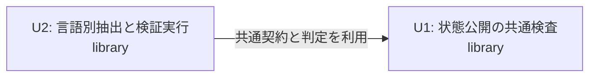

# 状態公開の共通検査 — 単位間の依存

## Sources

- [stories.md](../user-stories/stories.md): 承認済みのUS1.1〜US1.4と各受入条件。
- [unit-of-work.md](unit-of-work.md): 単位ID、ディレクトリ、種別、変更範囲。
- [components.md](../domain-design/components.md)、[decisions.md](../domain-design/decisions.md): 構成要素の所有と呼出し方向。
- [requirements.md](../requirements-analysis/requirements.md)、[確認記録](units-generation-questions.md): 一規則の範囲と二単位の選択。

## Dependency Catalogue

`name`はConstruction記録のディレクトリ名と同一とする。`depends_on`は「この単位が利用する相手」を列挙する。

```yaml
units:
  - name: u1-state-exposure-inspection
    kind: library
    depends_on: []
  - name: u2-language-state-verification
    kind: library
    depends_on: [u1-state-exposure-inspection]
```

## Dependency Diagram



図のテキスト表現: U2はU1の共通契約と判定を利用する。U1からU2への依存はない。単位は二つ、依存辺は一つで、循環はない。矢印は実装や出荷の順番を表すものではない。

## Integration Points

| 接続点 | 契約の所有者 | 作成・利用側 | 契約設計へ渡す条件 |
|---|---|---|---|
| InspectionRequest | U1 | U2が固定入力から作成し、言語別抽出とU1へ渡す | ソース・型・設定を識別し、要求した情報と応答の対応を確認できる |
| StateEvidence | U1 | U2が指定言語から抽出・変換し、U1が検証する | 根拠の確実性・完全性・対象範囲を区別し、不完全な空集合を不在の証明にしない |
| 実行状態 | U1が共通の意味を定義 | U2が観測して渡し、U1が規則結果と区別する | 起動不能・実行失敗・応答欠落を正常な空結果へ置き換えない |
| InspectionResult | U1 | U1が判定し、U2が期待値比較と報告に使う | 全体が検査不能でも、独立に確定した違反と未解決理由を保持する |

要求・応答の形式、版、具体的な関数、失敗時の返却形式はContract Designで固定する。AST、Cargo構造体、Compiler APIの型はこの接続点に出さない。

構成要素の呼出しとしてU2内のStateExposureVerificationがU1を呼ぶ。また、U2の言語別抽出処理はU1の契約宣言を参照する。どちらも同じU2からU1への単位依存に含まれ、U1が解析器を選ぶ依存にはしない。

US1.1・US1.2の言語別抽出とUS1.4の検証実行はU2、US1.3の共通検証・判定はU1の所有である。このストーリー対応でも、単位間の依存はU2からU1への一辺となる。

## Parallel Work and Coupling

単位間に直接の依存があるため、相互に依存しない二単位の組はない。U2の言語別抽出には内部作業の分担余地があるが、共通契約への結合とコマンドの検証を含めてU2の完了を確認する。

U1は既存Bun環境で単独試験を実行し、U2は開発依存と検証コマンドを登録する。Compiler API導入後の型検査はU2が両単位を対象に実行する。共通設定をU1の未宣言の依存先にしない。

この文書は依存の構造を定める。推奨する実装順序、出荷優先順位、日程、クリティカルパスを追加しない。

## Boundary Checks

- YAMLに全単位を一度ずつ記載し、参照先は宣言済みの単位に限定する。
- [単位定義](unit-of-work.md)と種別・ディレクトリ・所有する構成要素を一致させる。
- [ストーリー・要件対応表](unit-of-work-story-map.md)と[機械用対応表](traceability.json)の単位IDを一致させる。
- U2で共通契約の変更が必要になった場合は、U1への影響と契約の変更として扱う。言語別の都合で意味を複製しない。
