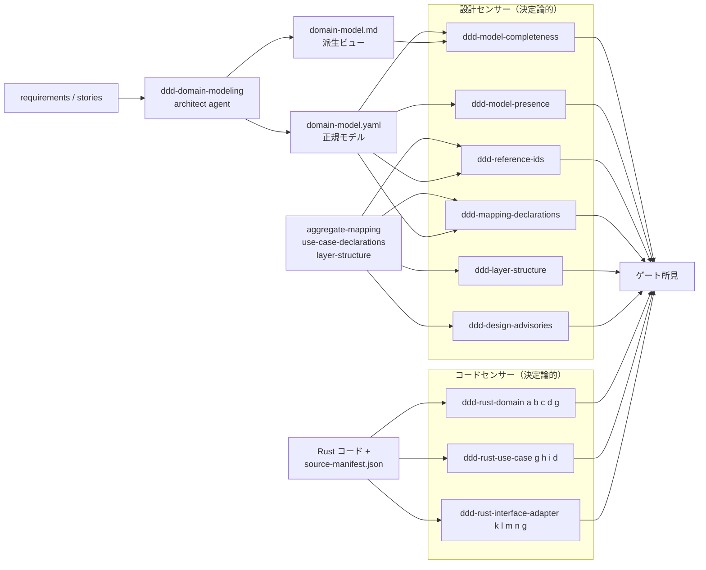
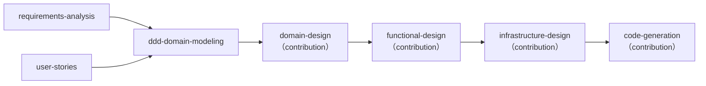
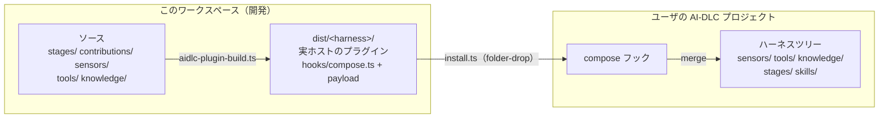

# DDD プラグインの仕組み

[English](architecture.md) | 日本語

正規ドメインモデルを一度作り、それと生成コードを 2 系統の決定論的センサーが検査する、[AI-DLC v2](https://github.com/awslabs/aidlc-workflows) 上のドメイン駆動設計ワークフローです。コアは変更しません。

- プラグイン: `ddd`（論理成果物は `ddd-` 接頭辞）
- ステージ: `ddd-domain-modeling`（inception、condition）
- センサー: 設計 6 本 ＋ Rust コード 3 本、すべて決定論的
- ツールチェーン: bun のみ。Rust 解析は同梱の tree-sitter-rust WASM 文法で動作

## §1 モデルと検査のループ

設計作業は確率的でエージェントが担い、検査は決定論的でセンサーが担います。受け渡し点は正規の `domain-model.yaml` と下流の宣言成果物で、所見はゲートのフィードバックとして人間に戻ります。



モデルが正で、markdown は派生です（正にはなりません）。設計センサーはモデルと宣言を読み、コードセンサーは unit が `source-manifest.json` で申告した正確な `.rs` ファイルだけを読みます。

## §2 ステージが走る位置

`ddd-domain-modeling` は Inception の `domain-design` の前に挿入されます。`execution: CONDITIONAL` で、`scopes: [enterprise, feature, mvp, classic, workshop, refactor]` を宣言するため、これらのスコープの intent でのみ実行されます。7 ステップは、文脈読込 → イベント発見 → 集約候補導出 → 質問と確認 → 正規モデル執筆 → 自己点検 → 完了です。



**途中導入**: 合成は追加型なので、AI-DLC が進行中のプロジェクトへ途中で導入しても動きます。導入前に作られた intent も `/aidlc --stage ddd-domain-modeling --single` で（ワークフローを進めずに）モデリングできます。ステージが SKIP のときは `ddd-model-presence` が note 付きで pass します。`domain-design` への contribution は正規モデル（`ddd-domain-model-yaml`、required）を消費し、`ddd-model-presence` がその存在をゲートで強制します。

## §3 何を検査し、何を約束するか

### 設計センサー

| センサー | 重大度 | 検査 |
|---|---|---|
| `ddd-model-completeness` | blocking | モデルの読み込み、条件 (i)(ii)(iv)、`domain-model.md` の全 ID 言及・全不変条件 statement 再掲・未知 ID なし (f) |
| `ddd-model-presence` | blocking | `domain-modeling` 実行時にモデルが存在・読み込み・解決。SKIP/absent は note 付き pass |
| `ddd-reference-ids` | blocking | 全宣言 ID の解決（undefined / deprecated / kind / malformed）、系譜循環、`reference_ids` 非空 |
| `ddd-mapping-declarations` | blocking | 全集約の 2 軸写像、ユースケース 6 項目、複数集約戦略、アクターモデル時の PM 必須、規則 (j) |
| `ddd-layer-structure` | blocking | ADR-009 必須項目と規則 (k)(l)(m)(n)（宣言のみに対して） |
| `ddd-design-advisories` | advisory | 複数集約ユースケース、リポジトリスコープ、upsert store |

### Rust コードセンサー

3 本とも blocking で、`code-summary.md` を契機に発火します。規則 (a)〜(n) は構文と字面だけで判定します（型推論・名前解決・実行なし）。

| センサー | 規則 |
|---|---|
| `ddd-rust-domain` | (a) 公開フィールド、(b) 未宣言の状態変更、(c) 不完全な生成経路、(d) getter 呼び出し、(g) 依存方向と外部 I/O、層診断、`model.invalid` |
| `ddd-rust-use-case` | (g) DIP と外部 I/O、(h) execute の集約引数、(i) ユースケース連鎖、(d) getter 呼び出し |
| `ddd-rust-interface-adapter` | (k) コマンド側⇄クエリ側、(l) クエリ側のドメイン参照、(m) リポジトリ命名、(n) 復元経路の迂回、(g) |

決定性は約束です。同じ申告ソース・workspace・モデルなら verdict はバイト一致します（パス昇順列挙、`(file, line, rule_id)` 整列、タイムスタンプなし）。ゴールデンケースがこれを強制します。2 つの規則（(c-model) の FactoryRule 前提条件検査、内部可変性 setter）は意図的に機械検査せず、ナレッジ文書に委ねています。

## §4 配布 — ビルドから compose まで

ビルド成果物は「実ホストのプラグイン」で、ハーネスごとに 1 つです。`ddd/` の単一ソースを `dist/<harness>/` に投影し、インストーラがビルドと compose を 1 コマンドで行います。



最短の導入は同梱インストーラ `bun ddd/scripts/install.ts --project <project> [--harness claude]` で、build → compose を 1 回で行います。store 系ハーネス（Claude Code / Codex / Kimi Code / opencode）は `dist/` から直接 compose し、プロジェクトへは何もコピーしません。storeless 系（Kiro / Kiro IDE / Cursor）だけ、ホストの期待に合わせて投影をプロジェクトルートへ folder-drop します。`--dry-run` で事前検証でき、compose は冪等なので再実行も安全です。この経路には導入時のトラストゲートがありません——コピー自体がトラスト判断です。プロジェクト外は変更されず、プラグインを無効化すれば素のワークフローに戻ります。

## §5 三部構成のワークスペース

「どこで作り」「ツールをどこから借り」「どこで試すか」を分離しています。

```text
aidlc-ddd-plugin/
├── ddd/                         # プラグイン本体（ソース + テスト + dist/）
│   ├── stages/ contributions/   # ddd-domain-modeling ステージとコアステージ contribution
│   ├── sensors/ tools/          # 9 センサーのマニフェストとスクリプト・ライブラリ
│   ├── knowledge/               # DDD / Rust ナレッジ 8 本
│   ├── tests/                   # ユニット + ゴールデン（設計・rust）
│   └── docs/decisions.md        # 設計判断の正規記録
├── aidlc-workflows/             # フレームワークのサブモジュール。validate/build/test を提供し編集しない
├── ddd-sandbox/                 # compose 検証の対象（git 管理外・使い捨て）
└── aidlc/                       # このリポジトリ自身の AI-DLC ワークスペース状態
```

ツールチェーンはサブモジュールから借ります: `aidlc-plugin-validate.ts`（規約検査）→ `aidlc-plugin-build.ts`（ハーネスごとに出力）→ `aidlc-plugin-test.ts --install`（対象を変更しない compose 検査）。
