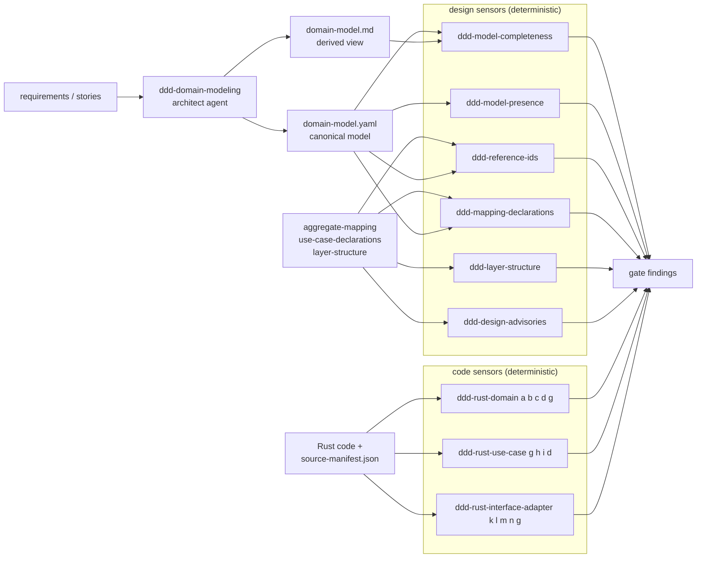
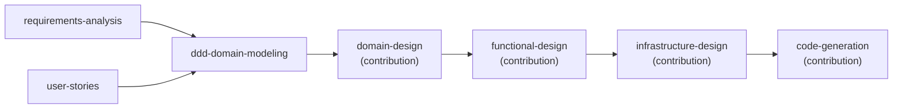
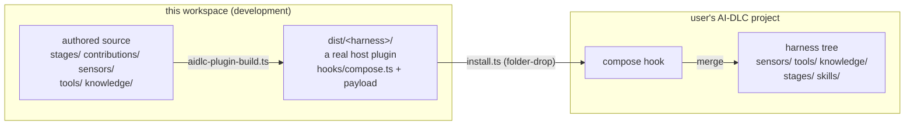

# How the DDD plugin works

English | [日本語](architecture.ja.md)

A canonical domain model is produced once, then two families of deterministic sensors check it and the code generated from it — a domain-driven-design workflow added on top of [AI-DLC v2](https://github.com/awslabs/aidlc-workflows). Core is never modified.

- Plugin: `ddd` (logical artifacts carry the `ddd-` prefix)
- Stage: `ddd-domain-modeling` (inception, conditional)
- Sensors: 6 design + 3 Rust code, all deterministic
- Toolchain: bun only; Rust analysis runs on a vendored tree-sitter-rust WASM grammar

## §1 The model-and-check loop

Design work is probabilistic and goes to the agents; the checks are deterministic and go to the sensors. The hand-off point is the canonical `domain-model.yaml` and its downstream declarations; findings come back to the human as gate feedback.



The model is canonical; the markdown is derived and never the source of truth. The design sensors read the model and the declarations; the code sensors read the exact `.rs` files the unit declared in `source-manifest.json`.

## §2 Where the stage runs

`ddd-domain-modeling` is inserted into Inception, before `domain-design`. It is `execution: CONDITIONAL` and declares `scopes: [enterprise, feature, mvp, classic, workshop, refactor]`, so it runs only for intents with those scopes. The seven steps are: load context → discover events → derive aggregate candidates → questions and confirmation → write the canonical model → self-check → completion.



**Late adoption**: compose is additive, so installing into a project already running AI-DLC works mid-flight. An intent that predates the install can still be modeled — without advancing the workflow — via `/aidlc --stage ddd-domain-modeling --single`. When the stage is SKIP, `ddd-model-presence` passes with a note. The contribution to `domain-design` consumes the canonical model (`ddd-domain-model-yaml`, required), and `ddd-model-presence` enforces its presence at that gate.

## §3 What is checked, what is promised

### Design sensors

| Sensor | Severity | Checks |
|---|---|---|
| `ddd-model-completeness` | blocking | the model loads; conditions (i)(ii)(iv); `domain-model.md` mentions every ID, repeats every invariant statement, and introduces no unknown IDs (f) |
| `ddd-model-presence` | blocking | when `domain-modeling` ran, the model exists, loads and resolves; SKIP/absent passes with a note |
| `ddd-reference-ids` | blocking | every declared ID resolves (undefined / deprecated / kind / malformed), cyclic lineage, non-empty `reference_ids` |
| `ddd-mapping-declarations` | blocking | every aggregate mapped on both axes; the six use-case items; the multi-aggregate strategy; the actor Process Manager requirement; rule (j) |
| `ddd-layer-structure` | blocking | the ADR-009 items and rules (k)(l)(m)(n) against the declaration only |
| `ddd-design-advisories` | advisory | multi-aggregate use cases, repository scope, upsert store |

### Rust code sensors

All three are blocking and fire on `code-summary.md`. Rules (a)–(n) are judged from syntax and text alone — no type inference, name resolution or execution.

| Sensor | Rules |
|---|---|
| `ddd-rust-domain` | (a) public field, (b) undeclared mutation, (c) incomplete construction, (d) getter call, (g) dependency direction / external I/O, layer diagnostics, `model.invalid` |
| `ddd-rust-use-case` | (g) DIP / external I/O, (h) `execute` aggregate argument, (i) use-case chaining, (d) getter call |
| `ddd-rust-interface-adapter` | (k) command/query cross-side, (l) query-side domain reference, (m) repository naming, (n) restoration bypass, (g) |

Determinism is a promise: the same claimed sources, workspace and model produce byte-identical verdicts (path-sorted enumeration, `(file, line, rule_id)` sorting, no timestamps), enforced by golden-case suites. Two rules are intentionally not machine-checked — the (c-model) FactoryRule precondition check and interior-mutability setters — and are delegated to the knowledge documents.

## §4 Distribution — from build to compose

The build artifacts are "real host plugins", one per harness. A single authored source under `ddd/` is projected to `dist/<harness>/`; the installer builds and composes in one command.



The shortest install is the bundled installer: `bun ddd/scripts/install.ts --project <project> [--harness claude]` runs build → compose in one go. Store harnesses (Claude Code, Codex, Kimi Code, opencode) compose straight from `dist/` and copy nothing into the project; only the storeless Kiro / Kiro IDE / Cursor get the projection folder-dropped into the project root first, as those hosts expect. `--dry-run` validates in advance; compose is idempotent, so re-running is safe. Note this path has no install-time trust gate — copying is itself the trust decision. Nothing is placed outside the project, and disabling the plugin recomposes back to vanilla — core stays unmodified.

## §5 The three-part workspace

The repository separates "where you build", "where the tooling comes from", and "where you try it".

```text
aidlc-ddd-plugin/
├── ddd/                         # the plugin itself (authored source + tests + dist/)
│   ├── stages/ contributions/   # the ddd-domain-modeling stage and the core-stage contributions
│   ├── sensors/ tools/          # 9 sensor manifests + their scripts and libraries
│   ├── knowledge/               # 8 DDD / Rust knowledge documents
│   ├── tests/                   # unit + golden suites (design and rust)
│   └── docs/decisions.md        # the canonical record of design decisions
├── aidlc-workflows/             # framework submodule — supplies validate/build/test; never edited
├── ddd-sandbox/                 # compose-verification target (gitignored, disposable)
└── aidlc/                       # this repository's own AI-DLC workspace state
```

The entire toolchain is borrowed from the submodule: `aidlc-plugin-validate.ts` (convention checks) → `aidlc-plugin-build.ts` (emits per harness) → `aidlc-plugin-test.ts --install` (a compose check that never modifies the target).
